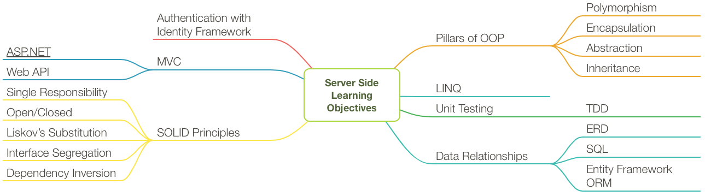

# The Backend

_You made it_

## Orientation

We'll spend the first few weeks orienting you to .NET, C#, SQL, and a new set of tools and techniques for building complex applications.

1. Installation of required tools.
1. Introduction to the C# language.
1. Concepts of sustainable, scalable, object-oriented software development.
1. Overview of server-side development ecosystem
1. How the Internet works
1. Inheritance, composition, and aggregation
1. Entity relationships
1. Structured Query Language (SQL)

## Web Applications using Server-side Rendering

After orientation's focus on the command line development, we'll turn to web applications using Microsoft's powerful, open source [ASP.NET Core](https://docs.microsoft.com/en-us/aspnet/core/) framework.

We'll start with building server-side rendered web apps using [ASP.NET Core MVC](https://docs.microsoft.com/en-us/aspnet/core/mvc/overview). These applications will generate HTML on the server and send it to the browser.

## Full Stack Web Applications

Finally, we'll end the course by learning to build a back-end API using [ASP.NET Core Web API](https://docs.microsoft.com/en-us/aspnet/core/web-api/). This will give us the opportunity to build a dynamic front-end in React.

## Capstone

After we've covered the course material, you'll wrap up your time at NSS by building a capstone project to demonstrate your learning.

## Learning Objectives

## Ready to get started?

[Book 1 - Orientation](./book-1-orientation/README.md)
