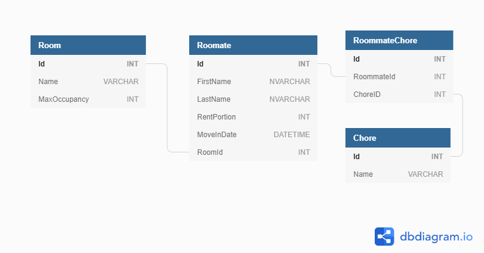

# Using SQL in a .NET Application

Sometimes money is tight. Sometimes when money is tight, it becomes an unavoidable truth that we must live with other people. We call these people _Roommates_.

Your task is to build a command line application to manage a house full of roommates. You should persist data in a SQL Server database.

> **NOTE:** This will begin as an interactive lesson. Your instructor will lead you through following the instructions.

## Instructions

1. Use the [Roommates](./assets/roommates.sql) SQL script to create a `Roommates` database.
1. Take a look at the ERD to familiarize yourself with the database.

1. In Visual Studio, create a new console application called `Roommates`.
1. In your terminal, navigate to the directory where you created your project. The directory will have a `Roommates.sln` file in it.
1. `cd` into your project directory. When you list what's in the directory, you should see your `Roommates.csproj` and `Program.cs`.
1. Run the following commands. This imports the required package needed to have your C# code connect to a SQL Server database.

   ```sh
   dotnet add package Microsoft.Data.SqlClient
   dotnet restore
   ```

1. Make a folder in your project called `Models`. This folder will contain classes that represent tables in our database.
1. In the `Models` folder, create `Room.cs`, `Roommate.cs` and `Chore.cs` file. Copy in the following code

   ## C# files

   **Models/Room.cs**

    ```cs
    namespace Roommates.Models
    {
        // C# representation of the Room table
        public class Room
        {
            public int Id { get; set; }
            public string Name { get; set; }
            public int MaxOccupancy { get; set; }
        }
    }
    ```


   **Models/Roommate.cs**

    ```cs
    using System;

    namespace Roommates.Models
    {
        // C# representation of the Roommate table
        public class Roommate
        {
            public int Id { get; set; }
            public string Firstname { get; set; }
            public string Lastname { get; set; }
            public int RentPortion { get; set; }
            public DateTime MovedInDate { get; set; }
            public Room Room { get; set; }
        }
    }
    ```

   **Models/Chore.cs**

    ```cs
    namespace Roommates.Models
    {
        // C# representation of the Chore table
        public class Chore
        {
            public int Id { get; set; }
            public string Name { get; set; }
        }
    }
    ```


1. Create a new folder called `Repositories`. This folder will contain classes that will be responsible for getting data out of our database and creating C# objects from that data. We typically call classes with this responsibility a Repository. Add two new files to it called `BaseRepository.cs` and `RoomRepository.cs`.
1. Copy the following code into `BaseRepository.cs`

   ```csharp
    using Microsoft.Data.SqlClient;

    namespace Roommates.Repositories
    {
        /// <summary>
        ///  A base class for every other Repository class to inherit from.
        ///  This class is responsible for providing a database connection to each of the repository subclasses
        /// </summary>
        public class BaseRepository
        {
            /// <summary>
            ///  A "connection string" is the address of the database.
            /// </summary>
            private string _connectionString;


            /// <summary>
            ///  This constructor will be invoked by subclasses.
            ///  It will save the connection string for later use.
            /// </summary>
            public BaseRepository(string connectionString)
            {
                _connectionString = connectionString;
            }


            /// <summary>
            ///  Represents a connection to the database.
            ///   This is a "tunnel" to connect the application to the database.
            ///   All communication between the application and database passes through this connection.
            /// </summary>
            protected SqlConnection Connection => new SqlConnection(_connectionString);
        }
    }

   ```

   The BaseRepository you just added contains a single, computed property called `Connection`. The type of this property is `SqlConnection`. It represents a connection from your C# application to your SQL Server database. Think of it like a two-way tunnel that all communication passes through. Since the property is computed, it means that any time the `Connection` property gets referenced in our code, it will create a new tunnel. Typically, this tunnel stays open only long enough to execute a single command (i.e. a `SELECT` or `INSERT` statement). Once the command is executed, we close the connection and effectively destroy that tunnel. Then when we want to execute another command, we do the same thing again and create a new tunnel.

1. Copy the following code into `RoomRepository.cs`

    ```cs
    using Microsoft.Data.SqlClient;
    using Roommates.Models;
    using System.Collections.Generic;

    namespace Roommates.Repositories
    {
        /// <summary>
        ///  This class is responsible for interacting with Room data.
        ///  It inherits from the BaseRepository class so that it can use the BaseRepository's Connection property
        /// </summary>
        public class RoomRepository : BaseRepository
        {
            /// <summary>
            ///  When new RoomRespository is instantiated, pass the connection string along to the BaseRepository
            /// </summary>
            public RoomRepository(string connectionString) : base(connectionString) { }

            // ...We'll add some methods shortly...
        }
    }
    ```


1. Let's see how we can get data out of our Room table and convert it into a `List<Room>`. Add the following method to your `RoomRepository` class

   ```csharp
    /// <summary>
    ///  Get a list of all Rooms in the database
    /// </summary>
    public List<Room> GetAll()
    {
        //  We must "use" the database connection.
        //  Because a database is a shared resource (other applications may be using it too) we must
        //  be careful about how we interact with it. Specifically, we Open() connections when we need to
        //  interact with the database and we Close() them when we're finished.
        //  In C#, a "using" block ensures we correctly disconnect from a resource even if there is an error.
        //  For database connections, this means the connection will be properly closed.
        using (SqlConnection conn = Connection)
        {
            // Note, we must Open() the connection, the "using" block doesn't do that for us.
            conn.Open();

            // We must "use" commands too.
            using (SqlCommand cmd = conn.CreateCommand())
            {
                // Here we setup the command with the SQL we want to execute before we execute it.
                cmd.CommandText = "SELECT Id, Name, MaxOccupancy FROM Room";

                // Execute the SQL in the database and get a "reader" that will give us access to the data.
                SqlDataReader reader = cmd.ExecuteReader();

                // A list to hold the rooms we retrieve from the database.
                List<Room> rooms = new List<Room>();

                // Read() will return true if there's more data to read
                while (reader.Read())
                {
                    // The "ordinal" is the numeric position of the column in the query results.
                    //  For our query, "Id" has an ordinal value of 0 and "Name" is 1.
                    int idColumnPosition = reader.GetOrdinal("Id");

                    // We user the reader's GetXXX methods to get the value for a particular ordinal.
                    int idValue = reader.GetInt32(idColumnPosition);

                    int nameColumnPosition = reader.GetOrdinal("Name");
                    string nameValue = reader.GetString(nameColumnPosition);

                    int maxOccupancyColunPosition = reader.GetOrdinal("MaxOccupancy");
                    int maxOccupancy = reader.GetInt32(maxOccupancyColunPosition);

                    // Now let's create a new room object using the data from the database.
                    Room room = new Room
                    {
                        Id = idValue,
                        Name = nameValue,
                        MaxOccupancy = maxOccupancy,
                    };

                    // ...and add that room object to our list.
                    rooms.Add(room);
                }

                // We should Close() the reader. Unfortunately, a "using" block won't work here.
                reader.Close();

                // Return the list of rooms who whomever called this method.
                return rooms;
            }
        }
    }
   ```

   To test this, let's call this method from the `Program.Main` method. Create a new instance of a `RoomRepository` and call `GetAll()`. Run the application.

    **Program.cs**

    ```csharp
    using System;
    using System.Collections.Generic;
    using Roommates.Models;
    using Roommates.Repositories;

    namespace Roommates
    {
        class Program
        {
            /// <summary>
            ///  This is the address of the database.
            ///  We define it here as a constant since it will never change.
            /// </summary>
            private const string CONNECTION_STRING = @"server=localhost\SQLExpress;database=Roommates;integrated security=true";

            static void Main(string[] args)
            {
                RoomRepository roomRepo = new RoomRepository(CONNECTION_STRING);

                Console.WriteLine("Getting All Rooms:");
                Console.WriteLine();

                List<Room> allRooms = roomRepo.GetAll();

                foreach (Room room in allRooms)
                {
                    Console.WriteLine($"{room.Name} has an Id of {room.Id} and a max occupancy of {room.MaxOccupancy}");
                }

            }
        }
    }
    ```

1. Now create another method in `RoomRepository` that will get a single room by its Id. The method should accept an `int id` as a parameter and return a single `Room` object.

   ```csharp
    /// <summary>
    ///  Returns a single room with the given id.
    /// </summary>
    public Room GetById(int id)
    {
        using (SqlConnection conn = Connection)
        {
            conn.Open();
            using (SqlCommand cmd = conn.CreateCommand())
            {
                cmd.CommandText = "SELECT Name, MaxOccupancy FROM Room WHERE Id = @id";
                cmd.Parameters.AddWithValue("@id", id);
                SqlDataReader reader = cmd.ExecuteReader();

                Room room = null;

                // If we only expect a single row back from the database, we don't need a while loop.
                if (reader.Read())
                {
                    room = new Room
                    {
                        Id = id,
                        Name = reader.GetString(reader.GetOrdinal("Name")),
                        MaxOccupancy = reader.GetInt32(reader.GetOrdinal("MaxOccupancy")),
                    };
                }

                reader.Close();

                return room;
            }
        }
    }
   ```

1. Update `Program.Main` to also call this new method

   ```csharp
    Console.WriteLine("----------------------------");
    Console.WriteLine("Getting Room with Id 1");

    Room singleRoom = roomRepo.GetById(1);

    Console.WriteLine($"{singleRoom.Id} {singleRoom.Name} {singleRoom.MaxOccupancy}");
   ```

1. Now that we've read data from our database, let's look at how we can add new records. Create a new method in the `RoomRepository` and name it `Insert`. It should accept a single `Room` parameter.

   ```csharp
    /// <summary>
    ///  Add a new room to the database
    ///   NOTE: This method sends data to the database,
    ///   it does not get anything from the database, so there is nothing to return.
    /// </summary>
    public void Insert(Room room)
    {
        using (SqlConnection conn = Connection)
        {
            conn.Open();
            using (SqlCommand cmd = conn.CreateCommand())
            {
                // These SQL parameters are annoying. Why can't we use string interpolation?
                // ... sql injection attacks!!!
                cmd.CommandText = @"INSERT INTO Room (Name, MaxOccupancy) 
                                            OUTPUT INSERTED.Id 
                                            VALUES (@name, @maxOccupancy)";
                cmd.Parameters.AddWithValue("@name", room.Name);
                cmd.Parameters.AddWithValue("@maxOccupancy", room.MaxOccupancy);
                int id = (int)cmd.ExecuteScalar();

                room.Id = id;
            }
        }

        // when this method is finished we can look in the database and see the new room.
    }
    ```

   You may be wondering why we set the `room.Id` property after the records is inserting into the database. Remember that the database is where each room's Id gets created. The room parameter that gets passed into the method doesn't have an Id when the method begins, but once it gets returned the Id will be included. Notice this part of the SQL command: `OUTPUT INSERTED.Id`. Normally, when we issue an INSERT statement to our database, no records come back and nothing gets returned. The addition of this `OUTPUT` statement means that we'd also like to get back the ID of the room that we just inserted.

   The `cmd.ExecuteScalar` method does two things: First, it executes the SQL command against the database. Then it looks at the first thing that the database sends back (in our case this is just the `Id` it created for the room) and returns it.

1. Update `Program.Main` to create a new instance of Room and pass it into the `Insert` method.

    ```csharp
    Room bathroom = new Room
    {
        Name = "Bathroom",
        MaxOccupancy = 1
    };

    roomRepo.Insert(bathroom);

    Console.WriteLine("-------------------------------");
    Console.WriteLine($"Added the new Room with id {bathroom.Id}");
    ```

1. Now add the following method to the repository that allows us to update a room in the database. This method should be called `Upate`. It should take  a `Room updatedRoom` parameter, and should not return anything

    ```csharp
    /// <summary>
    ///  Updates the room
    /// </summary>
    public void Update(Room room)
    {
        using (SqlConnection conn = Connection)
        {
            conn.Open();
            using (SqlCommand cmd = conn.CreateCommand())
            {
                cmd.CommandText = @"UPDATE Room
                                        SET Name = @name,
                                            MaxOccupancy = @maxOccupancy
                                        WHERE Id = @id";
                cmd.Parameters.AddWithValue("@name", room.Name);
                cmd.Parameters.AddWithValue("@maxOccupancy", room.MaxOccupancy);
                cmd.Parameters.AddWithValue("@id", room.Id);

                cmd.ExecuteNonQuery();
            }
        }
    }
    ```

    The only difference here is we're calling a method called `cmd.ExecuteNonQuery`. We use this method when we want to execute a SQL command, but we don't expect anything back from the database.

1. Write some code in `Program.Main` to test the `Update` method.

1. Lastly let's create a method that allows us to delete a room. Update `RoomRepository` to include a method called `Delete`. It should take in an `int id` as a parameter and not return anything.

    ```csharp
    /// <summary>
    ///  Delete the room with the given id
    /// </summary>
    public void Delete(int id)
    {
        using (SqlConnection conn = Connection)
        {
            conn.Open();
            using (SqlCommand cmd = conn.CreateCommand())
            {
                cmd.CommandText = "DELETE FROM Room WHERE Id = @id";
                cmd.Parameters.AddWithValue("@id", id);
                cmd.ExecuteNonQuery();
            }
        }
    }
    ```
1. Write some code in `Program.Main` to test the `Delete` method.

## Exercise

1. Implement the `RoommateRepository` class to include the following methods
    - `public List<Roommate> GetAll()` 
        - Roommate objects should have a null value for their Room property
    - `public Roommate GetById(int id)`
    - `public List<Roommate> GetRoommatesByRoomId(int roomId)`
        - Roommate objects _should_ have a Room property
    - `public void Insert(Roommate roommate)`
    - `public void Update(Roommate roommate)` 
    - `public void Delete(int id)`

1. Update the `Program.Main` method to print a report of all roommates and their rooms

## Challenges

1. Change the program to provide the user with a menu to allow them to interact with the Roommates database
1. Add Chores to the applications. Users should be able to perform full CRUD on Chores as well as assign and remove them from Roommates.

## Supplemental: Comparison of data access tools

| \_                          | <span>ADO.NET</span>           | Micro-ORM (Dapper)                           | Full ORM (Entity Framework)            |
| --------------------------- | ------------------------------ | -------------------------------------------- | -------------------------------------- |
| **Dev Writes SQL**          | yes                            | yes                                          | no                                     |
| **Boilerplate Code**        | yes                            | minimal                                      | no                                     |
| **Automatic Model Binding** | no                             | yes                                          | yes                                    |
| **Degree of "Magic"**       | none                           | a little                                     | a lot                                  |
| **Pros**                    | Full control, best performance | Balance between control and ease of use      | Ease of use, Rapid development         |
| **Cons**                    | Lots of code to write          | Can lead to writing more code than is needed | Too much magic, Performance can suffer |
