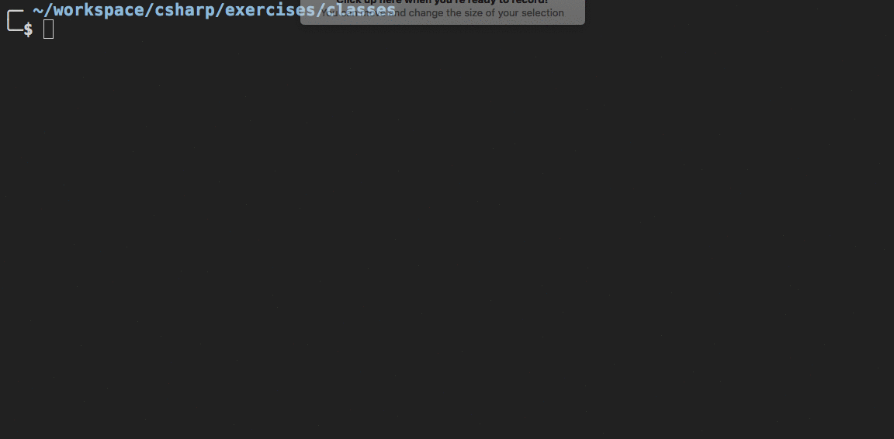

# Classes

## Setup

```
mkdir -p ~/workspace/csharp/exercises/classes && cd $_
dotnet new console
dotnet restore
```

## Practice - List employees working at a company

Using C# classes, you need to create custom types to represent an **`Employee`** and a **`Company`**. Then you will create some employees, hire them into the company and then display a simple report showing the employee names and their titles.



## Instructions

1. Create a custom type for `Employee`. An employee has the following properties.
    1. First name (_string_)
    1. Last name (_string_)
    1. Title (_string_)
    1. Start date (_DateTime_)
1. Create a custom type for `Company`. A company has the following properties.
    1. Date founded (_DateTime_)
    1. Company name (_string_)
    1. Employees (_List\<Employee\>_)
1. The `Company` class should also have a `ListEmployees()` method which outputs the name of each employee to the console.
1. In the `Main` method of your console application, create a new instance of Company, and three instances of Employee. Then assign the employees to the company.

---

Copy this `Company` class into your `Program.cs` file to get started. You will define the `Employee` type.

```cs
public class Company
{

    // Some readonly properties (let's talk about gets, baby)
    public string Name { get; }
    public DateTime CreatedOn { get; }

    // Create a public property for holding a list of current employees

    /*
        Create a constructor method that accepts two arguments:
            1. The name of the company
            2. The date it was created

        The constructor will set the value of the public properties
    */
}

class Program
{
    static void Main(string[] args)
    {
        // Create an instance of a company. Name it whatever you like.

        // Create three employees

        // Assign the employees to the company

        /*
            Iterate the company's employee list and generate the
            simple report shown above
        */
    }
}
```
