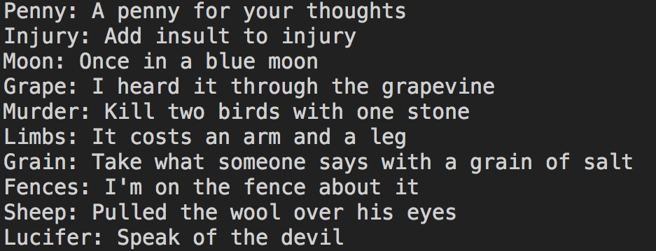
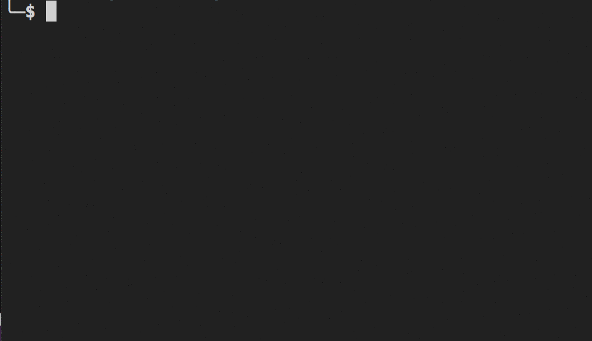

# Common Types - Dictionary

In C#, a **`Dictionary`** is much like the objects that you used in JavaScript. They are collections of a key/value pairs - just strongly typed.

Here's a JavaScript object to represent toys sold by a business.

```js
const toysSold = {
    "hotWheels": 344,
    "legos": 763,
    "gamingConsoles": 551,
    "boardGames": 298
}
```

Here's how that would look in C# as a **`Dictionary`**.

```cs
Dictionary<string, int> toysSold = new Dictionary<string, int>() {
    {"Hot Wheels", 344},
    {"Legos", 763},
    {"Gaming Consoles", 551},
    {"Board Games", 298}
};
```

You can also use the `Add()` method to add more key/value pairs to a dictionary.

```cs
toysSold.Add("Bicycles", 87);
```

## Iterating a Dictionary

If you want to see all the toys and how many were sold, you can use a `foreach` to iterate over all of the `KeyValuePair` items in the dictionary.

```cs
foreach(KeyValuePair<string, int> toy in toysSold)
{
    Console.WriteLine($"We sold {toy.Value} units of {toy.Key}");
}
```

## References

* [C# dictionaries](https://msdn.microsoft.com/en-us/library/xfhwa508(v=vs.110).aspx#Anchor_8)
* [Dictionary in C#](http://www.c-sharpcorner.com/UploadFile/219d4d/dictionary-in-C-Sharp-language/)
* [Interactive C# Dictionaries](http://www.learncs.org/en/Dictionaries)


---

## Practice: Dictionary of Words

You are going to buid a C# Dictionary to represent an actual dictionary. Each KeyValuePair within the Dictionary will contain a single word as the key, and a definition as the value. Below is some starter code. You need to add a few more words and definitions to the dictionary.

After you have added them, use square bracket notation to output the definition of two of the words to the console.

Lastly, use the `foreach` loop to iterate over the KeyValuePairs and display the entire dictionary to the console.

```cs
/*
    Create a dictionary with key value pairs to
    represent words (key) and its definition (value)
*/
Dictionary<string, string> wordsAndDefinitions = new Dictionary<string, string>();

// Add several more words and their definitions
wordsAndDefinitions.Add("Awesome", "The feeling of students when they are learning C#");

/*
    Use square bracket lookup to get the definition two
    words and output them to the console
*/

/*
    Loop over dictionary to get the following output:
        The definition of [WORD] is [DEFINITION]
        The definition of [WORD] is [DEFINITION]
        The definition of [WORD] is [DEFINITION]
*/
foreach (KeyValuePair<string, string> word in wordsAndDefinitions)
{
}
```


## Practice: List of Dictionaries about Words

Now, you are going to refactor the structure of our data. Instead of one C# Dictionary with key value pairs for words and definitions. You want to track more than just the word and its definition, so we are going to build a list of dictionaries.


```cs
// Make a new list
List<Dictionary<string, string>> dictionaryOfWords = new List<Dictionary<string, string>>();

/*
    You want to track the following about each word:
        word, definition, part of speech, example sentence

    Example of one dictionary in the list:
    {
        "word": "excited",
        "definition": "having, showing, or characterized by a heightened state of energy, enthusiasm, eagerness",
        "part of speech": "adjective",
        "example sentence": "I am excited to learn C#!"
    }
*/

// Create dictionary to represent a few word
Dictionary<string, string> excitedWord = new Dictionary<string, string>();

// Add each of the 4 bits of data about the word to the Dictionary
excitedWord.Add();

// Add Dictionary to your `dictionaryOfWords` list


// create another Dictionary and add that to the list


/*
    Iterate your list of dictionaries and output the data

    Example output for one word in the list of dictionaries:
        word: excited
        definition: having, showing, or characterized by a heightened state of energy, enthusiasm, eagerness
        part of speech: adjective
        example sentence: I am excited to learn C#!
*/

// Iterate the List of Dictionaries
foreach ()
{
    // Iterate the KeyValuePairs of the Dictionary
    foreach ()
    {
        Console.WriteLine($"{wordData.Key}: {wordData.Value}");
    }
}
```

## Practice: English Idioms

Create a new console application and paste the following code into your `Main()` method. Then write a `foreach` loop to produce the output in the image below.

```cs
Dictionary<string, List<string>> idioms = new Dictionary<string, List<string>>();
idioms.Add("Penny", new List<string> { "A", "penny", "for", "your", "thoughts" });
idioms.Add("Injury", new List<string> { "Add", "insult", "to", "injury" });
idioms.Add("Moon", new List<string> { "Once", "in", "a", "blue", "moon" });
idioms.Add("Grape", new List<string> { "I", "heard", "it", "through", "the", "grapevine" });
idioms.Add("Murder", new List<string> { "Kill", "two", "birds", "with", "one", "stone" });
idioms.Add("Limbs", new List<string> { "It", "costs", "an", "arm", "and", "a", "leg" });
idioms.Add("Grain", new List<string> { "Take","what","someone","says","with","a","grain","of","salt" });
idioms.Add("Fences", new List<string> { "I'm", "on", "the", "fence", "about", "it" });
idioms.Add("Sheep", new List<string> { "Pulled", "the", "wool", "over", "his", "eyes" });
idioms.Add("Lucifer", new List<string> { "Speak", "of", "the", "devil" });
```



> Reference: [String.Join() method](https://docs.microsoft.com/en-us/dotnet/api/system.string.join?view=netframework-4.7.2)

## Challenge: Randall's Car Lot in C#

Take the following JavaScript data structure that represents car sales and convert it to C# Lists and Dictionaries. Make sure that all of your variable names conform to the C# standard of [Camel Case](https://en.wikipedia.org/wiki/Camel_case) instead of [Snake Case](https://en.wikipedia.org/wiki/Snake_case).

```js
"vehicles": [
    {
        "vehicle": {
            "year": 2008,
            "model": "Damfresh",
            "make": "Biotraxquote",
            "color": "sky magenta"
        },
        "sales_id": "ecb1c841-1a43-4a7c-896e-712d2ec39c71",
        "sales_agent": {
            "mobile": "(896) 478-6975",
            "last_name": "Botsford",
            "first_name": "Shaina",
            "emails": ["beatae_sonny@hotmail.com", "shaina@aol.com"]
        },
        "purchase_date": "2017-11-15",
        "gross_profit": 871.26,
        "credit": {
            "credit_provider": "J.P.Morgan Chase & Co",
            "account": "601109582720302"
        }
    },
    {
        "vehicle": {
            "year": 2010,
            "model": "Hotquadtrax",
            "make": "Transtintechno",
            "color": "robin egg blue"
        },
        "sales_id": "a2f80554-bd9d-4ea1-8229-01fd4cf220a8",
        "sales_agent": {
            "mobile": "562.300.2912",
            "last_name": "Davis",
            "first_name": "Gerardo",
            "emails": ["girl70@hotmail.com", "jova43@gmail.com"]
        },
        "purchase_date": "2017-04-28",
        "gross_profit": 156.02,
        "credit": {
            "credit_provider": "PNC Financial Services",
            "account": "34578280562836"
        }
    }
]
```

## Challenge: The Family Dictionary

### Setup

```
mkdir -p ~/workspace/csharp/exercises/family_dictionary && cd $_
dotnet new console -n FamilyDictionary -o .
```

Oh, the Glory Days of JavaScript, when creating an object that contains another object was as simple as this.

```js
const myFamily = {
    'sister': {
        'name': 'Krista',
        'age': 42
    },
    'mother': {
        'name': 'Cathie',
        'age': 70
    }
}
```

Well, those days are over while you learn C#. Below you will see an example of how you will do that with a Dictionary.

### Instructions

1. Define a Dictionary that contains information about several members of your family. Use the following example as a template.

    ```cs
    Dictionary<string, Dictionary<string, string>> myFamily = new Dictionary<string, Dictionary<string, string>>();

    myFamily.Add("sister", new Dictionary<string, string>(){
        {"name", "Krista"},
        {"age", "42"}
    });
    ```
2. Next, iterate over each item in `myFamily` and produce the following output. Remember that you can use square bracket notation to get to the value of a key, and that a dictionary has a `Key` and a `Value` property.
    ```cs
    foreach(KeyValuePair<string, Dictionary<string, string>> familyMember in myFamily)
    {
        ... your code here
    }
    ```

    ```sh
    Krista is my sister and is 42 years old
    ```


## Challenge: Planets and Probes and KeyValuePairs

In this exercise, you are going to directly use KeyValuePairs instead of Dictionaries.

### Instructions
> **Ref:** [List of Solar System probes](https://en.wikipedia.org/wiki/List_of_Solar_System_probes)

1. Use the list of planets you created in the previous chapter or create a new one with all eight planets.
    ```cs
    List<string> planetList = new List<string>(){"Mercury", "Venus", "Earth", ...};
    ```

1. Create a list containing KeyValuePairs. Each KeyValuePair will hold the name of a spacecraft that we have launched, and the name of a planet that it has visited. The key of the KeyValuePair will be the probe name, and the value will be the planet it visited.
    ```cs
    List<KeyValuePair<string, string>> probeDestinations = new List<KeyValuePair<string, string>>();
    // Add some planet/probe combinations to the list
    ```

    This would be the equivalent of an having an array of objects in JavaScript.

    ```js
    const probeDestinations = [
        {
            "Viking 1": "Mars",
        },
        {
            "Mariner 1": "Venus"
        },
        {
            "Voyager 1": "Jupiter"
        },
        {
            "Voyager 1": "Saturn"
        }
    ]
    ```
1. Iterate over `probeDestinations`, and inside that loop, iterate over the list of dictionaries. Write to the console, for each planet, which probes have visited it.
    ```cs
    // Iterate planets
    foreach (string planet in planetList)
    {
        // List to store probes that visited the planet
        List<string> matchingProbes = new List<string>();

        // Iterate probeDestinations
        foreach()
        {
            /*
                Does the current probe's destination
                match the value of the `planet` variable?
                If so, add it to the list.
            */
        }

        /*
            Use String.Join(",", matchingProbes) as part of the
            solution to get the output below. It's the C# way of
            writing `array.join(",")` in JavaScript.
        */
        Console.WriteLine($"{}: {}");
    }
    ```

#### Example Output in the Terminal

```sh
Mars: Viking, Opportunity, Curiosity
Venus: Mariner, Venera
```

## Advanced Challenge: Stock Purchase Report

### Setup

```
mkdir -p ~/workspace/csharp/exercises/stocks && cd $_
dotnet new console
```

### Instructions

A block of publicly traded stock has a variety of attributes, we'll look at a few of them. A stock has a ticker symbol and a company name. Create a simple dictionary with ticker symbols and company names in the `Main` method.

##### Example

```cs
Dictionary<string, string> stocks = new Dictionary<string, string>();
stocks.Add("GM", "General Motors");
stocks.Add("CAT", "Caterpillar");
// Add a few more of your favorite stocks
```

To find a value in a Dictionary, you can use square bracket notation much like JavaScript object key lookups.

```cs
string GM = stocks["GM"];   <--- "General Motors"
```

Next, create a data structure to record how many stock purchases were made for each company over time. In this Dictionary, the key will be the ticker symbol, and the value will be a collection of numbers representing how much the investor paid.

#### JavaScript Equivalent

```js
{
    "AAPL": [1214.90, 2881.95],
    "GM": [4892.12],
    "MSFT": [934.21, 9025.23, 4013.89],
    "TWTR": [180.44, 298.01, 9092.45],
}
```

How would you define this structure using C# data types? Once you've determined how to define the data structure, you need to add purchases for a few companies. Start with three companies, and 1-3 purchases for each one.

Once you've added your stocks and purchases, produce a total ownership report that computes the total amount of money spent by the investor on each stock. Note that the final report has the full company name, not the ticker symbol. You must use the ticker symbol and square bracket notation to get the full company name from the `stocks` Dictionary.

This is the basic relational database join algorithm between two tables.



```cs
Dictionary<string, string> stocks = new Dictionary<string, string>();
stocks.Add("GM", "General Motors");
// Add a few more of your favorite stocks

foreach (var stock in portfolio)
{
    Console.WriteLine($"Investor has spent a total of {total spend} on the stock for {display the full business name}");
}
```
