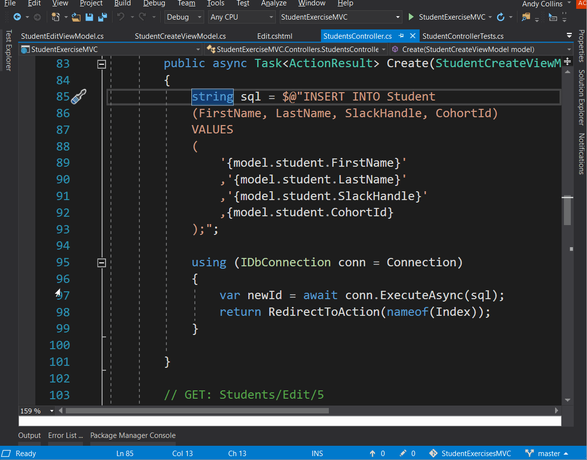
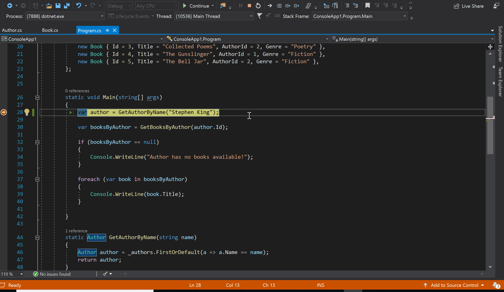
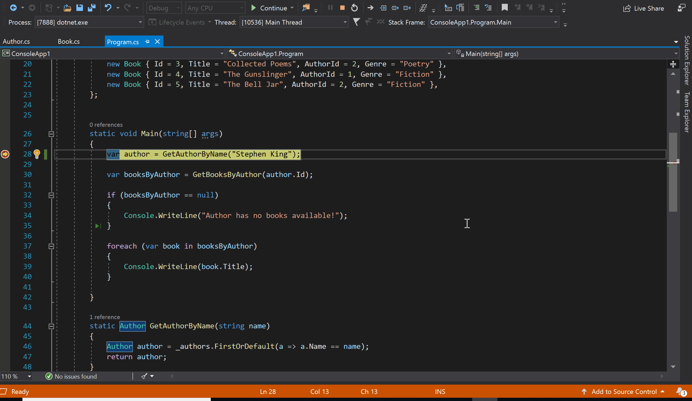
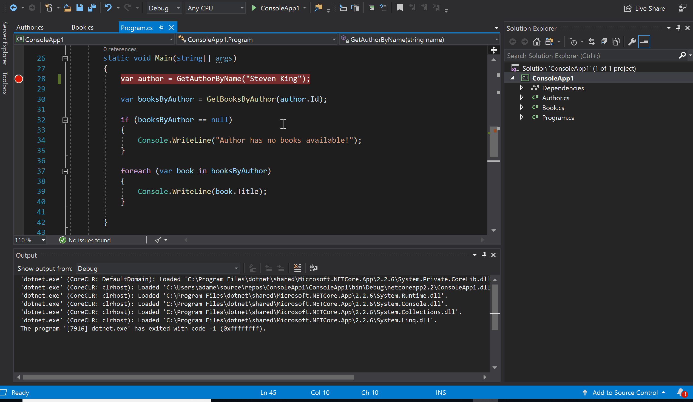
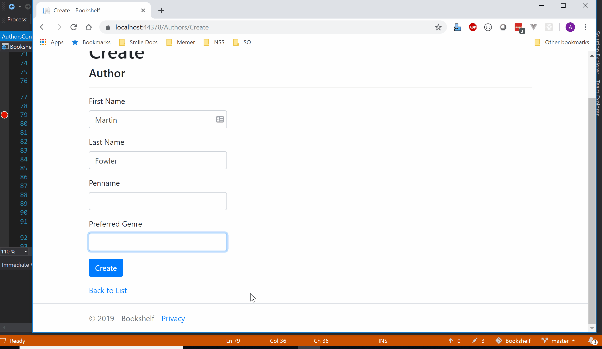

# Debugging in Visual Studio

## Starting in Debug Mode

By default when you run your application in Visual Studio, it will run in Debug Mode. 

You can tell your application is running in debug mode, because the status bar at the bottom of the Visual Studio window will turn from blue to orange.


## Breakpoints

Breakpoints can be the most effective tool when debugging your code. A breakpoint is a location in your code where you want to pause execution so you can examine the state of your application. It's a nice way to check that variables are holding values that are expected, and gives you a great opportunity to step through your code line by line while it's running. This can be especially helpful when debugging control flow such as `if/else`, `switch`, or `while` statements.

To set a breakpoint click on the vertical margin to the left of the Code Editor window. A red dot will appear in the margin and the code at that line will be highlighted in red.

To remove a breakpoint, click the red dot in the margin.



**Further reading**
[Use Breakpoints in the Visual Studio Debugger](https://docs.microsoft.com/en-us/visualstudio/debugger/using-breakpoints?view=vs-2017)

Once your breakpoint is hit, you can hover over any variable that is in scope to inspect its value. For variables holding complex objects, you can drill down into each property.



When your application is paused, you can step through its execution line by line. To step to the next line, click the button at the top of visual studio marked `Step Over`

If you are paused on a line that invokes a function, you can continue debugging inside that function by clicking the button marked `Step Into`



Likewise, if you've stepped into a function and want to get out of it, you can click the `Step Out` button.

To continue the execution of your application as normal, click the green `Continue` button.

### _Example_

Lets say we have the following code that keeps lists of books and authors. The program is supposed to find the books written by Stephen King and print them to the console, but instead it's breaking with a null reference error and we don't know why.

```csharp
class Program
{
    private static List<Author> _authors = new List<Author>
    {
        new Author { Id = 1, Name = "Stephen King" },
        new Author { Id = 2, Name = "Sylvia Plath" },
        new Author { Id = 3, Name = "Robert Martin" }
    };

    private static List<Book> _books = new List<Book>
    {
        new Book { Id = 1, Title = "The Shining", AuthorId = 1, Genre = "Horror" },
        new Book { Id = 2, Title = "Clean Code", AuthorId = 3, Genre = "Software" },
        new Book { Id = 3, Title = "Collected Poems", AuthorId = 2, Genre = "Poetry" },
        new Book { Id = 4, Title = "The Gunslinger", AuthorId = 1, Genre = "Fiction" },
        new Book { Id = 5, Title = "The Bell Jar", AuthorId = 2, Genre = "Fiction" },
    };


    static void Main(string[] args)
    {
        var author = GetAuthorByName("Steven King");

        var booksByAuthor = GetBooksByAuthor(author.Id);

        if (booksByAuthor == null)
        {
            Console.WriteLine("Author has no books available!");
        }

        foreach (var book in booksByAuthor)
        {
            Console.WriteLine(book.Title);
        }

    }

    static Author GetAuthorByName(string name)
    {
        Author author = _authors.FirstOrDefault(a => a.Name == name);
        return author;
    }

    static IEnumerable<Book> GetBooksByAuthor(int authorId)
    {
        IEnumerable<Book> books = _books.Where(b => b.AuthorId == authorId);
        return books;
    }
```

Put a breakpoint at the start of the `Main` method and step through. If we Step Into the `GetAuthorByName` method, we can see that it unexpectedly returns `null`. We can inspect both the parameter that was passed in along with the items in `_authors` by hovering over each of them. We can now see that we mispelled the name Stephen.



## Autos and Locals Window

When you are stopped on a breakpoint Studio, instead of hovering over every variable name, you can also view the values of all your variables with the Autos and Locals windows.


If you ever lose track of these debugging windows, you can always get them back on your screen by clicking _Debug > Windows_ in the top toolbar

**Further reading**
[Autos and Locals Windows](https://docs.microsoft.com/en-us/visualstudio/debugger/autos-and-locals-windows?view=vs-2017).

## Immediate Window

The Immediate window is used to debug and evaluate expressions, execute statements, print variable values, and so forth. It allows you to enter expressions to be evaluated or executed during debugging.


One great opportunity to use the immediate window during web development is when checking ModelState in an MVC app. Lets say you have a `Create` method in a controller that is not working as expected. By adding a breakpoint, we can confirm that it is not working because the ModelState is invalid. Then using the immediate window, we can find out exactly why it is invalid by running `ModelState.Values.ToList()`



**Further reading**
[Immediate Window](https://docs.microsoft.com/en-us/visualstudio/ide/reference/immediate-window?view=vs-2017)

## Call Stack

Use the callstack to view the entire execution "path" to the code up to the breakpoint.


**Further reading**
[Call Stack Window](https://docs.microsoft.com/en-us/visualstudio/debugger/how-to-use-the-call-stack-window?view=vs-2017).

## More Debugging Windows

There are more windows that you can use while debugging your application. To see the entire list, and read more about each one, read the [Learn about Debugger Windows in Visual Studio](https://docs.microsoft.com/en-us/visualstudio/debugger/debugger-windows?view=vs-2017) article.


## Further Reading
* https://tutorials.visualstudio.com/vs-get-started/debugging
* https://docs.microsoft.com/en-us/visualstudio/debugger/navigating-through-code-with-the-debugger?view=vs-2017 
* [Getting Started with the Debugger](https://msdn.microsoft.com/en-us/library/k0k771bt.aspx).
