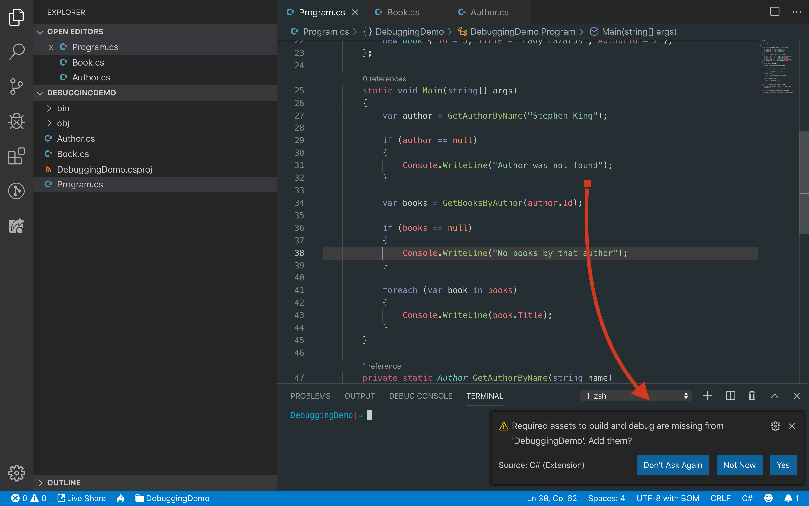
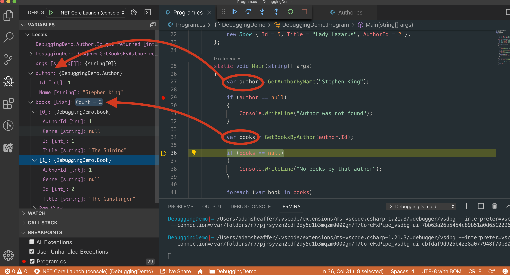

# Debugging

## Visual Studio Code

When first opening a C# project in VS Code, you may be presented with a dialog asking if you'd like to add assets that are required for debugging. Select Yes.



If you aren't presented with that window, you can select the Debugger icon on the left side of you VS Code window, hit the green Run button, and select .NET Core


This will create a `.vs` folder in your project that contains a `launch.json` and a `tasks.json` file. 

Open the `launch.json` file and find the "console" property. This propety can have 1 of 3 values

- **"integratedConsole"**: The output from statements such as `Console.WriteLine` will show up in a VS Code window called the Debug Console

- **"integratedTerminal"**: The output will show up in the terminal that is built into VS Code

- **"externalTerminal"**: The output will show up in your normal terminal window outside of VS Code.

For debugging most applications, you'll find the _intergratedTerminal_ option to be the most helpful. Set the console propety to that

```json
"console": "integratedTerminal",
```

## Breakpoints

Now that your project is set up for debugging, you can enable breakpoints. Breakpoints are spots in your code where execution will be paused. Once your application is paused in one of these breakpoints, you can easily debug your application by doing things like inspecting all the variables that are in scope, and stepping through the execution of your code line by line. To place a breakpoint in VS Code, hover your cursor to the left of the line number where you'd like to place it and click to add a red dot at the edge of the editor. To remove it, click the red dot again.


When in a breakpoint, you can hover over any variable that's in scope to find out its value. If hovering over a complex object, you can drill down into its individual properties to see their values as well.


You can also get a quick look at the values of all variables in the *Locals* window of your sidebar



You can step through the execution of your code using the controls that appear at the top of VS Code when paused in a breakpoint. The controls allow you to:

- **Step Over**: Execute the current line and move to the next line in the code.
- **Step Into**: If paused on a line that will invoke a method, you can step into that method and continue debugging.
- **Step Out**: If you've stepped into a method but want to return to where it was called from, you can step out of the current method.
- **Continue**: Go to either the next breakpoint, or if there are no more breakpoints, continue executing the program normally.
- **Refresh**: Start the program over again.
- **Stop**: Stop the program

While in a breakpoint, you can also execute any C# code by typing into the Debug Console at the bottom of your editor. This is the same as the console tab of you browser devtools

