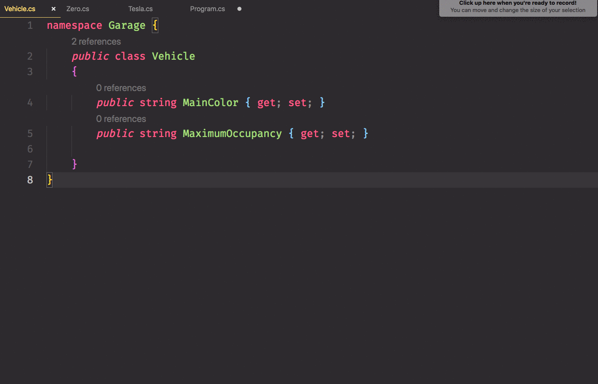
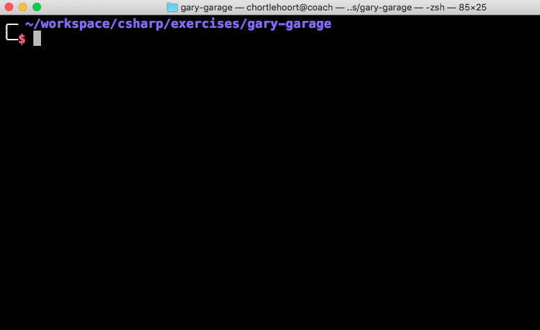
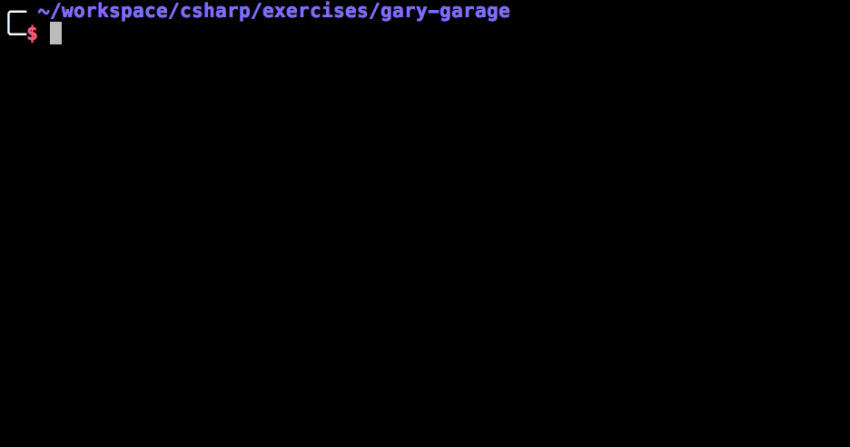
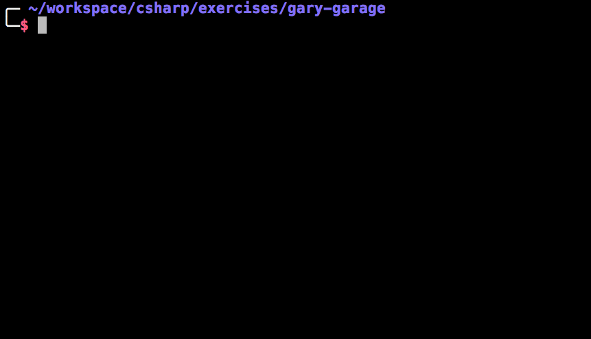

# Class Based Inheritance

Class based inheritance let's you specify that one type will contain **all** of the properties and methods that are defined in another type, without having to duplicate the code in the two source code files. Inheritance is a powerful feature of C#, but it should be used sparingly when you are defining many types in your program.

## Why Are You Learning This?

You will use inheritance to reduce the amount of duplicated code that can arise in a system with dozens of types that all share the **exact** same properties and/or methods. It's one of the mechanisms to introduce polymorphism into a program.

You will likely be asked about inheritance during the interview process and should be able to describe it in one of the following ways.

1. Allows one type to include all of the public properties and methods of another type.
1. It reduces duplicated code when many types in a program all have the same properties and methods.

## Gary's Wholesale Garage Revisited

You are going to use the vehicle classes from Gary's Wholesale Garage from the last chapter to learn about the basics of inheritance. Here's the code from the last chapter.

When considering interfaces, you examine your code to look for properties and methods that **some** of the classes have in common. When considering inheritance, you examine your code to look for properties and meethods that **all** of the classes have in common.

Are there any in the classes below?

```cs
public class Zero {  // Electric motorcycle
    public double BatteryKWh { get; set; }
    public string MainColor { get; set; }
    public string MaximumOccupancy { get; set; }

    public void ChargeBattery () { ... }
}
```

```cs
public class Cessna {  // Propellor light aircraft
    public double FuelCapacity { get; set; }
    public string MainColor { get; set; }
    public string MaximumOccupancy { get; set; }

    public void RefuelTank () { ... }
}
```

```cs
public class Tesla {  // Electric car
    public double BatteryKWh { get; set; }
    public string MainColor { get; set; }
    public string MaximumOccupancy { get; set; }

    public void ChargeBattery () { ... }
}
```

```cs
public class Ram {  // Gas powered truck
    public double FuelCapacity { get; set; }
    public string MainColor { get; set; }
    public string MaximumOccupancy { get; set; }

    public void RefuelTank () { ... }
}
```

That's right. They all share `MainColor` and `MaximumOccupancy`.

As you add more vehicle types to your system, it would get very tedious to keep defining those properties in each of those classes. It would also increase the possibililty of bugs being introduced. If your team decided to change the `MainColor` property to renamed to `BaseColor`, all of the classes would need to be changed. Since human beings are highly prone to error, a class could be missed during refactoring.

To avoid these kinds of problems, you are going to create a more general type in your system and then have all vehicles inherit from it.

## Vehicle Class

Since all of the types are vehicles, a good name for this new type would be `Vehicle`.

```cs
public class Vehicle
{
    public string MainColor { get; set; }
    public string MaximumOccupancy { get; set; }
}
```

Then each of the other, more specific, types would inherit from it. It's the same syntax as interfaces - a colon then the type.

```cs
public class Tesla : Vehicle {
    public double BatteryKWh { get; set; }

    public void ChargeBattery () { ... }
}
```

Now any instance of `Tesla` will have both of those properties on it automatically.



> **Note:** You might ask yourself what the difference between inheritance and interfaces are in this simple example. You could create a `ElectricCar` type, and a `GasCar` type and simply have the other classes inherit from them. Your instructor will present to you a more complex type system to see how relying upon inheritance can break down very quickly.

## Overriding Parent Behavior

To this point, you've seen how to inherit common properties from a parent class, and now you're going to implement a behavior on a parent class. Each child class will automatically inherit it, but then an **_override_** the default logic.

You can safely assume that each vehicle can be driven. What you would then do is implement a `Drive()` method on the **`Vehicle`** class.

```cs
public class Vehicle
{
    public string MainColor { get; set; }
    public string MaximumOccupancy { get; set; }

    public void Drive () {
        Console.WriteLine("Vrooom!");
    }
}
```

Once you do this, all of the specific vehicles can be driven. For now, however, they will all make the same sound, which is ridicuous because a plane doesn't sound like a truck which doesn't sound like a motorcycle.

```cs
Zero fxs = new Zero ();
Tesla modelS = new Tesla ();
Cessna mx410 = new Cessna ();

fxs.Drive();
modelS.Drive();
mx410.Drive();
```




To have each vehicle make its own sound, you need to do two things.

1. Define the `Drive()` method as virtual.

    ```cs
    public class Vehicle
    {
        public string MainColor { get; set; }
        public string MaximumOccupancy { get; set; }

        public virtual void Drive () {
            Console.WriteLine("Vrooom!");
        }
    }
    ```
1. Override the method in the child class.

    ```cs
    public class Cessna : Vehicle {
        public double FuelCapacity { get; set; }

        public void RefuelTank () { ... }

        public override void Drive () {
            Console.WriteLine("Zoooooom!");
        }
    }
    ```

Now you can run the program again and the Cessna will make a different noise.


## Practice: Custom Colors and Sounds

1. Move all common properties in your vehicles to a new **`Vehicle`** class.
1. Create an instance of each vehicle.
1. Define a different value for each vehicle's properties.
1. Create a `Drive()` method in the **`Vehicle`** class.
1. Override the `Drive()` method in all the other vehicle classes. Include the vehicle's color in the message _(i.e. "The blue Ram drives past. RRrrrrrummbbble!")_.
    
1. Create a `Turn(string direction)` mathod, and a `Stop()` method on **`Vehicle`**. Define a basic implementation of each.
1. Override all three of those methods on some of the vehicles. For example, the `Stop()` method for a plane would be to output the message _"The white Cessna rolls to a stop after rolling a mile down the runway."_
1. Make your vehicle instances perform all three behaviors.


