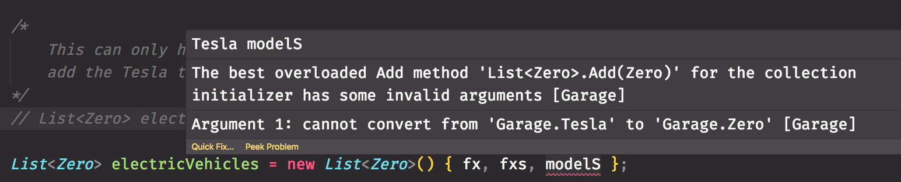
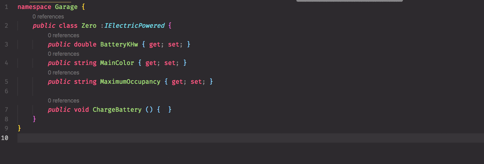

# Interfaces

An interface in C# is a construct that you define for classes to implement. Think of it as a contract for a class. If a class implements an interface, then it must define a method, property, or event for each one defined in the interface.

> **Instructor Note:** Have students read chapter first. Then lightning exercises leading to Flower Shop. Then cover lesson.

## Why Are You Learning This?

You will use interfaces to provide much more flexibility to your project to work with disparate types. It's one of the most powerful features of the C# language, and languages like it (e.g. Java).

You will also likely be asked about interfaces during the interview process. After working with interfaces during your time at Nashville Software School, you should be able to describe interfaces in the following ways.

1. Interfaces are a mechanism to introduce polymorphism into your system. They provide additional types to your classes.
1. They allow you to define common properties and behaviors among different classes in your system so that you can group them together into collections.
1. They are contracts that you and your team decide upon to ensure consistency and quality in the classes that you author.
1. Interfaces define what your class **should** do, but they can't specify **how** your class will do it.

## More Gary's Wholesale Garage

Here are some types of vehicles from **Gary's Wholesale Garage**.

1. Scooter
1. Car
1. Jetski
1. RV
1. Motorcycle
1. Boat
1. Truck
1. Light aircraft

Now, all of these types of things have some attributes and behaviors in common.

- They all have an engine
- They all carry one, or more, passenger
- They all move
- They all accelerate in any direction

There are other attributes and behaviors that **some** specific kinds of these vehicles share, but others don't.

- Some use gas
- Some are electric
- Some use a propeller to move
- Some have wheels
- Some have doors
- Some use a jet to move

## Gas Fueling Problem

Consider the following four classes representing some of these vehicles.

```cs
public class Zero  // Electric motorcycle
{
    public double BatteryKWh { get; set; }
    public string MainColor { get; set; }
    public string MaximumOccupancy { get; set; }

    public void ChargeBattery()
    {
        // method definition omitted
    }
}
```

```cs
public class Cessna  // Propellor light aircraft
{
    public double FuelCapacity { get; set; }
    public string MainColor { get; set; }
    public string MaximumOccupancy { get; set; }

    public void RefuelTank()
    {
        // method definition omitted
    }
}
```

```cs
public class Tesla  // Electric car
{
    public double BatteryKWh { get; set; }
    public string MainColor { get; set; }
    public string MaximumOccupancy { get; set; }

    public void ChargeBattery()
    {
        // method definition omitted
    }
}
```

```cs
public class Ram  // Gas powered truck
{
    public double FuelCapacity { get; set; }
    public string MainColor { get; set; }
    public string MaximumOccupancy { get; set; }

    public void RefuelTank()
    {
        // method definition omitted
    }
}
```

So you have two vehicles that are electric-powered and two that are standard gasoline-powered. You want to write code to send the correct vehicles to the correct fueling stations. Gas-powered go to the fuel pump, and the electric-powered go to the charging tower.

How do you put them into a single collection? Remember that a `List<>` can only contain things of a single type.

```cs
Zero fxs = new Zero();
Zero fx = new Zero();
Tesla modelS = new Tesla();

/*
    This can only hold individual motorcycles. You can't
    add the Tesla to this list. It's a different type.
    This is invalid code. The `modelS` is not of type Zero.
*/
List<Zero> electricVehicles = new List<Zero>() { fx, fxs, modelS };
```



## Fuel Interfaces

This is where you can use the power of interfaces. First, you determine what each of the items you want to group together have in common. For the electric vehicles, they share the `BatteryKWh` property and the `ChargeBattery()` method. You and your team agree that every electric-powered vehicle must have those two things on them - it's what makes them eletric vehicles. They can't be ommitted.

You create an interface that every electric vehicle class must implement. It's important to note that you **cannot** put logic in an interface. An interface simply lists the rules, or the contract, that a class must abide by. **_How_** the class abides by the rules is up to the individual class.

For example, this interface says that any class that implements it **must** have a `BatteryKHw` property. The developer can choose...

- If it has a getter and setter
- If the getter/setter have specific logic

Those are implementation details that an `interface` doesn't care about.

```cs
namespace Garage
{
    public interface IElectricPowered
    {
        double BatteryKWh { get; set; }

        void ChargeBattery();
    }
}
```

Likewise, the `ChargeBattery()` method can be implemented completely differently for a `Zero` and a `Tesla`. The interface doesn't care. It only cares that the classes have the method.

### Implementing IElectricPowered Interface

You tell the compiler that a class must implement an interface by putting a colon after the class name, followed by the interface.

#### Example Pattern

```cs
public class YourClassName : InterfaceToImplement
{
    // class definition omitted
}
```

Now you need to refactor the `Zero` and the `Tesla` classes to implement your new interface.

```cs
namespace Garage
{
    public class Zero : IElectricPowered
    {
        public double BatteryKWh { get; set; }
        public string MainColor { get; set; }
        public string MaximumOccupancy { get; set; }

        public void ChargeBattery()
        {
            // method definition omitted
        }
    }
}
```

```cs
namespace Garage
{
    public class Tesla : IElectricPowered
    {
        public double BatteryKWh { get; set; }
        public string MainColor { get; set; }
        public string MaximumOccupancy { get; set; }

        public void ChargeBattery()
        {
            // method definition omitted
        }
    }
}
```

The compiler will make sure that the developer implements everything in the interface, or the code won't compile. Watch what happens when I remove the `ChargeBattery()` method from my `Zero` class. I'm immediately informed by the compiler that my code has an error because I didn't implement something in the interface.



Now, once you implement everything in the interface in your class, something very cool emerges from that process. The `IElectricPowered` interface is **_also a type, just like `Zero` is_**.

Check this out. This is valid code now.

```cs
using System;
using System.Collections.Generic;

namespace Garage
{
    class Program
    {
        static void Main (string[] args)
        {
            Zero fxs = new Zero ();
            Zero fx = new Zero ();
            Tesla modelS = new Tesla ();

            List<IElectricPowered> electricVehicles = new List<IElectricPowered>();

            electricVehicles.Add(fx);
            electricVehicles.Add(fxs);
            electricVehicles.Add(modelS);
        }
    }
}
```

You are now able to add objects of completely different types, because they both now share another type of `IElectricPowered`!! That's pretty cool. Now you are able to group together electric vehicles in one list and gas vehicle in another.

```cs
namespace Garage
{
    class Program
    {
        static void Main (string[] args)
        {
            /*
                Create some electric vehicles, add them to a List
                and then iterate the List to charge all of their
                batteries.
            */
            Zero fxs = new Zero ();
            Zero fx = new Zero ();
            Tesla modelS = new Tesla ();

            List<IElectricPowered> electricVehicles = new List<IElectricPowered>() {
                fx, fxs, modelS
            };

            gasVehicles.ForEach(gv => gv.ChargeBattery());

            /*
                Create some gas vehicles, add them to a List
                and then iterate the List to fill all of their
                fuel tanks.
            */
            Ram ram = new Ram ();
            Cessna cessna150 = new Cessna ();

            List<IGasPowered> gasVehicles = new List<IGasPowered>() {
                ram, cessna150
            };

            gasVehicles.ForEach(gv => gv.RefuelTank());
        }
    }
}
```

## Zoological Zaniness

Imagine a scenario in which you are writing an application in which you need to classify any animal species as ground-based, air-based, or water-based. Also consider that animal species can be any combination of those classifications.

For example, a platypus is both ground and water. Most birds are both air and ground. Cats are ground only. Dolphins are water only. Seagulls are air, ground, and water (they can dive to amazing depths and are great swimmers). So many possible combinations of behavior in the animal kingdom!

🐯 🦅 🐎 🦈 🙎🏾‍♀️ 🦉

To make our code base as flexible as possible, we define the properties and behaviors of each classification (or description) into an interface. You are going to start with interfaces for animals that can walk and those that can swim.

```cs
public interface IWalking
{
    void Run();
    void Walk();
}

public interface ISwimming
{
    int MaximumDepth {get;}
    void Swim();
}
```

Now you can define a class as an implementation of the interface for a walking animal. You can start with an African Painted Dog.

```cs
public class PaintedDog : IWalking
{
}
```

Since it is a contract, we must implement the methods that were defined in the interface.

```cs
public class PaintedDog : IWalking
{
    public void Run()
    {
        Console.WriteLine("Animal is now running");
    }

    public void Walk()
    {
        Console.WriteLine("Animal is now walking");
    }
}
```

The `PaintedDog` class has now followed the rules of the interface, and implemented the two required methods that are required.

### Multiple Interfaces

A class can implement more than one interface. Let's use a Sea Turtle as an example, since they both swim in the ocean and walk on land.

```cs
class SeaTurtle : IWalking, ISwimming
{
    int MaximumDepth { get; } = 100;

    public void Run()
    {
        Console.WriteLine("Animal is now running");
    }

    public void Walk()
    {
        Console.WriteLine("Animal is now walking");
    }

    public void Swim()
    {
        Console.WriteLine("Animal is now swimming");
    }
}
```

Because you specified two interfaces, you had to provide an implementation for the properties and methods from both of them.

## Resources

- [Interface-based programming](https://en.wikipedia.org/wiki/Interface-based_programming)
- [Understanding Interface-based Programming](<https://msdn.microsoft.com/en-us/library/aa260635(v=vs.60).aspx>)

## Practice: Diggers and Fliers

As an avid animal lover, you have started your very own collection of creatures in your home. You can use the code from the lesson as a starting point to have interfaces for walking and swimming animals, but you want to have several other kinds in your collection.

This is the list of animals you want to own and care for.

1. Parakeets
1. Earthworms
1. [Terrapins](https://en.wikipedia.org/wiki/Terrapin)
1. Timber Rattlesnake
1. Mice
1. Ants
1. Finches
1. [Betta Fish](https://bettafish.org/)
1. Copperhead snake
1. Gerbils

Each month, you clean out all of the habitats in a single day for efficiency. On that day, all animals need to be put into temporary containers. Each container will hold animals of similar similar, but different, types.

- Animals that dig and live in the ground
- Animals that move about on the ground
- Animals that swim in water
- Animals that fly above the ground

1. Before you write any classes for the above animals, determine the common properties and behaviors that some of them share and define interfaces first.
1. Once you believe you have a good set of interfaces, then start creating your specific animal classes and have them implement the appropriate interface.
1. Then define classes to represent the containers that will hold various animals. Each container class should have a single property - a list to hold animal instances.
1. Lastly, in `Main()` create one (or more if you like) instances of each type of animal and each container. Then add the animals to their corresponding container.

<br/>
<br/>
<br/>
<br/>
<br/>
<br/>
<br/>
<br/>
<br/>
<br/>
<br/>
<br/>
<br/>
<br/>
<br/>
<br/>
<br/>
<br/>
<br/>
<br/>
<br/>
<br/>
<br/>
<br/>
<br/>
<br/>
<br/>
<br/>
<br/>
<br/>
<br/>
<br/>
<br/>
<br/>
<br/>
<br/>
<br/>
<br/>
<br/>
<br/>
<br/>
<br/>
<br/>
<br/>
<br/>
<br/>

[ø](https://github.com/nashville-software-school/bangazon-inc/wiki/InterfaceStrategy)
