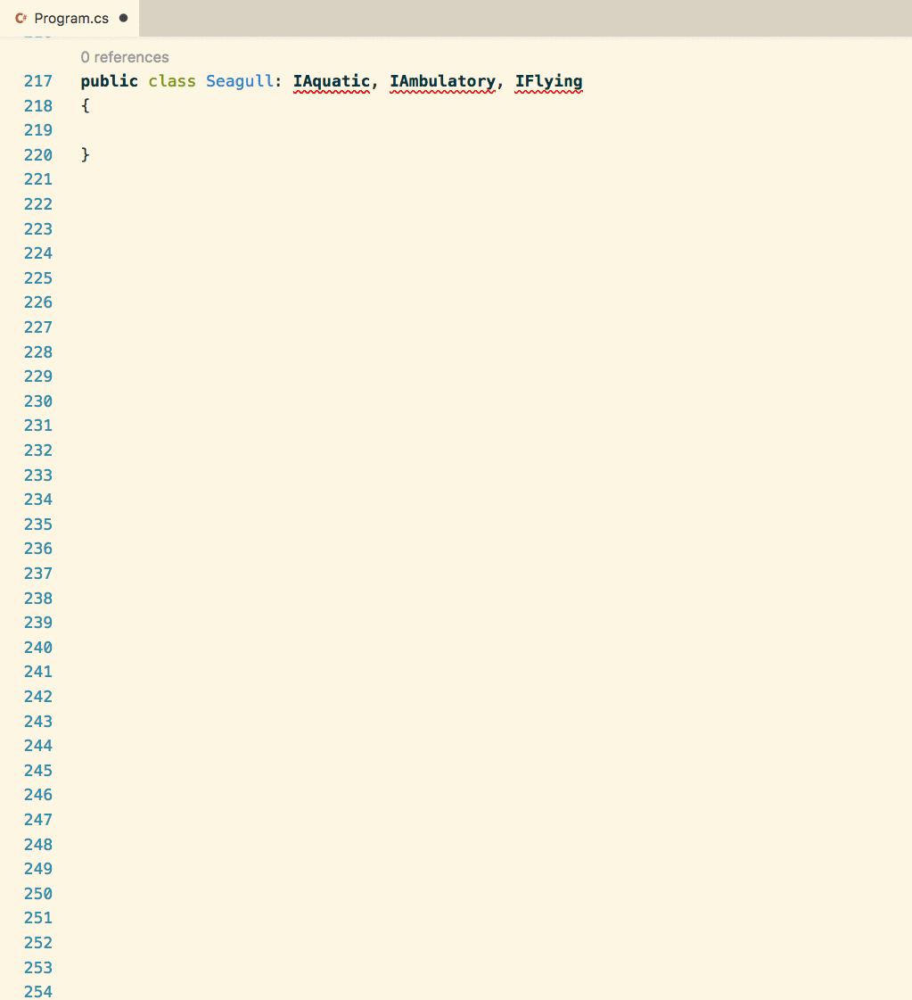

# Interfaces

An interface in C# is a construct that you define for classes to implement. Think of it as a contract for a class. If a class implements an interface, then it must define a method, property, or event for each one defined in the interface.

You use interfaces to provide much more flexibility to your project to work with disparate types. Here's an example.

## Gary's Wholesale Garage

You work for a company that sells all kinds of motorized vehicles - **Gary's Wholesale Garage**.

1. Scooter
1. Car
1. Jetski
1. RV
1. Motorcycle
1. Boat
1. Truck
1. Light aircraft

Now, all of these types of things have some attributes and behaviors in common.

* They all have an engine
* They all carry one, or more, passenger
* They all move
* They all accelerate in any direction

There are other attributes and behaviors that **some** specific kinds of these vehicles share, but others don't.

* Some use gas
* Some are electric
* Some use a propeller to move
* Some have wheels
* Some have doors
* Some use a jet to move

## Gas Fueling Problem

Consider the following four classes representing some of these vehicles.

```cs
public class Zero {  // Electric motorcycle
    public double BatteryKWh { get; set; }
    public string MainColor { get; set; }
    public string MaximumOccupancy { get; set; }

    public void ChargeBattery () { ... }
}
```

```cs
public class Cessna {  // Propellor light aircraft
    public double FuelCapacity { get; set; }
    public string MainColor { get; set; }
    public string MaximumOccupancy { get; set; }

    public void RefuelTank () { ... }
}
```

```cs
public class Tesla {  // Electric car
    public double BatteryKWh { get; set; }
    public string MainColor { get; set; }
    public string MaximumOccupancy { get; set; }

    public void ChargeBattery () { ... }
}
```

```cs
public class Ram {  // Gas powered truck
    public double FuelCapacity { get; set; }
    public string MainColor { get; set; }
    public string MaximumOccupancy { get; set; }

    public void RefuelTank () { ... }
}
```

So you have two vehicles that are electric-powered and two that are standard gasoline-powered. You want to write code to send the correct vehicles to the correct fueling stations. Gas-powered go to the fuel pump, and the electric-powered go to the charging tower.

How do you put them into a single collection? Remember that a `List<>` can only contain things of a single type.

```cs
Zero fxs = new Zero();
Zero fx = new Zero();
Tesla modelS = new Tesla();

/*
    This can only hold individual motorcycles. You can't
    add the Tesla to this list. It's a different type.
    This is invalid code. The `modelS` is not of type Zero.
*/
List<Zero> electricVehicles = new List<Zero>() { fx, fxs, modelS };
```


## Fuel Interfaces

This is where you can use the power of interfaces. First, you determine what each of the items you want to group together have in common. For the electric vehicles, they share the `BatteryKWh` property and the `ChargeBattery()` method. You and your team agree that every electric-powered vehicle must have those two things on them - it's what makes them eletric vehicles. They can't be ommitted.

You create an interface that every eletric vehicle class must implement. It's important to note that you **cannot** put logic in an interface. An interface simply lists the rules, or the contract, that a class must abide by. **_How_** the class abides by the rules is up to the individual class.

For example, this interface says that any class that implements it **must** have a `BatteryKHw` property. The developer can choose...

* If it is public or private
* If it has a getter and setter
* If the getter/setter have specific logic

Those are implementation details that an `interface` doesn't care about.

```cs
namespace Garage {
    public interface IElectricPowered {
        double BatteryKHw;

        void ChargeBattery ();
    }
}
```

Likewise, the `ChargeBattery()` method can be implemented completely differently for a `Zero` and a `Tesla`. The interface doesn't care. It only cares that the classes have the method.

### Implementing IElectricPowered Interface

You tell the compiler that a class must implement an interface by putting a colon after the class name, followed by the interface.

#### Example Pattern
```cs
public class YourClassName : InterfaceToImplement {}
```

Now you need to refactor the `Zero` and the `Tesla` classes to implement your new interface.

```cs
namespace Garage {
    public class Zero : IElectricPowered {
        public double BatteryKHw { get; set; }
        public string MainColor { get; set; }
        public string MaximumOccupancy { get; set; }

        public void ChargeBattery () {  }
    }
}
```

```cs
namespace Garage {
    public class Tesla : IElectricPowered {
        public double BatteryKHw { get; set; }
        public string MainColor { get; set; }
        public string MaximumOccupancy { get; set; }

        public void ChargeBattery () {  }
    }
}
```

The compiler will make sure that the developer implements everything in the interface, or the code won't compile. Watch what happens when I remove the `ChargeBattery()` method from my `Zero` class. I'm immediately informed by the compiler that my code has an exception because I didn't implement something in the interface.


Now, once you implement everything in the interface in your class, something very cool emerges from that process. The `IElectricPowered` interface is **_also a type, just like `Zero` is_**.

Check this out. This is valid code now.

```cs
using System;
using System.Collections.Generic;

namespace Garage {
    class Program {
        static void Main (string[] args) {
            Zero fxs = new Zero ();
            Zero fx = new Zero ();
            Tesla modelS = new Tesla ();

            List<IElectricPowered> electricVehicles = new List<IElectricPowered>();

            electricVehicles.Add(fx);
            electricVehicles.Add(fxs);
            electricVehicles.Add(modelS);
        }
    }
}
```

You are now able to add objects of completely different types, because they both now share another type of `IElectricPowered`!! That's pretty cool. Now you are able to group together electric vehicles in one list and gas vehicle in another.

```cs
namespace Garage {
    class Program {
        static void Main (string[] args) {
            /*
                Create some electric vehicles, add them to a List
                and then iterate the List to charge all of their
                batteries.
            */
            Zero fxs = new Zero ();
            Zero fx = new Zero ();
            Tesla modelS = new Tesla ();

            List<IElectricPowered> electricVehicles = new List<IElectricPowered>() {
                fx, fxs, modelS
            };

            gasVehicles.ForEach(gv => gv.ChargeBattery());

            /*
                Create some gas vehicles, add them to a List
                and then iterate the List to fill all of their
                fuel tanks.
            */
            Ram ram = new Ram ();
            Cessna cessna150 = new Cessna ();

            List<IGasPowered> gasVehicles = new List<IGasPowered>() {
                ram, cessna150
            };

            gasVehicles.ForEach(gv => gv.RefuelTank());
        }
    }
}
```

## Zoological Zaniness

Imagine a scenario in which you are writing an application in which you need to classify any animal species as ground-based, air-based, or water-based. Also consider that animal species can be any combination of those classifications. To make our code base as flexible as possible, we define the properties and behaviors of each classification (or description) into an interface.

```cs
public interface IWalking
{
    void run();
    void walk();
}

public interface IFlying
{
    void fly();
    void land();
}

public interface ISwimming
{
    int MaximumDepth {get;}
    void swim();
    void land();
}
```

We've defined three interfaces. One for land animals, one for aquatic animals, and one for flying animals. Here's how you would specify that a class must implement an interface.

```cs
public class PaintedDog : IWalking
{
}
```

Since it is a contract, we must implement the methods that were defined in the interface.

```cs
public class PaintedDog : IWalking
{
    public void run()
    {
        Console.WriteLine("Animal is now running");
    }

    public void walk()
    {
        Console.WriteLine("Animal is now walking");
    }
}
```


The `PaintedDog` class has now implemented the two methods required by the inteface that was designated. If you had not written the `walk()` function, the code would not compile and you would get a message like this.

```
'PaintedDog' does not implement interface member 'IWalking.walk()'
```

### Multiple Interfaces

A class can implement more than one interface. Let's use a flying squirrel as an example. They don't truly fly (they glide) but it's close enough for an example.

```cs
class FlyingSquirrel : IWalking, IFlying
{
    public void run()
    {
        Console.WriteLine("Animal is now running");
    }

    public void walk()
    {
        Console.WriteLine("Animal is now walking");
    }

    public void fly()
    {
        Console.WriteLine("Animal is now flying");
    }

    public void land()
    {
        Console.WriteLine("Animal is now on the ground");
    }
}
```

Let's look at another example of a class that would implement all three of the interfaces. Since this is orientation, and you're learning to use Visual Studio Code, we've included an animation that shows you how you can quickly implement interfaces for a class with some boilerplate code.

Paste this code into `Program.cs`, and the interfaces should now be underlined in red.

```cs
public class Seagull: ISwimming, IWalking, IFlying
{

}
```

Watch how to generate the boilerplate code.



# Dependency Inversion

Now that we've got a flexible system to define many different kinds of animals, our next task is to define an animal control person. The thing is, the painted dogs keep finding a way to escape their enclosure at a zoo, and we keep needing to hire an animal control specialist that specializes in capturing ground-based animals like dogs, cats, emus, etc.

We need to represent this actor in our software application so we can write logic to keep records of when the specialist captures the dog. Here's an initial code.

```cs
public class AnimalControl
{
    public string FirstName { get; set; }
    public string LastName { get; set; }
    public double HourlyRate { get; set; }

    public void Capture (PaintedDog dog)
    {
        // Logic to contain, sedate, and return the painted dog
    }
}
```

This certainly solves the problem at hand so we can perform the behavior of capturing an escaped dog. However, the experienced developer that has knowlede of, and practice in, the SOLID principles understand that *in the future*, it is highly like that the animal control specialist will be needed to capture other ground-based animals.

Therefore, the `Capture()` method must be rewritten to allow external code to pass in any ambulatory animal. This is the Dependency Inversion Principle.

```cs
public class AnimalControl
{
    public string FirstName { get; set; }
    public string LastName { get; set; }
    public double HourlyRate { get; set; }

    public void Capture (IWalking animal)
    {
        // Logic to contain, sedate, and return any ground-based animal
    }
}
```

Now, any object instance based on the `AnimalControl` class can capture any ground-based animal. In the previous code, they were locked into capturing dogs only.

## Resources

* [Interface-based programming](https://en.wikipedia.org/wiki/Interface-based_programming)
* [Understanding Interface-based Programming](https://msdn.microsoft.com/en-us/library/aa260635(v=vs.60).aspx)
* [The Dependency Inversion Principle](https://code.tutsplus.com/tutorials/solid-part-4-the-dependency-inversion-principle--net-36872)
* [Interface segregation principle](https://en.wikipedia.org/wiki/Interface_segregation_principle)

