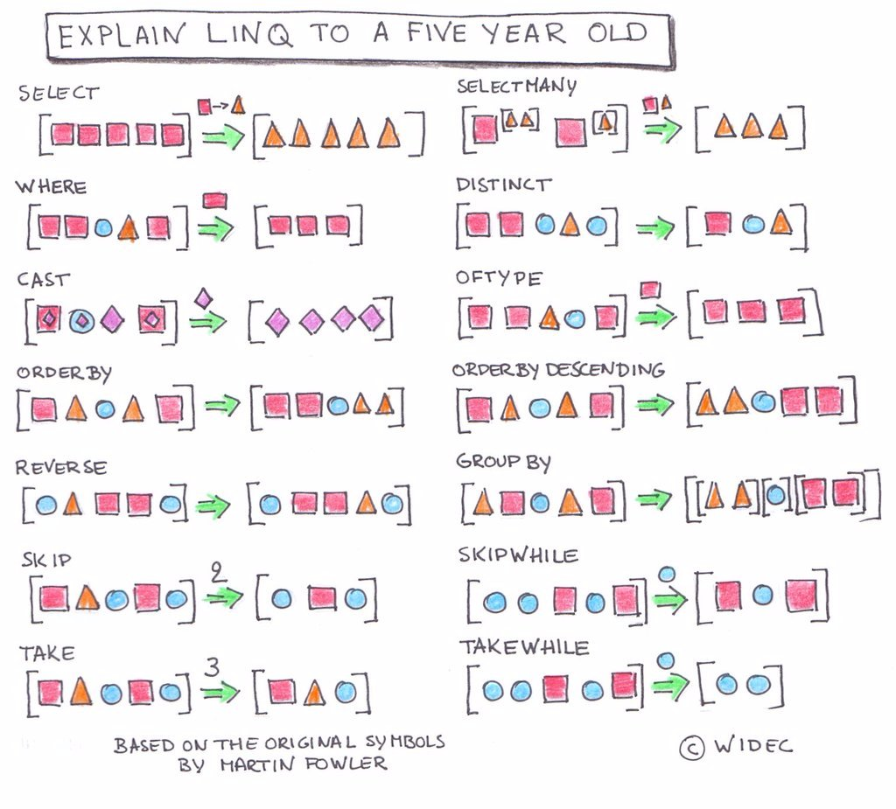

# Language Integrated Query

.NET Language-Integrated Query defines a set of general purpose standard query operators that allow traversal, filter, and projection operations to be expressed in a direct yet declarative way in any .NET-based programming language. The standard query operators allow queries to be applied to any `IEnumerable<T>`-based information source.

### Visualization of LINQ methods



## Selecting Items from a Collection

```cs
using System;
using System.Linq;
using System.Collections.Generic;

public class Program
{
    public static void Main() {
        /*
            Start with a collection that is of type IEnumerable, which
            List is and initialize it with some values. This is the
            class sizes for a selection of NSS cohorts.
        */
        List<int> cohortStudentCount = new List<int>()
        {
            25, 12, 28, 22, 11, 25, 27, 24, 19
        };

        /*
            Now we need to determine which cohorts fell within the range
            of acceptable size - between 20 and 26 students. Also, sort
            the new enumerable collection in ascending order.
        */
        IEnumerable<int> idealSizes = from count in cohortStudentCount
            where count < 27 && count > 19
            orderby count ascending
            select count;

        // Display each number that was the acceptable size
        foreach (int c in idealSizes)
        {
            Console.WriteLine($"{c}");
        }
    }
}
```

## Using Aggregation Methods

There are also helper methods that let you do aggregate calculations on collections, such as getting the sum of all numbers, or finding the maximum value. Let's looks at some examples.

```cs
List<int> cohortStudentCount = new List<int>()
{
    25, 12, 28, 22, 11, 25, 27, 24, 19
};
Console.WriteLine($"Largest cohort was {cohortStudentCount.Max()}");
Console.WriteLine($"Smallest cohort was {cohortStudentCount.Min()}");
Console.WriteLine($"Total students is {cohortStudentCount.Sum()}");

IEnumerable<int> idealSizes = from count in cohortStudentCount
    where count < 27 && count > 19
    orderby count ascending
    select count;

Console.WriteLine($"Average ideal size is {idealSizes.Average()}");

// The @ symbol lets you create multi-line strings in C#
Console.WriteLine($@"
There were {idealSizes.Count()} ideally sized cohorts
There have been {cohortStudentCount.Count()} total cohorts");
```

This produces the following output.

```sh
Largest cohort was 28
Smallest cohort was 11
Total students is 193
22
24
25
25
Average ideal size is 24

There were 4 ideally sized cohorts
There have been 9 total cohorts
```

## Selecting Using Properties of Objects

It's not just for built-in types. In the following code, I define a custom type for representing products in the system. I can then use LINQ to filter a collection based on the properties of the type.

```cs
using System;
using System.Linq;
using System.Collections.Generic;

public class Product
{
    /*
    Properties
    */
    public string Title { get; set; }
    public double Price { get; set; }

    // Constructor method
    public Product (string title, double price)
    {
        this.Title = title;
        this.Price = price;
    }
}

public class Program
{

    public static void Main() {
        /*
            We can use curly braces to create instances of objects
            and immediately inject them into the List.
        */
        List<Product> shoppingCart = new List<Product>(){
            new Product("Bike", 109.99),
            new Product("Mittens", 6.49),
            new Product("Lollipop", 0.50),
            new Product("Pocket Watch", 584.00)
        };

        /*
            IEnumerable is an interface, which we'll get to later,
            that we're using here to create a collection of Products
            that we can iterate over.
        */
        IEnumerable<Product> inexpensive = from product in shoppingCart
            where product.Price < 100.00
            orderby product.Price descending
            select product;

        foreach (Product p in inexpensive) {
            Console.WriteLine($"{p.Title} ${p.Price:f2}");
        }

        /*
            You can also use `var` when creating LINQ collections. The
            following variable will still be typed as List<Product> by
            the compiler, but you don't need to type that all out.
        */
        var expensive = from product in shoppingCart
            where product.Price >= 100.00
            orderby product.Price descending
            select product;
    }
}
```

## LINQ and Lambdas

Remember your anonymous function syntax that you learned about in the client-side course? It was nice, clean syntax to pass a function to another function, such as `forEach()` or `map()`, or `filter()` on an array.

```js
// Given this JavaScript array of numbers
const numbers = [9, -59, 23, 71, -74, 13, 52, 44, 2]

/*
    Use filter() method to build a new array of numbers that
    match two conditions. Then chain the sort() method to order
    them ascending
*/
let smallPositiveNumbers = numbers.filter(n => n < 40 && n > 0).sort((f, s) => f - s)
```

Luckily for you, you can use lambdas in C#, and the syntax is almost identical using LINQ.

```cs
// Give this C# List of numbers
List<int> numbers = new List<int>(){ 9, -59, 23, 71, -74, 13, 52, 44, 2 };

/*
    Use the IEnumerable Where() method to build a new array of
    numbers that match two conditions. Then chain the OrderBy()
    method to order them ascending
*/
var smallPositiveNumbers = numbers.Where(n => n < 40 && n > 0).OrderBy(n => n);

/*
    Use All() to see if every item in the collection passes the
    provided conditions.
*/
var allBetweenLarge = numbers.All(n => n > -100 && n < 400);  // true
var allBetweenSmall = numbers.All(n => n > -5 && n < 39);  // false
```

Here's some more examples of how JavaScript Array methods and LINQ are similar:

## Determine if every item in a collection passes a condition

```cs
// JavaScript
const sampleNumbers = [18, 9, 5, 6, 84, 2, 5, 13];
const allAreEven = sampleNumbers.every(number => number % 2 == 0 );

// LINQ
List<int> sampleNumbers = new List<int> {18, 9, 5, 6, 84, 2, 5, 13};
bool areAllEven = sampleNumbers.All(number => number % 2 == 0);
```

## Limit an array to the items that meet a criteria

```cs
// JavaScript
var onlyEvens = sampleNumbers.filter(number => number % 2 == 0);

// LINQ
IEnumerable<int> onlyEvens = sampleNumbers.Where(number => number % 2 == 0);
```

## Perform an action on each item in an array

```cs
// JavaScript
onlyEvens.forEach(evenValue => { console.log(evenValue + " is an even value"); });

// LINQ
onlyEvens.ToList().ForEach(evenValue => Console.WriteLine(evenValue + " is an even value"));
```

## Transform each value in a collection

```cs
// JavaScript
var sampleNumbersSquared = sampleNumbers.map(number => number * number);

// LINQ
IEnumerable<int> sampleNumbersSquared = sampleNumbers.Select(number => number * number);
```

## First matching item

```cs
// JavaScript
const small = sampleNumber.find(n => n < 5);

// LINQ
int small = sampleNumbers.Single(n => n < 5);
```

## Practice: LINQed List

### Setup

```
mkdir -p ~/workspace/csharp/exercises/linq && cd $_
dotnet new console
```

### References

* [Videos: What is LINQ?](https://www.youtube.com/watch?v=z3PowDJKOSA&list=PL6n9fhu94yhWi8K02Eqxp3Xyh_OmQ0Rp6)
* [Write LINQ queries in C#](https://docs.microsoft.com/en-us/dotnet/csharp/linq/write-linq-queries)
* [101 LINQ Samples](https://code.msdn.microsoft.com/101-LINQ-Samples-3fb9811b)

### Instructions

Given the collections of items shown below, use LINQ to build the requested collection, and then `Console.WriteLine()` each item in that resulting collection.

### Restriction/Filtering Operations

```cs
// Find the words in the collection that start with the letter 'L'
List<string> fruits = new List<string>() {"Lemon", "Apple", "Orange", "Lime", "Watermelon", "Loganberry"};

IEnumerable<string> LFruits = from fruit in fruits ...
```

```cs
// Which of the following numbers are multiples of 4 or 6
List<int> numbers = new List<int>()
{
    15, 8, 21, 24, 32, 13, 30, 12, 7, 54, 48, 4, 49, 96
};

IEnumerable<int> fourSixMultiples = numbers.Where();
```

### Ordering Operations

```cs
// Order these student names alphabetically, in descending order (Z to A)
List<string> names = new List<string>()
{
    "Heather", "James", "Xavier", "Michelle", "Brian", "Nina",
    "Kathleen", "Sophia", "Amir", "Douglas", "Zarley", "Beatrice",
    "Theodora", "William", "Svetlana", "Charisse", "Yolanda",
    "Gregorio", "Jean-Paul", "Evangelina", "Viktor", "Jacqueline",
    "Francisco", "Tre"
};

List<string> descend = ...
```

```cs
// Build a collection of these numbers sorted in ascending order
List<int> numbers = new List<int>()
{
    15, 8, 21, 24, 32, 13, 30, 12, 7, 54, 48, 4, 49, 96
};
```

### Aggregate Operations

```cs
// Output how many numbers are in this list
List<int> numbers = new List<int>()
{
    15, 8, 21, 24, 32, 13, 30, 12, 7, 54, 48, 4, 49, 96
};
```

```cs
// How much money have we made?
List<double> purchases = new List<double>()
{
    2340.29, 745.31, 21.76, 34.03, 4786.45, 879.45, 9442.85, 2454.63, 45.65
};
```

```cs
// What is our most expensive product?
List<double> prices = new List<double>()
{
    879.45, 9442.85, 2454.63, 45.65, 2340.29, 34.03, 4786.45, 745.31, 21.76
};
```

### Partitioning Operations

```cs
/*
    Store each number in the following List until a perfect square
    is detected.

    Ref: https://msdn.microsoft.com/en-us/library/system.math.sqrt(v=vs.110).aspx
*/
List<int> wheresSquaredo = new List<int>()
{
    66, 12, 8, 27, 82, 34, 7, 50, 19, 46, 81, 23, 30, 4, 68, 14
};
```

### Using Custom Types

```cs
// Build a collection of customers who are millionaires
public class Customer
{
    public string Name { get; set; }
    public double Balance { get; set; }
    public string Bank { get; set; }
}

public class Program
{
    public static void Main() {
        List<Customer> customers = new List<Customer>() {
            new Customer(){ Name="Bob Lesman", Balance=80345.66, Bank="FTB"},
            new Customer(){ Name="Joe Landy", Balance=9284756.21, Bank="WF"},
            new Customer(){ Name="Meg Ford", Balance=487233.01, Bank="BOA"},
            new Customer(){ Name="Peg Vale", Balance=7001449.92, Bank="BOA"},
            new Customer(){ Name="Mike Johnson", Balance=790872.12, Bank="WF"},
            new Customer(){ Name="Les Paul", Balance=8374892.54, Bank="WF"},
            new Customer(){ Name="Sid Crosby", Balance=957436.39, Bank="FTB"},
            new Customer(){ Name="Sarah Ng", Balance=56562389.85, Bank="FTB"},
            new Customer(){ Name="Tina Fey", Balance=1000000.00, Bank="CITI"},
            new Customer(){ Name="Sid Brown", Balance=49582.68, Bank="CITI"}
        };
    }
}
```

```cs
/*
    Given the same customer set, display how many millionaires per bank.
    Ref: https://stackoverflow.com/questions/7325278/group-by-in-linq

    Example Output:
    WF 2
    BOA 1
    FTB 1
    CITI 1
*/
```

### Introduction to Joining Two Related Collections

As a light introduction to working with relational databases, this example works with two collections of data - `banks` and `customers` - that are related through the `Bank` attribute on the customer. In that attribute, we store the abbreviation for a bank. However, we want to get the full name of the bank when we produce our output.

This is called joining the collections together.

This exercise is also an introduction to producing anonymous objects as the result of the LINQ statement.

Read the [Group Join](https://code.msdn.microsoft.com/LINQ-Join-Operators-dabef4e9#groupjoin) example to get started.

```cs
/*
    TASK:
    As in the previous exercise, you're going to output the millionaires,
    but you will also display the full name of the bank. You also need
    to sort the millionaires' names, ascending by their LAST name.

    Example output:
        Tina Fey at Citibank
        Joe Landy at Wells Fargo
        Sarah Ng at First Tennessee
        Les Paul at Wells Fargo
        Peg Vale at Bank of America
*/

// Define a bank
public class Bank
{
    public string Symbol { get; set; }
    public string Name { get; set; }
}

// Define a customer
public class Customer
{
    public string Name { get; set; }
    public double Balance { get; set; }
    public string Bank { get; set; }
}

public class Program
{
    public static void Main() {
        // Create some banks and store in a List
        List<Bank> banks = new List<Bank>() {
            new Bank(){ Name="First Tennessee", Symbol="FTB"},
            new Bank(){ Name="Wells Fargo", Symbol="WF"},
            new Bank(){ Name="Bank of America", Symbol="BOA"},
            new Bank(){ Name="Citibank", Symbol="CITI"},
        };

        // Create some customers and store in a List
        List<Customer> customers = new List<Customer>() {
            new Customer(){ Name="Bob Lesman", Balance=80345.66, Bank="FTB"},
            new Customer(){ Name="Joe Landy", Balance=9284756.21, Bank="WF"},
            new Customer(){ Name="Meg Ford", Balance=487233.01, Bank="BOA"},
            new Customer(){ Name="Peg Vale", Balance=7001449.92, Bank="BOA"},
            new Customer(){ Name="Mike Johnson", Balance=790872.12, Bank="WF"},
            new Customer(){ Name="Les Paul", Balance=8374892.54, Bank="WF"},
            new Customer(){ Name="Sid Crosby", Balance=957436.39, Bank="FTB"},
            new Customer(){ Name="Sarah Ng", Balance=56562389.85, Bank="FTB"},
            new Customer(){ Name="Tina Fey", Balance=1000000.00, Bank="CITI"},
            new Customer(){ Name="Sid Brown", Balance=49582.68, Bank="CITI"}
        };

        /*
            You will need to use the `Where()`
            and `Select()` methods to generate
            instances of the following class.

            public class ReportItem
            {
                public string CustomerName { get; set; }
                public string BankName { get; set; }
            }
        */
        List<ReportItem> millionaireReport = ...

        foreach (var item in millionaireReport)
        {
            Console.WriteLine($"{item.CustomerName} at {item.BankName}");
        }
    }
}
```

