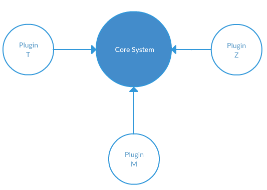

# Open - Closed Principle

#### Technical Explanation
> A satisfactory modular decomposition technique must satisfy one more requirement:
>
> It should yield modules that are both **open** and **closed**.
>
> * A module will be said to be **open** if it is available for extension. For example, it should be possible to add fields to the data structures it contains, or new elements to the set of functions it performs.
> * A module will be said to be **closed** if is available for use by other modules. This assumes that the module has been given a well-defined, stable description (the interface in the sense of information hiding). In the case of a programming language module, a **closed** module is one that may be compiled and stored in a library, for others to use. In the case of a design or specification module, closing a module simply means having it approved by management, adding it to the project's official repository of accepted software items (often called the project baseline), and publishing its interface for the benefit of other module designers.

## What does this mean?

Imagine a system that is architected so that it could be infinitely extendable by new code without having the modify a single line of code of the core system. Every module could have its behavior extended, or completely overridden. New features could be added to the system without modifying the system.

Seem impossible?

Consider the tools that you use on a day-to-day basis: modern code editors.

Ever installed a plugin that provides the ability to do something in the editor that the base installation couldn't? Well, you just witnessed a very powerful implementation of the Open-Closed Principle (OCP). The base program is very rarely changed, and yet plugin developers can quickly provide extensions of the core system to fill the needs of different developers.

What's amazing about this kind of architecture is that the plugins have the ability to know about much of the architecture of the core system, and yet the core system has zero knowledge of the plugins.



Let's take a look at a much simpler case study of the Open-Closed Principle. The code below involves two modules that represent a bank account, and a bank teller that is the interface between the account and a customer.

## Basic Bank & Teller System

```py
import locale

class BankAccount():

  def __init__(self):
    self.balance = 0
    self.account = None

  def add_money(self, amount):
    """Add money to a bank account

    Arguments:
      amount - A numerical value by which the bank account's balance will increase
    """
    self.balance += float(amount)

  def withdraw_money(self, amount):
    """Withdraw money to a bank account

    Arguments:
      amount - A numerical value by which the bank account's balance will decrease
    """
    pass
    self.balance -= float(amount)

  def show_balance(self):
    """Show formatted balance

    Arguments:
      None
    """
    locale.setlocale( locale.LC_ALL, '' )
    return locale.currency(self.balance, grouping=True)
```

```py
import os
from bank import *


class Teller():
  """This class is the interface to a customer's bank acccount"""

  def __init__(self):
    self.account = BankAccount()

  def build_menu(self):
    """Construct the main menu items for the command line user interface"""

    # Clear the console first
    os.system('cls' if os.name == 'nt' else 'clear')

    # Print all the options
    print("1. Add money")
    print("2. Withdraw money")
    print("3. Show balance")
    print("4. Quit")

  def main_menu(self):
    """Show teller options"""

    # Build the menu
    self.build_menu()

    # Wait for user input
    choice = input(">> ")

    # Perform the appropriate actions corresponding to user choice
    if choice == "1":
      deposit = input("How much? ")
      self.account.add_money(deposit)

    if choice == "2":
      withdrawal = input("How much? ")
      self.account.withdraw_money(withdrawal)

    if choice == "3":
      print(self.account.show_balance())
      input()

    # If the user chose anything except Quit, show the menu again
    if choice != "4":
      self.main_menu()


if __name__ == "__main__":
  teller = Teller()
  teller.main_menu()
```

The code appears to be fairly straightforward and accomplishes the task of providing an interface to the user of the system for the purposes of adding money, withdrawing money, and checking balances.

Unfortunately, it violates the OCP.

* It is not open, because it cannot be extended by other modules.
* It is not closed, because additional functionality requires modification of the existing code. Also, if we need to *modify* the logic of one of the actions

The first step is to determine what our core system is. What functionality do we need to write in such a way that it is extendable without needing to modify the core system?

## Define the Core System

Is it the `Teller` code? That's possible. The functionality of the teller may need to be expanded, or restricted in the future. However, in this basic example, all the `Teller` does is present an interface, accept input for each action, and then calls the appropriate method on the `BankAccount`.

Perhaps, then, the core system we need to define is a consistent way to build a user interface - specifically a command line menu - that can be used by any client. The menu building system should be open for extension, so new menu features can be added by anyone. It should be closed for modification, so the core system code should never have to be modified if a new feature is added.

# Menu Builder

If the core system is the building of a menu, let's create a `MenuBuilder` module. It should provide a way to add menu items, and a way to display the menu.

I'll start us off with a basic implementation.

```py
class MenuBuilder():
    """Responsible for building a command line menu system"""

    def __init__(self):
        self.__menu = list()

    def add(self, menu_item):
        self.__menu.append(menu_item)

    def show(self):
        # Clear the console
        os.system('cls' if os.name == 'nt' else 'clear')

        # Display each menu item
        for index, menu_item in enumerate(self.__menu):
            print("{}. {}".format(index+1, menu_item))

b = MenuBuilder()
b.add("Add money")
b.add("Withdraw money")
b.show()
```

Good, this generates a list of menu prompts in the terminal

```bash
1. Add money
2. Withdraw money
```

Next, I'll add logic to accept user input.

```py
def show(self):
    # Clear the console
    os.system('cls' if os.name == 'nt' else 'clear')

    # Display each menu item
    for index, menu_item in enumerate(self.__menu):
        print("{}. {}".format(index+1, menu_item))

    # Accept user choice
    choice = int(input(">> "))
```

Cool, it halts execution, awaiting the user to enter in a number.

```bash
1. Add money
2. Withdraw money
>>
```

So how do we define what logic should be executed when a user selects one of the options? Again, we're not going to put a giant if/else statement in this class to handle all possible options like it was done in the original `Teller` class above. That violates the OCP because it would require us to constantly modify this class whenever a new feature is added.

The answer is to let the client define what logic should be executed when a menu item is selected. That means that a menu item has two attributes:

1. The prompt to display to the human.
2. The logic to be performed if that prompt item is chosen.

Let's define a class that acts as an blueprint for our menu items.

> menuitem.py

```py
class MenuItem():

    def __init__(self, prompt, action):
        self.prompt = prompt
        self.action = action
```

We could just use tuples, but I like the fact that when a menu item is defined, it's clear in the code that it should have a prompt and an action defined.

Now the code need to perform the action that was chosen from the main menu being displayed. Let's look at the final code of the `show()` method.

```py
def show(self):
    # Clear the console
    os.system('cls' if os.name == 'nt' else 'clear')

    # Display each menu item
    for index, menu_item in enumerate(self.__menu):
        try:
            print("{}. {}".format(index+1, menu_item.prompt))
        except AttributeError:
            raise AttributeError('Could not display the prompt for the current menu item {}'.format(str(menu_item)))

    try:
        choice = int(input(">> "))

        # Invoke the class corresponding to the choice
        for menu_item in self.__menu:
            if choice == self.__menu.index(menu_item) + 1:
                menu_item.action()

    except KeyboardInterrupt:   # Handle ctrl+c
        exit()

    except ValueError:    # Handle any invalid choice
        pass

    self.show()    # Display the MenuItems
```

## It's Closed

Now we have a module that is closed for modification, and can be used by any other program or library. It has a clear interface for building a command-line menu system, and is infinitely flexible because it prescribes no contraints on the actual functionality of a menu system. It simply displays prompts, and then invokes the appropriate action based on what the user selects.

## It's Open

It's also open, because we can add as many elements (menu items) as we want to it's internal collection, and it will still function without any issues.


