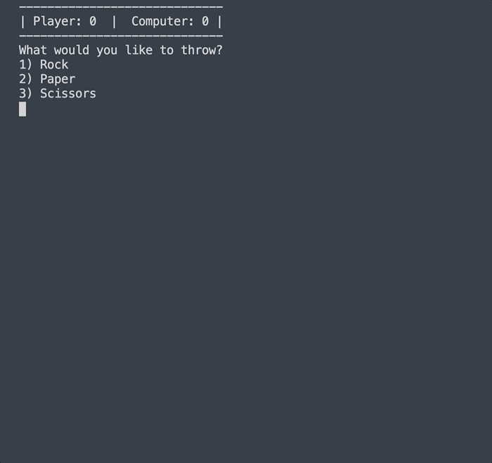

# Rock Paper Scissors

Program a rock paper scissors game as a console application. The user should play against the computer which makes random selections on each turn.

The game should end when either the user or the computer gets to 3 points. At that point the user should be shown a message saying either "YOU WIN" or "YOU LOSE" and the program should exit.

For ascii art:
https://gist.github.com/wynand1004/b5c521ea8392e9c6bfe101b025c39abe
