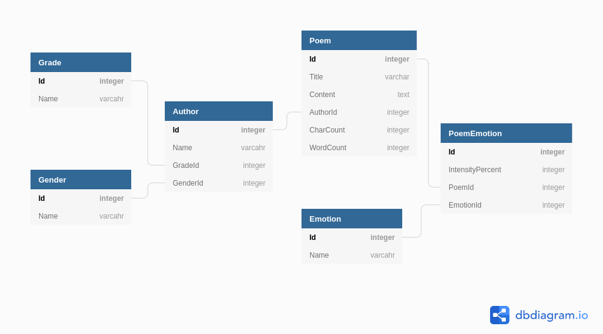

# SQL Exercise - Poems by Kids

> **Note:** The data in this exercise is derived from the datasets found [here](https://github.com/whipson/PoKi-Poems-by-Kids). An academic paper describing the PoKi project can be found [here](https://arxiv.org/abs/2004.06188)
> The data is used for education purposes with permission from the maintainer.

## Setup

1. Download [this SQL script](./assets/poki.sql)
1. Open Visual Studio
1. From Visual Studio's main menu, Select the `File` -> `Open` -> `File` menu option
1. Use the file explorer to navigated to and select the file you downloaded in _step 1_
1. The file will open in an editor window. Find and click the `Connect` near the upper-left of the editor 
1. In the `Connect` window, find and select your SQL Express database instance and click the `Connect` button
1. Back in the editor window click the `Execute` button or use the `Ctrl + SHift + E` shortcut to run the script
1. Open the SQL Server Object Explorer and expand the `Databases` node beneath your SQL Express instance. You should see a new database named `PoKi`
10. Open a new query window to the `PoKi` database. Use this editor window to write SQL to answer the questions below.

## PoKi ERD

## Investigating the Data

Query the `PoKi` database using SQL `SELECT` statements to answer the following questions.

1. How many poems are in the database?
1. How many authors are in the third grade?
1. How many authors are in each grade? (Order your results by grade starting with `1st Grade`)
1. How many poems are there per grade?
1. Which author(s) have the most poems? (Remember authors can have the same name.)
1. How many poems have an emotion of sadness?
1. How many poems are not associated with any emotion?
1. Which emotion is associated with the least number of poems?
1. Which grade has the largest number of poems with an emotion of joy?
1. Which gender has the least number of poems with an emotion of fear?

