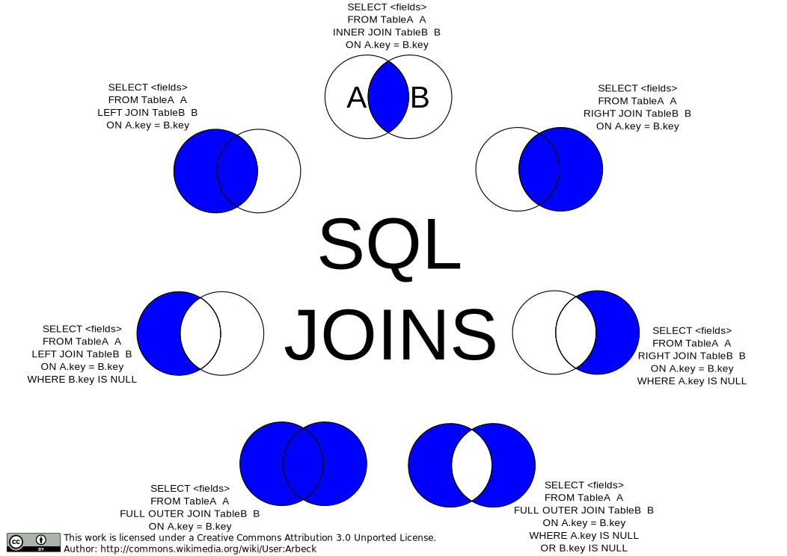

# Introduction to SQL with Music History

## What is SQL?

**Structured Query Language** (**SQL**) is the language for interacting with relational databases. It has commands for all the CRUD operations.

* **INSERT**: Create a new record in a table
* **SELECT**: Read records from a table or combination of joined tables
* **UPDATE**: Update records in a table
* **DELETE**: Delete records from a table

What is a **relational database**? A relational database is one that stores data in tables and allows you to specify the relationships between records in those tables.

## Setup

1. Open **Visual Studio**.
1. At the start screen select `Continue without code`.
1. Open the `View` menu and select `SQL Server Object Explorer`.
1. Expand the node for your SQL Server instance.
1. Right-click on "Databases" and select `Add new database`.
1. Name the new database `MusicHistory`.
1. Right click the `MusicHistory` database and choose `New Query`.
1. Run [this SQL script](./assets/musichistory.sqlserver.sql) to create tables in your database and insert some seed data.
1. Create a new query window You will be writing your SQL statements in this new, blank query window.

## Querying Data

Querying the database is how you ask for data that is stored in it. Here's some starter examples.

In the Music History database, there is a list of songs stored in the `Song` table. Here is how you would ask to see all of the rows in that table. You can specify every column in a table.

```sql
SELECT
    Id,
    Title,
    SongLength,
    ReleaseDate,
    GenreId,
    ArtistId,
    AlbumId
FROM Song;
```

However, if you only need information from a smaller set of columns, you can specify only those.

```sql
SELECT
    Id,
    Title,
    ReleaseDate
FROM Song;
```

A shortcut that you can use during development (but never in the final production code) is the asterisk - which mean select all columns. The following query is will return that same set of results that the first query above returned.

```sql
SELECT * FROM Song;
```

## Filtering Queries

The `WHERE` clause on a SQL query will filter the results. If you want to find songs that have a duration greater than 100 seconds, you would use the following query.

```sql
SELECT
    Id,
    Title,
    SongLength,
    ReleaseDate,
    GenreId,
    ArtistId,
    AlbumId
FROM Song
WHERE SongLength > 100
;
```

## Joining Tables

Use `JOIN`s to combine tables together into one result set.

```sql
SELECT s.Title,
       a.ArtistName
  FROM Song s
       LEFT JOIN Artist a on s.ArtistId = a.id;
```

### SQL Joins Visualized


## Creating New Data

Create a new row in the `Genre` table to represent techno music.

```sql
INSERT INTO Genre (Label) VALUES ('Techno');
```

## Updating Existing Data

Change the length (in seconds) for one of the songs.

```sql
select SongLength from Song where Id = 18;

-- The following is the output you get when you run the query above.
> 237

update Song
set SongLength = 515
where Id = 18;

-- Once you run the update statement, in order to make sure the value has changed, we run the select query again.
select SongLength from Song where Id = 18;
> 515
```

## Deleting Data

You can use the `DELETE` keyword to remove rows from your database tables.

```sql
delete from Song where Id = 18;
```

Be wary of leaving off the `WHERE` clause. The following SQL statement will remove **ALL ROWS** from the table.

```sql
delete from Song;
```


## References

* [SQLBolt Learn SQL with simple, interactive exercises.](https://sqlbolt.com/)
* [Introductory SQL tutorial](http://www.sqlcourse.com/)
* [W3schools interactive SQL tutorial](https://www.w3schools.com/sql/sql_intro.asp)
* [SQL Server Functions](https://www.w3schools.com/sqL/sql_ref_sqlserver.asp)

## Instructions

1. Using the **SQL Server Object Explorer** in Visual Studio, examine the tables, columns, and foreign keys of the database.
1. Using the `dbdiagram.io` site, create an ERD for the database.

For each of the following exercises, provide the appropriate query. Yes, even the ones that are expressed in the form of questions. Everything from class and the references listed above is fair game.

1. Query all of the entries in the `Genre` table
1. Query all the entries in the `Artist` table and order by the artist's name. HINT: use the ORDER BY keywords
1. Write a `SELECT` query that lists all the songs in the `Song` table and include the Artist name
1. Write a `SELECT` query that lists all the Artists that have a Pop Album
1. 1. Write a `SELECT` query that lists all the Artists that have a Jazz or Rock Album
1. Write a `SELECT` statement that lists the Albums with no songs
1. Using the `INSERT` statement, add one of your favorite artists to the `Artist` table.
1. Using the `INSERT` statement, add one, or more, albums by your artist to the `Album` table.
1. Using the `INSERT` statement, add some songs that are on that album to the `Song` table.
1. Write a `SELECT` query that provides the song titles, album title, and artist name for all of the data you just entered in. Use the [`LEFT JOIN`](https://www.tutorialspoint.com/sql/sql-using-joins.htm) keyword sequence to connect the tables, and the `WHERE` keyword to filter the results to the album and artist you added.
    > **Reminder:** Direction of join matters. Try the following statements and see the difference in results.

    ```
    SELECT a.Title, s.Title FROM Album a LEFT JOIN Song s ON s.AlbumId = a.Id;
    SELECT a.Title, s.Title FROM Song s LEFT JOIN Album a ON s.AlbumId = a.Id;
    ```
1. Write a `SELECT` statement to display how many songs exist for each album. You'll need to use the `COUNT()` function and the `GROUP BY` keyword sequence.
1. Write a `SELECT` statement to display how many songs exist for each artist. You'll need to use the `COUNT()` function and the `GROUP BY` keyword sequence.
1. Write a `SELECT` statement to display how many songs exist for each genre. You'll need to use the `COUNT()` function and the `GROUP BY` keyword sequence.
1. Write a `SELECT` query that lists the Artists that have put out records on more than one record label. Hint: When using `GROUP BY` instead of using a `WHERE` clause, use the [`HAVING`](https://www.tutorialspoint.com/sql/sql-having-clause.htm) keyword
1. Using `MAX()` function, write a select statement to find the album with the longest duration. The result should display the album title and the duration.
1. Using `MAX()` function, write a select statement to find the song with the longest duration. The result should display the song title and the duration.
1. Modify the previous query to also display the title of the album.
