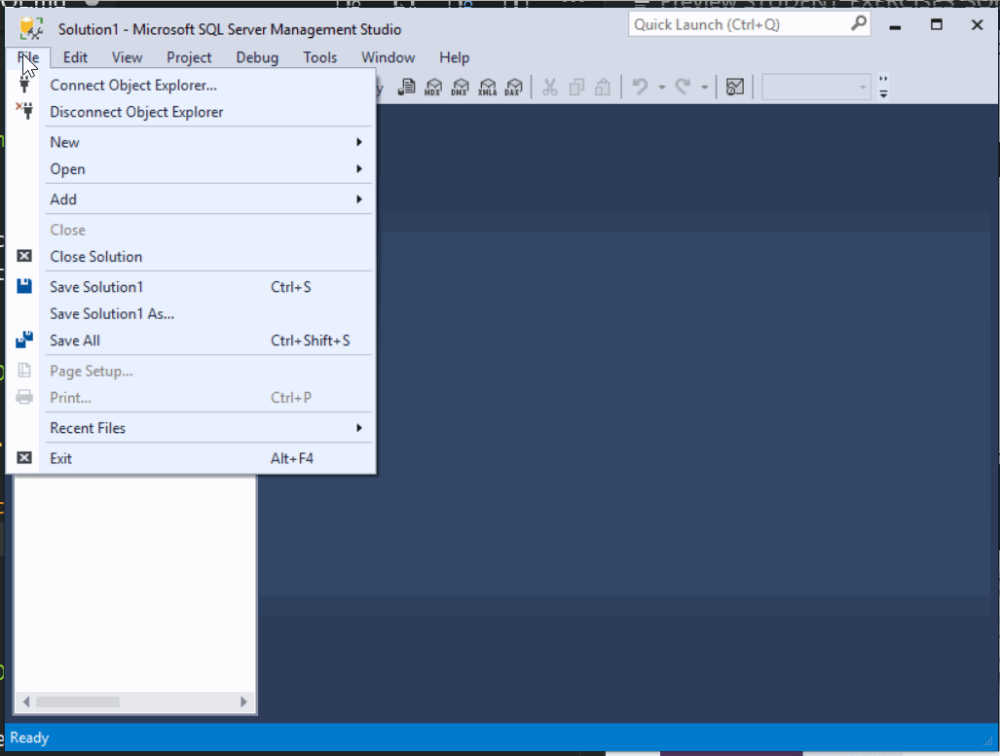
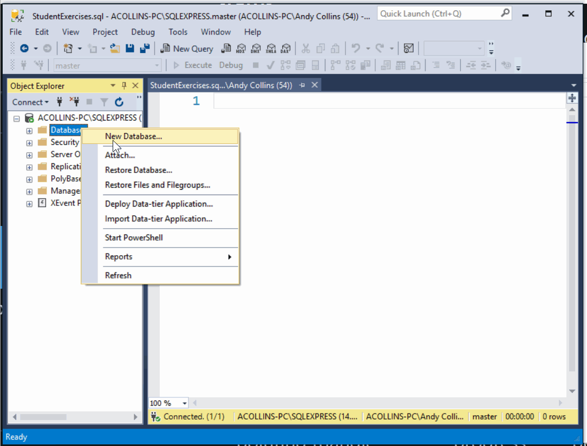
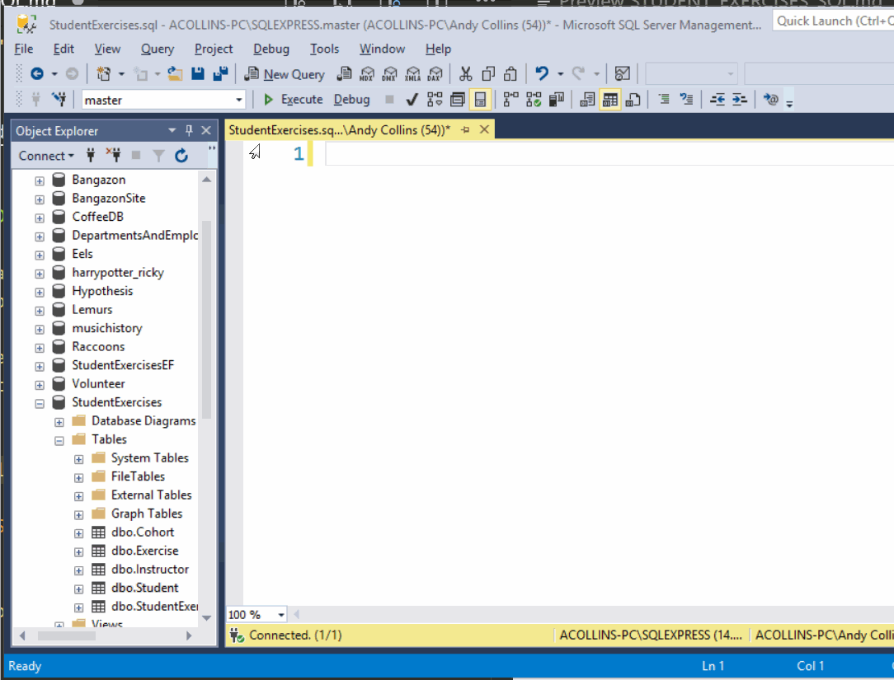
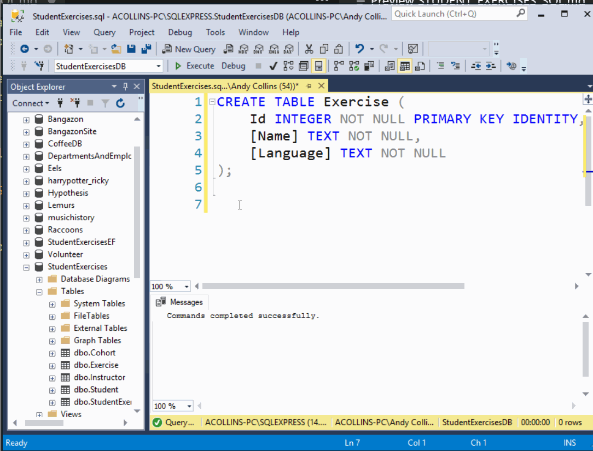

# Student Exercises Database

In this part of building your application, you will be creating the database tables and the data that you will be querying in your application logic later.

You will use `CREATE TABLE` statements and `INSERT` statements to create all the tables necessary for storing information about student exercises in a SQL Server database.

## Setup

### Create the Database Script File

```sh
cd ~/workspace/csharp/StudentExercises
touch StudentExercises.sql
```

## Open the Database Script for Editing

1. Open SSMS.
1. Using the "File" menu, open the `StudentExercises.sql` file.



## Create a new Database

1. In the Object Explorer, right-click the Databases node.
1. Click "New Database" in the pop-up menu.
1. Enter a name for the new database.
1. Click "Ok".




## Creating Data

1. Ensure that your database is selected in the database dropdown located above the Object Explorer.
1. In the Query Window, enter the SQL to create all of your tables, columns, and foreign key constraints.



Then use `INSERT` statements to create data in your tables.




## Instructions

1. Create tables from each entity in the Student Exercises ERD.
1. Populate each table with data. You should have 2-3 cohorts, 5-10 students, 4-8 instructors,  2-5 exercises and each student should be assigned 1-2 exercises.

