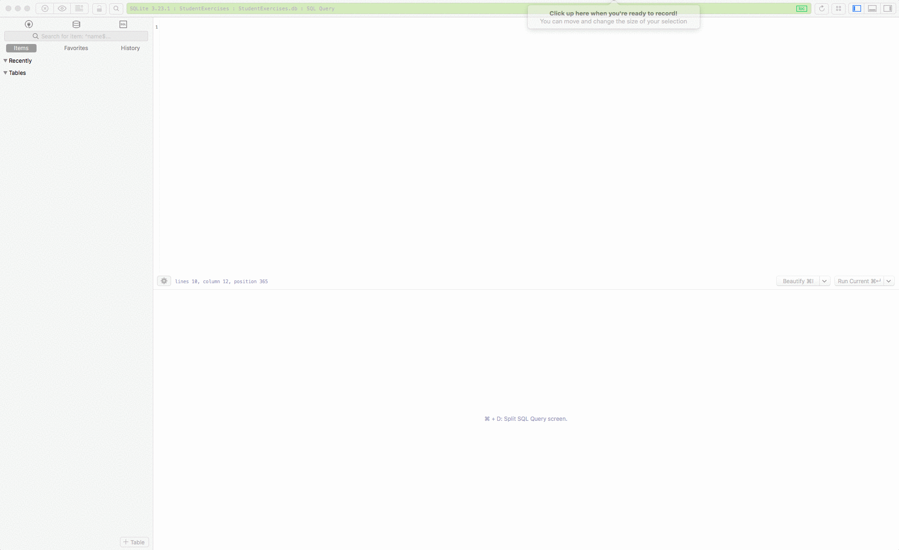

# Student Exercises Database

In this part of building your application, you will be creating the database tables and the data that you will be querying in your application logic later.

You will use `CREATE TABLE` statements and `INSERT` statements to create all the tables necessary for storing information about student exercises in a SQLite database.

## Setup

### Create the Database File

```sh
cd ~/workspace/csharp/StudentExercises
touch StudentExercises.db
```

## Open the Database for Editing

Using your database management tool, create a connection to the SQLite database file - `StudentExercises.db`. Then go to the SQL editing section of the application. The image below shows how to do it in TablePlus.


## Creating Data

First, create all of your tables, columns, and foreign key constraints.



Then use `INSERT` statements to create data in your tables.


