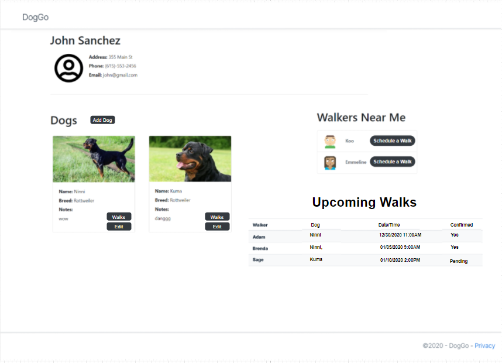
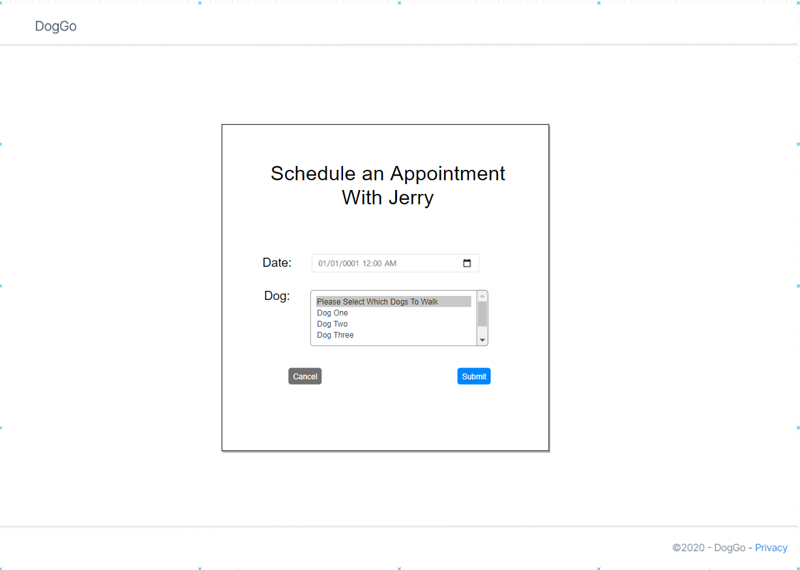
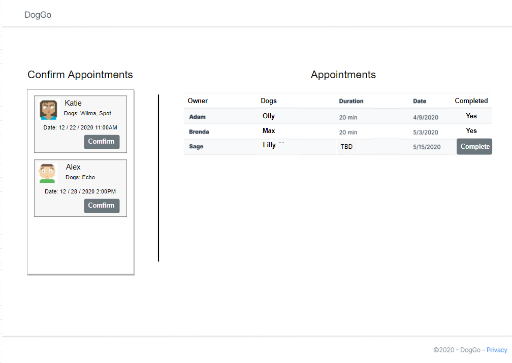
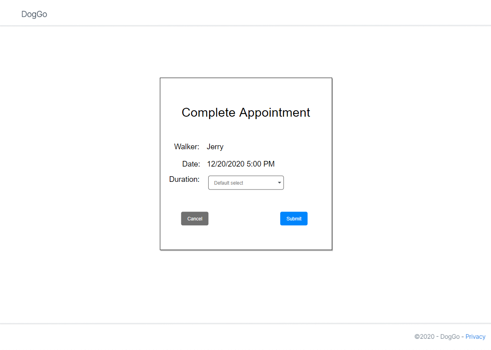
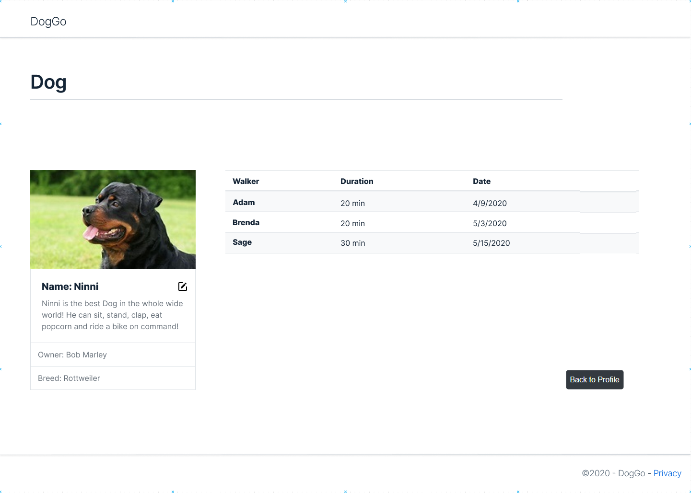

# Holiday Break MVC Project

1. Allow an Owner to pick a Walker from the Walkers Near Me list and then pick which dogs to be walked and a date/time which will create a Walk with a Requested status.

2. A Walker should be able to log in and see a list of all of their associated Walks

3. A Walker should be able to confirm Walk requests which will update their status so that they show up on their list of appointments.

4. A Walker should be able to see past and upcoming Walks and can click to Complete an appointment and add a Duration

5. An Owner looking at a Dog’s Details should be able to see a list of past walks associated with that Dog.

6. An Owner looking at their own Details should be able to see a list of Walk Requests including whether they are pending or confirmed.

7. An Owner looking at their own Details should be able to go see their specific dogs walks.

8. An Owner looiking at their own Details should also have buttons to add dogs and edit dogs they have already added.

9. On the login page users should be able to choose between logging in as an Owner or a Walker.

10. The Owners Create page should be turned into the registration page for Owners. (The page doesnt need to change other than maybe addinga new heading).

## Tips 

1. You will need to delete your current DogWalkerMVC database and run this new SQL script to update existing tables. (It adds an `Email` column to Walkers and a Status to a Walk)
[Holiday Break Project SQL](assets/DogWalkerHolidayProject.sql).
Here is the [updated ERD](https://dbdiagram.io/d/5fdb90a99a6c525a03bb7b45) with the additional columns and table

1. No need for a create page for Walker.

## WireFrames

### Owner's Details View

### Schedule Appointment View

### Appointment View

### Complete Appointment View

### Dog Details View

