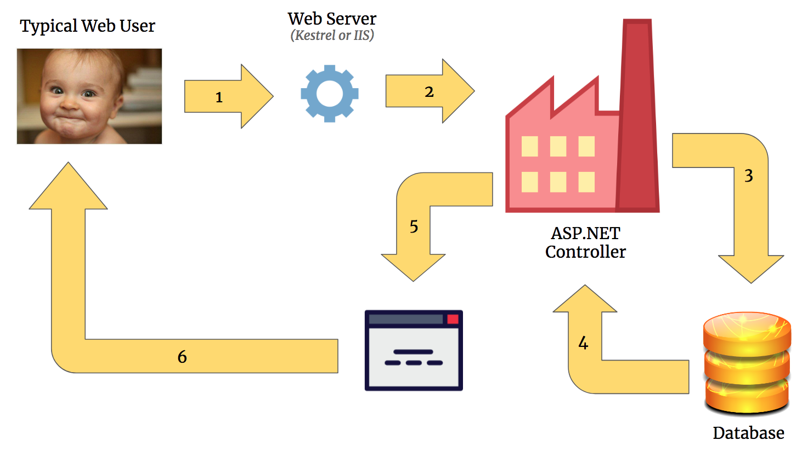

# Intro to MVC

In the front end course, you were used to building applications as react clients that would make fetch calls out to web APIs request data in the form of JSON.

This pattern of a JavaScript client application communicating with a Server API is sometimes called "Fullstack", sometimes "Client/Server" and sometimes "client-side rendering". This is a popular pattern for making web applications, but it's certainly not the only one.

An alternative to client-side rendering is server-side rendering. MVC, which stands for Model View Controller, is a popular pattern for server-side rendering applications.

## Rendering HTML

What do we mean by the term "rendering"? In the context of a web application we use the word "render" to refer to the process of dynamically generating HTML using some programming language.

In a React application we use a combination of JavaScript and JSX to render html inside the client. The rendering happens on the user's computer within their web browser.

In an MVC application we will use C# and a language called "Razor" to dynamically generate HTML on the server amd the HTML is then downloaded by the browser. In production this means the rendering happens on a computer somewhere on the Internet. During development we will be running the server within Visual Studio.

## Comparing Client and Server Rendering

Let's take an application that you built in the front end course, like Kennel, and consider how it would work using both architectures.

### Client-Side Rendering (React and JSON Web API)

Let's imagine a deployed version of the Kennels app built using React.

1. A user wants to see all the animals in Kennel, so they open their browser and make a request to `https://kennel.nss.com` in the url bar

1. The request gets handled by an nss server, and the server responds by sending all the react code back. Because it's a react application, almost all the code is javascript.

1. The browser immediately starts executing the react js code. Part of that code tells the browser to make a `fetch` call to `https://kennel.nss.com/api/animals` so the react app can get animal data in the form of JSON. If we were to pause this whole process right here, the user would see _some_ of the animal page, but would not see any animals listed since that data has not been returned yet.

1. The nss server receives the request made by the react app for animal data. It makes a call to the database to ask for all the saved information on the animals. The nss server then sends a response to the react app with all the animal information as JSON.

1. The react application now has all the animal information and can finish filling out the page by rendering each animal object to a visual component.

### Server-Side Rendering (MVC Pattern)

Now let's imagine a deployed version of the Kennels app built using MVC.

1. A user wants to see all the animals in Kennel, so they open their browser and make a request to `https://kennel.nss.com` in the url bar

1. The request gets handled by an nss server. The code running on the server knows that the user wants to see the web page with all the animals on it, so the server makes a call to the database to ask for all the saved information on the animals.

1. The server then takes the animal data returned by the database, and dynamically creates an html page.

1. The server sends the generated html page back to the browser along with whatever css and js is needed.



### Which is better?

The big difference here is that in the React app, most of the rendering is being done client side while with MVC, the rendering is being server side.

So which is better? By now you should know that the answer to this question is always "it depends." Both have their advantages and disadvantages, and in this course we'll explore both.

## Breaking down MVC further

### Models

We've touched on models before when we learned ADO<span>.</span>NET. A "model" is a kind of class whose properties match columns in a particular database table. We say it's a C# representation of a database table.

It is very important to remember that a model is just a C# class. It's a C# class that has a particular purpose, but in the end it's just a class.

If Kennel had an actual database, we could imagine an Animal table looking like this

```sql
CREATE TABLE Animal (
    Id      integer NOT NULL PRIMARY KEY IDENTITY,
    [Name]  varchar(80) NOT NULL,
    Breed   varchar(80),
    OwnerId integer NOT NULL,

    CONSTRAINT FK_AnimalOwner FOREIGN KEY(OwnerId) REFERENCES [Owner](Id)
);
```

This table stores the raw data for animals. When you query the database for an animal, you want to represent that data as an object in your code. Below is the most basic representation of that database table as a class.

```cs
using System.Collections.Generic;
using System.ComponentModel;
using System.ComponentModel.DataAnnotations;

namespace Kennel.Models
{
    public class Animal
    {
        public int Id { get; set; }
        public string Name { get; set; }
        public string Breed { get; set; }
        public int OwnerId { get; set; }
        public Owner Owner { get; set; }
    }
}
```

> **NOTE:** In addition to properties that are foriegn keys like `OwnerId`, we may also want to include a property for the entire foriegn entity. That is why there is a property for the Owner object.

### Views

In MVC, the View is sometimes refereed to as part of the Presentation Layer. It is an HTML template written in a language called "razor", and is similar to the JSX code you are used to writing in react except it has the power of C# instead of JS. If it is given the context of a C# object, it knows how to dynamically create HTML.

```html+razor
@model List<Kennel.Models.Animal>

<h1>All The Animals</h2>
@foreach(Animal animal in Model)
{
    <div class="animal__card">
        <h3>@animal.Name</h3>
        <h5>Breed: @animal.Breed</h5>
        <span>Animal is owned by @animal.Owner.Name</span>
    </div>
}
```

The First line of this code `@model List<Kennel.Models.Animal>` is telling the view what _type_ of object is going to be passed to it. In this case, the view is going to be passed a List of Animal objects. When the server has to respond a request for the homepage, the view will iterate over the list of animals and create a div element for each one. The html that gets generated will be what the server sends back to a user's browser.

### Controllers

First, controllers are just classes.

Second, the job of these controller classes is to handle incoming HTTP requests.

The controller has all of the logic needed to generate the  response requested by the client. It can validate the user, validate request data, query the database, contain logic for manipulating the data, and generate an HTML response.

```csharp
public class AnimalsController : Controller
{
    public ActionResult Index()
    {
        AnimalRepository repo = new AnimalRepository();
        List<Animal> animals = repo.GetAllAnimals();

        return View(animals);
    }
}
```

In this code, the controller is simply getting all the animals from the database and handing it to the View.
