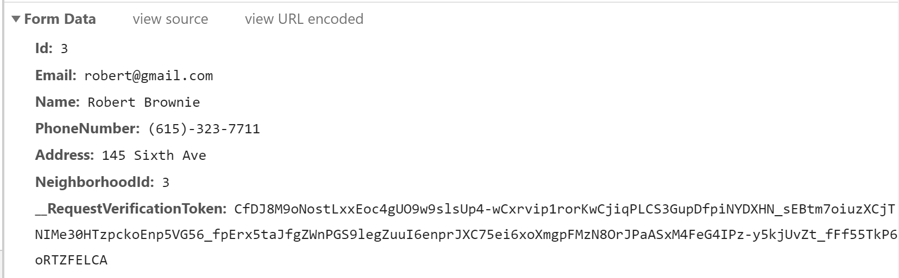

# Routing and HTTP Requests

The ASP.<span>NET</span> framework is great at taking in HTTP requests and knowing what controller methods to call. To get a better understanding of how it makes these decisions, lets look at some relevant parts of an HTTP request

### Verb

**NOTE** The actual term for this is "method", but we use that word enough

An HTTP request will have a verb like GET, POST, PUT, or DELETE. We can use different verbs at the same url. For instance, I can make a GET request to `https://doggo.com/owners/create` and I can also make a `POST` request to that same url.

### URL 

HTTP requests all get made to a url. The ASP.<span>NET</span> framework can make a lot of assumptions about how to handle those requests from the url's path. The url `https://doggo.com/owners/create` tips the framework off to look for an Owners controller and specifically a `Create` method.

Urls can also carry route parameters. These are parts of the url that typically hold things like IDs. If a request comes in at `https://doggo.com/owners/details/81`, the 81 part of that url is considered a route parameter. The framework will look for an `Details` method in an Owner controller and invoke it by passing in the value of 81 as the parameter

### Body

POST and PUT requests are likely to have a **body**. This is the thing we are actually submitting to the server. In our MVC apps, we're typically sending up _Form Data_. Here is a snapshot of the chrome developer tools while submitting the Owner Edit form to `/owners/edit/3`. This is the raw data that's being submitted to the server.



The framework knows how to take that raw data and convert it to an `Owner` object so it can pass it as a parameter to a method that looks like this

```csharp
[HttpPost]
public ActionResult Create(Owner owner)
{
    ...
}
```

## Exercise

Given the following Controller methods, what can you infer about the HTTP request that would be made to execute them?

> WalkersController.cs

```csharp
public ActionResult Details(int id)
{
    ...
}
```

> DogsController.cs

```csharp
public ActionResult Edit(int id)
{
    ...
}
```

> TacosController.cs

```csharp
public ActionResult Details(int id)
{
    ...
}
```

> DogsController.cs

```csharp
[HttpPost]
public ActionResult Create(Dog dog)
{
    ...
}
```

> DogsController.cs

```csharp
[HttpPost]
public ActionResult Edit(int id, Dog dog)
{
    ...
}
```

Given the following HTTP requests, what would the controller method look like that would handle them?

```
path: /owners/index
method: GET
```

```
path: /owners/details/96
method: GET
```

```
path: /dogs/create
method: GET
```

```
path: /dogs/create
method: POST
body: 
    Name: Delta
    Breed: Golden Retriever
    Notes: She will chase squirrels
```

```
path: walkers/delete/6
method: POST
body:
    Id: 6
    Name: Mellesa
    NeighborhoodId: 5
```
