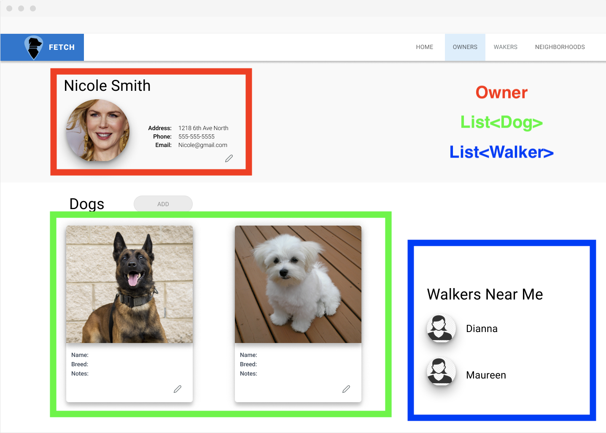
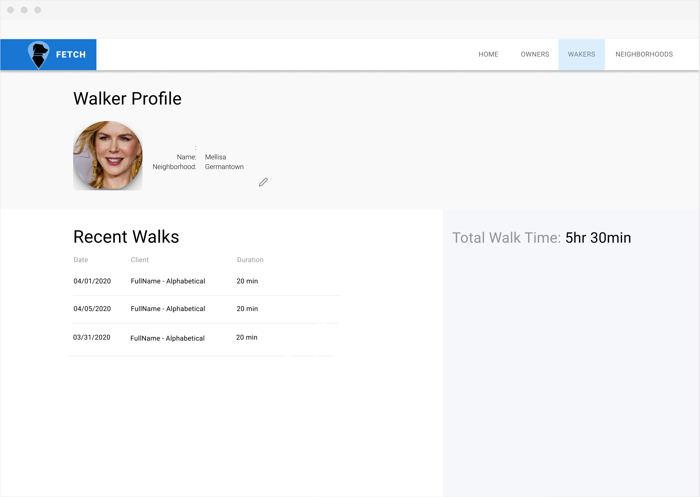

# View Models

We've seen how controllers are able to pass objects into our views, and how views expect a certain type of object. For example:

> OwnersController.cs

```csharp
public ActionResult Details(int id)
{
    ...

    return View(owner);
}
```

> Owners/Details.cshtml

```html+razor
@model DogWalker.Models.Owner

...

<dl class="row">
  <dt class = "col-sm-2">
    @Html.DisplayNameFor(model => model.Name)
  </dt>
  <dd class = "col-sm-10">
    @Html.DisplayFor(model => model.Name)
  </dd>
  <dt class = "col-sm-2">
    @Html.DisplayNameFor(model => model.Email)
  </dt>
  <dd class = "col-sm-10">
    @Html.DisplayFor(model => model.Email)
  </dd>
  <dt class = "col-sm-2">
    @Html.DisplayNameFor(model => model.PhoneNumber)
  </dt>
  <dd class = "col-sm-10">
    @Html.DisplayFor(model => model.PhoneNumber)
  </dd>
</dl>
```

In this example we can see that the `Details` method of the Owners Controller is passing an owner instance to the View. The view will then dynamically create some html using the properties of that object.

This works out fine if the page you're creating only requires owner information on it. Let's consider a more realistic scenario though. Say your designer asks that the Owner Details page of your application is a bit more complex. Here is the mockup you're given


This View now seems to require more data than just an Owner object. There's now information on the owner's dogs and walkers as well.

The problem is that in ASP<span>.NET</span>, we can only pass a View **one** type of thing. So how do we pass it multiple things?

The answer is to wrap all the things up in a single class called a View Model. The difference between regular models and view models is that regular models are meant to mimic the shape of our database tables. View models are meant to mimic the shape of our html pages. It may be helpful to think of view models as similar to react state. Looking at the mockup again, what are the things on the page that would belong in state?



- An Owner object
- A list of Dogs
- A list of Walkers

Let's create a View Model that contains all of these things. Create a directory inside of your `Models` folder and name it `ViewModels`. Within that folder, create a file called `ProfileViewModel.cs` and add the following code

```csharp
using System;
using System.Collections.Generic;

namespace DogWalker.Models.ViewModels
{
    public class ProfileViewModel
    {
        public Owner Owner { get; set; }
        public List<Walker> Walkers { get; set; }
        public List<Dog> Dogs { get; set; }
    }
}
```

We have a repository method already for getting a single owner, but we'll also need a method for getting a list of dogs by an owner Id, and method for getting a list of walkers in a given neighborhood.

Add this method to the `DogRepository`

> DogRepository.cs
```csharp
public List<Dog> GetDogsByOwnerId(int ownerId)
{
    using (SqlConnection conn = Connection)
    {
        conn.Open();

        using (SqlCommand cmd = conn.CreateCommand())
        {
            cmd.CommandText = @"
                SELECT Id, Name, Breed, Notes, ImageUrl, OwnerId 
                FROM Dog
                WHERE OwnerId = @ownerId
            ";

            cmd.Parameters.AddWithValue("@ownerId", ownerId);

            SqlDataReader reader = cmd.ExecuteReader();

            List<Dog> dogs = new List<Dog>();

            while (reader.Read())
            {
                Dog dog = new Dog()
                {
                    Id = reader.GetInt32(reader.GetOrdinal("Id")),
                    Name = reader.GetString(reader.GetOrdinal("Name")),
                    Breed = reader.GetString(reader.GetOrdinal("Breed")),
                    OwnerId = reader.GetInt32(reader.GetOrdinal("OwnerId"))
                };

                // Check if optional columns are null
                if (reader.IsDBNull(reader.GetOrdinal("Notes")) == false)
                {
                    dog.Notes = reader.GetString(reader.GetOrdinal("Notes"));
                }
                if (reader.IsDBNull(reader.GetOrdinal("ImageUrl")) == false)
                {
                    dog.ImageUrl = reader.GetString(reader.GetOrdinal("Notes"));
                }

                dogs.Add(dog);
            }
            reader.Close();
            return dogs;
        }
    }
}
```

Now update the Walkers Repository to add a method to get a list of walkers in a neighborhood

> WalkersRepository.cs

```csharp
public List<Walker> GetWalkersInNeighborhood(int neighborhoodId)
{
    using (SqlConnection conn = Connection)
    {
        conn.Open();
        using (SqlCommand cmd = conn.CreateCommand())
        {
            cmd.CommandText = @"
                SELECT Id, [Name], ImageUrl, NeighborhoodId
                FROM Walker
                WHERE NeighborhoodId = @neighborhoodId
            ";

            cmd.Parameters.AddWithValue("@neighborhoodId", neighborhoodId);

            SqlDataReader reader = cmd.ExecuteReader();

            List<Walker> walkers = new List<Walker>();
            while (reader.Read())
            {
                Walker walker = new Walker
                {
                    Id = reader.GetInt32(reader.GetOrdinal("Id")),
                    Name = reader.GetString(reader.GetOrdinal("Name")),
                    ImageUrl = reader.GetString(reader.GetOrdinal("ImageUrl")),
                    NeighborhoodId = reader.GetInt32(reader.GetOrdinal("NeighborhoodId"))
                };

                walkers.Add(walker);
            }

            reader.Close();

            return walkers;
        }
    }
}
```

Now that we have all the repository methods implemented, we can refactor the Owner Details method to create a ProfileViewModel. Change the `Details` method to use the following code

> OwnersController.cs 

```csharp
// GET: Owners/Details/5
public ActionResult Details(int id)
{
    OwnerRepository ownerRepo = new OwnerRepository(_config);
    WalkerRepository walkerRepo = new WalkerRepository(_config);
    DogRepository dogRepo = new DogRepository(_config);

    Owner owner = ownerRepo.GetOwnerById(id);
    List<Dog> dogs = dogRepo.GetDogsByOwnerId(owner.Id);
    List<Walker> walkers = walkerRepo.GetWalkersInNeighborhood(owner.NeighborhoodId);

    ProfileViewModel vm = new ProfileViewModel()
    {
        Owner = owner,
        Dogs = dogs,
        Walkers = walkers
    };

    return View(vm);
}
```

Try running the application now and going to `/owners/1` while logged in. You should see this error message

```
InvalidOperationException: The model item passed into the ViewDataDictionary is of type 'DogWalker.Models.ViewModels.ProfileViewModel', but this ViewDataDictionary instance requires a model item of type 'DogWalker.Models.Owner'
```

This is because the controller is now passing the view an instance of `ProfileViewModel` but the view is still expecting an `Owner`. Fix this by changing the first line of `Details.cshtml` to this

```html+razor
@model DogWalker.Models.ViewModels.ProfileViewModel
```

Now replace the rest of the view with the following code

```html+razor
@model DogWalker.Models.ViewModels.ProfileViewModel @{ ViewData["Title"] =
"Profile"; }
<div>
  <h1 class="mb-4">@Model.Owner.Name</h1>

  <section class="container">
    
    <div>
      <label class="font-weight-bold">Address:</label>
      <span>@Model.Owner.Address</span>
    </div>
    <div>
      <label class="font-weight-bold">Phone:</label>
      <span>@Model.Owner.PhoneNumber</span>
    </div>
    <div>
      <label class="font-weight-bold">Email:</label>
      <span>@Model.Owner.Email</span>
    </div>
  </section>

  <hr class="mt-5" />
  <div class="clearfix"></div>

  <div class="row">
    <section class="col-8 container mt-5">
      <h1 class="text-left">Dogs</h1>

      <div class="row">
        @foreach (Dog dog in Model.Dogs) {
        <div class="card m-4" style="width: 18rem;">
          @if (String.IsNullOrEmpty(dog.ImageUrl)) {
          
          } else {
          
          }
          <div class="card-body">
            <div>
              <label class="font-weight-bold">Name:</label>
              <span>@dog.Name</span>
            </div>
            <div>
              <label class="font-weight-bold">Breed:</label>
              <span>@dog.Breed</span>
            </div>
            <div>
              <label class="font-weight-bold">Notes:</label>
              <p>@dog.Notes</p>
            </div>
          </div>
        </div>
        }
      </div>
    </section>

    <section class="col-lg-4 col-md-8 container mt-5">
      <h1>Walkers Near Me</h1>

      <ul class="list-group mt-4">
        @foreach (Walker walker in Model.Walkers) {
        <li class="list-group-item disabled" aria-disabled="true">
          
          <span class="font-weight-bold ml-4">@walker.Name</span>
        </li>
        }
      </ul>
    </section>
  </div>
</div>
```

## Using View Models with Forms

Currently the Create and Edit forms for Owners have a text input field to collect an owner's neighborhood Id. It was mentioned ealier that we'd ideally like to have that be a dropdown list instead. We can make this happen with view models. Once again, lets think about what we'd need to have in _state_ if this were a React application. 

- Properties for all the Owner form fields
- A list of available options for the dropdown

Create a new class inside the ViewModels folder and name it `OwnerFormViewModel`. Add the following code

```csharp
using System.Collections.Generic;

namespace DogWalker.Models.ViewModels
{
    public class OwnerFormViewModel
    {
        public Owner Owner { get; set; }
        public List<Neighborhood> Neighborhoods { get; set; }
    }
}
```

We don't yet have a repository for Neighborhoods, so lets add that now. Create a `NeighborhoodRepository.cs` file in the repositories folder and add the following code

> NeighborhoodRepository.cs

```csharp
using DogWalker.Models;
using Microsoft.Data.SqlClient;
using Microsoft.Extensions.Configuration;
using System.Collections.Generic;

namespace DogWalker.Repositories
{
    public class NeighborhoodRepository
    {
        private readonly IConfiguration _config;

        public NeighborhoodRepository(IConfiguration config)
        {
            _config = config;
        }

        public SqlConnection Connection
        {
            get
            {
                return new SqlConnection(_config.GetConnectionString("DefaultConnection"));
            }
        }

        public List<Neighborhood> GetAll()
        {
            using (SqlConnection conn = Connection)
            {
                conn.Open();
                using (SqlCommand cmd = conn.CreateCommand())
                {
                    cmd.CommandText = @"SELECT Id, Name FROM Neighborhood";

                    SqlDataReader reader = cmd.ExecuteReader();

                    List<Neighborhood> neighborhoods = new List<Neighborhood>();

                    while (reader.Read())
                    {
                        Neighborhood neighborhood = new Neighborhood()
                        {
                            Id = reader.GetInt32(reader.GetOrdinal("Id")),
                            Name = reader.GetString(reader.GetOrdinal("Name"))
                        };
                        neighborhoods.Add(neighborhood);
                    }

                    reader.Close();

                    return neighborhoods;
                }
            }
        }
    }
}

```

Now update the GET `Create` method to now create a view model and pass it to the view

> OwnersController.cs

```csharp
// GET: Owners/Create
public ActionResult Create()
{
    NeighborhoodRepository neighborhoodRepo = new NeighborhoodRepository(_config);
    List<Neighborhood> neighborhoods = neighborhoodRepo.GetAll();

    OwnerFormViewModel vm = new OwnerFormViewModel()
    {
        Owner = new Owner(),
        Neighborhoods = neighborhoods
    };

    return View(vm);
}
```

Now update the view to accept an instance of an `OwnerFormViewModel` and change the NeighborhoodId field from an `<input>` to a `<select>` 

```html+razor
@model DogWalker.Models.ViewModels.OwnerFormViewModel

@{
    ViewData["Title"] = "Create";
}

<h1>Create</h1>

<h4>Owner</h4>
<hr />
<div class="row">
    <div class="col-md-4">
        <form asp-action="Create">
            <div asp-validation-summary="ModelOnly" class="text-danger"></div>
            <div class="form-group">
                <label asp-for="Owner.Email" class="control-label"></label>
                <input asp-for="Owner.Email" class="form-control" />
                <span asp-validation-for="Owner.Email" class="text-danger"></span>
            </div>
            <div class="form-group">
                <label asp-for="Owner.Name" class="control-label"></label>
                <input asp-for="Owner.Name" class="form-control" />
                <span asp-validation-for="Owner.Name" class="text-danger"></span>
            </div>
            <div class="form-group">
                <label asp-for="Owner.PhoneNumber" class="control-label"></label>
                <input asp-for="Owner.PhoneNumber" class="form-control" />
                <span asp-validation-for="Owner.PhoneNumber" class="text-danger"></span>
            </div>
            <div class="form-group">
                <label asp-for="Owner.Address" class="control-label"></label>
                <input asp-for="Owner.Address" class="form-control" />
                <span asp-validation-for="Owner.Address" class="text-danger"></span>
            </div>
            <div class="form-group">
                <label asp-for="Owner.NeighborhoodId" class="control-label"></label>
                <select asp-for="Owner.NeighborhoodId" class="form-control">
                    <option value="">Select Neighborhood</option>
                    @foreach (Neighborhood neighborhood in Model.Neighborhoods)
                    {
                        <option value="@neighborhood.Id">@neighborhood.Name</option>
                    }
                </select>
                <span asp-validation-for="Owner.NeighborhoodId" class="text-danger"></span>
            </div>
            <div class="form-group">
                <input type="submit" value="Create" class="btn btn-primary" />
            </div>
        </form>
    </div>
</div>

<div>
    <a asp-action="Index">Back to List</a>
</div>
```

## Exercise

1. Update the `/owner/edit/{id}` route to use the `OwnerFormViewModel` so that the Neighborhood Id uses a dropdown instead of an input. field. 

1. Try to implement the following design for the walker details page at `/walkers/details/{id}`. Hint: Use the `DateTime` class to help format the date strings.


