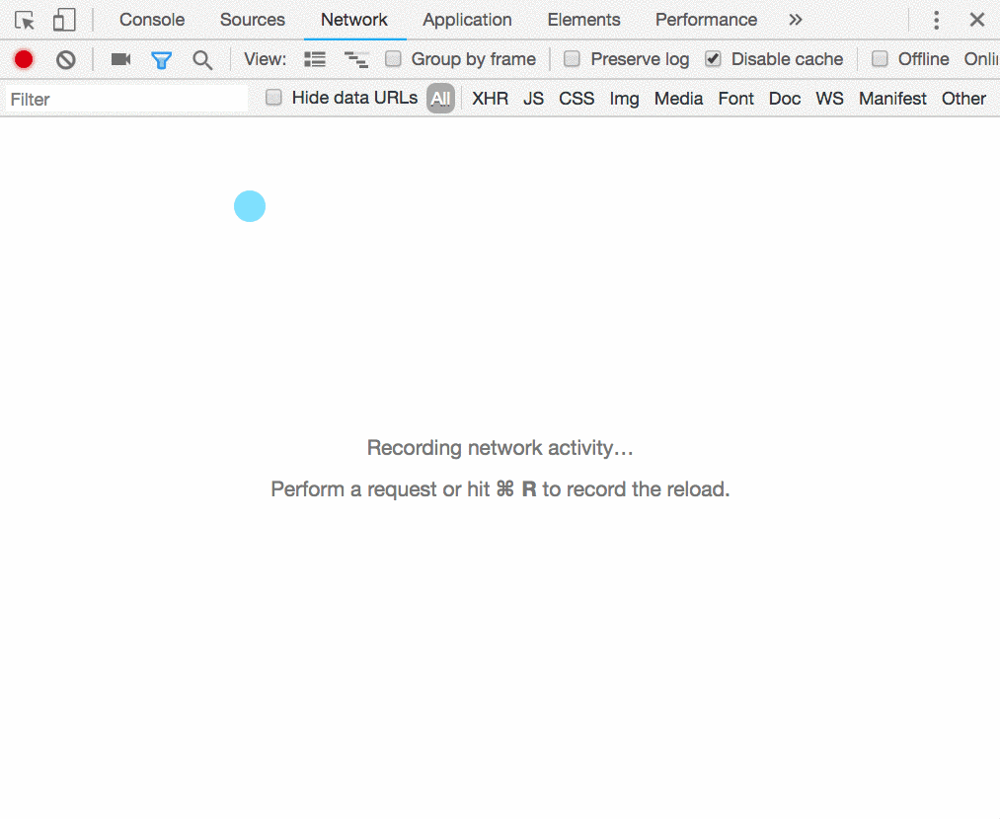

# Query String and Route Parameters

You can send data to the server in your request in three main ways.

1. In the body of the request.
1. As a route parameter.
1. As a query string parameter.

## Request Body

You learned how to do this in JavaScript using `fetch`. Here's a JavaScript request to your `cohorts` resource in your API.

```js
fetch("http://localhost:5000/cohorts", {
    "method": "POST",
    "headers": {
        "Content-Type": "application/json"
    },
    "body": JSON.stringify({
        "name": "Day 26"
    })
})
.then(res => res.json())
.then(console.table)
```

You can view the body request by looking in your Network tab of Chrome Developer Tools, clicking on the request, and scrolling to the bottom.



## Route Parameters

A route parameter is part of the route itself. For example, if you want to get a single student, you would GET the following URL.

```sh
http://localhost:5000/students/1
```

The `1` at the end of the URL is a route parameter.

This kind of parameter is handled in a controller method by specifying the `[FromRoute]` attribute in the argument list. The following method will create a variable `id` and store the value of `1` in it.

```cs
public async Task<IActionResult> Get([FromRoute]int id)
```

## Query String Parameters

Anything after the route and preceded by a question mark is a query string parameter.

```sh
http://localhost:5000/students?cohort=13
```

The `cohort` in the URL above is a query string parameter. It's value is `13`. You can provide as many query string parameters as you want.

```sh
http://localhost:5000/students?cohort=13&orderBy=lastname&limit=5
```

To get the value of each of those query string parameters, you specify each in the argument list. Any arguments with no attribute in front of them will instruct ASP.NET to look in the query string parameters for the values.

> **Note:** The variable names you define in the argument list must match the name in the URL. If you changed `string orderBy` to `string orderColumn`, then it would not capture `lastname` from the URL above.

```cs
public async Task<IActionResult> Get(int? cohort, string orderBy, int limit)
```
