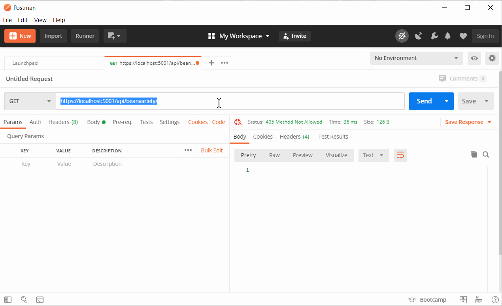

# ASP<span>.NET</span> Core Web API

In this chapter we'll walk through creating a "Coffee Shop" Web API in ASP<span>.NET</span> Core. When it's complete our API will expose resources for `Coffee` and `BeanVariety`.

* Coffee - https://localhost:5001/api/coffee
* BeanVariety - https://localhost:5001/api/beanvariety

## Setting up the database

Review and run [this SQL script](./sql/CoffeeShop.sql) to create the `CoffeeShop` database.

In this chapter we'll be focused on the `BeanVariety` entity and you'll work with the `Coffee` entity in the exercise.

```sql
CREATE TABLE BeanVariety (
    Id INTEGER NOT NULL PRIMARY KEY IDENTITY,
    [Name] VARCHAR(50) NOT NULL,
    Region VARCHAR(255) NOT NULL,
    Notes TEXT
);
```

## Project Setup

1. Open Visual Studio
1. Select "Create a new project"
1. In the "Create a new project" dialog, choose the C# "ASP<span>.NET</span> Core web application" option
1. Name the project "CoffeeShop"
1. In the "Create a new ASP<span>.NET</span> Core web application" dialog choose "API"
1. In Solution Explorer, right click the name of the project and select "Manage Nuget Packages". Install the `Microsoft.Data.SqlClient` pacakge

You now have an ASP<span>.NET</span> Core Web API project. Spend some time looking around the code that Visual Studio generated. You'll find several familiar items.

As in an MVC project, a Web API project has an `appsettings.json` file to store configuration information for the app. Update the `appsettings.json` file to contain the database connection string.

> appsettings.json

```json
{
  "Logging": {
    "LogLevel": {
      "Default": "Information",
      "Microsoft": "Warning",
      "Microsoft.Hosting.Lifetime": "Information"
    }
  },
  "AllowedHosts": "*",
  "ConnectionStrings": {
    "DefaultConnection":  "server=localhost\\SQLExpress;database=CoffeeShop;integrated security=true"
  }
}
```

## Models

Models (a,k.a _data models_) in Web API are exactly the same as in MVC. They are simple classes containing properties that correspond to columns in a database table. We can even use the same `DataAnnotations` as we used in MVC.

Create a `Models` folder and add a `BeanVariety` class.

> Models/BeanVariety.cs

```cs
using System.ComponentModel.DataAnnotations;

namespace CoffeeShop.Models
{
    public class BeanVariety
    {
        public int Id { get; set; }

        [Required]
        [StringLength(50, MinimumLength = 3)]
        public string Name { get; set; }

        [Required]
        [StringLength(255, MinimumLength = 3)]
        public string Region { get; set; }

        public string Notes { get; set; }
    }
}
```

## Repositories

We can use the [Repository Pattern](https://www.c-sharpcorner.com/article/repository-pattern-with-ado-net-in-mvc/) when building a Web API just as we did with MVC and console applications.

Create a `Repositories` directory and a `BeanVarietyRepository` class.

> Repositories/BeanVarietyRepository.cs

```cs
using System;
using System.Collections.Generic;
using Microsoft.Data.SqlClient;
using Microsoft.Extensions.Configuration;
using CoffeeShop.Models;

namespace CoffeeShop.Repositories
{
    public class BeanVarietyRepository
    {
        private readonly string _connectionString;
        public BeanVarietyRepository(IConfiguration configuration)
        {
            _connectionString = configuration.GetConnectionString("DefaultConnection");
        }

        private SqlConnection Connection
        {
            get { return new SqlConnection(_connectionString); }
        }

        public List<BeanVariety> GetAll()
        {
            using (var conn = Connection)
            {
                conn.Open();
                using (var cmd = conn.CreateCommand())
                {
                    cmd.CommandText = "SELECT Id, [Name], Region, Notes FROM BeanVariety;";
                    var reader = cmd.ExecuteReader();
                    var varieties = new List<BeanVariety>();
                    while (reader.Read())
                    {
                        var variety = new BeanVariety()
                        {
                            Id = reader.GetInt32(reader.GetOrdinal("Id")),
                            Name = reader.GetString(reader.GetOrdinal("Name")),
                            Region = reader.GetString(reader.GetOrdinal("Region")),
                        };
                        if (!reader.IsDBNull(reader.GetOrdinal("Notes")))
                        {
                            variety.Notes = reader.GetString(reader.GetOrdinal("Notes"));
                        }
                        varieties.Add(variety);
                    }

                    reader.Close();

                    return varieties;
                }
            }
        }

        public BeanVariety Get(int id)
        {
            using (var conn = Connection)
            {
                conn.Open();
                using (var cmd = conn.CreateCommand())
                {
                    cmd.CommandText = @"
                        SELECT Id, [Name], Region, Notes 
                          FROM BeanVariety
                         WHERE Id = @id;";
                    cmd.Parameters.AddWithValue("@id", id);

                    var reader = cmd.ExecuteReader();

                    BeanVariety variety = null;
                    if (reader.Read())
                    {
                        variety = new BeanVariety()
                        {
                            Id = reader.GetInt32(reader.GetOrdinal("Id")),
                            Name = reader.GetString(reader.GetOrdinal("Name")),
                            Region = reader.GetString(reader.GetOrdinal("Region")),
                        };
                        if (!reader.IsDBNull(reader.GetOrdinal("Notes")))
                        {
                            variety.Notes = reader.GetString(reader.GetOrdinal("Notes"));
                        }
                    }

                    reader.Close();

                    return variety;
                }
            }
        }

        public void Add(BeanVariety variety)
        {
            using (var conn = Connection)
            {
                conn.Open();
                using (var cmd = conn.CreateCommand())
                {
                    cmd.CommandText = @"
                        INSERT INTO BeanVariety ([Name], Region, Notes)
                        OUTPUT INSERTED.ID
                        VALUES (@name, @region, @notes)";
                    cmd.Parameters.AddWithValue("@name", variety.Name);
                    cmd.Parameters.AddWithValue("@region", variety.Region);
                    if (variety.Notes == null)
                    {
                        cmd.Parameters.AddWithValue("@notes", DBNull.Value);
                    }
                    else
                    {
                        cmd.Parameters.AddWithValue("@notes", variety.Notes);
                    }

                    variety.Id = (int)cmd.ExecuteScalar();
                }
            }
        }

        public void Update(BeanVariety variety)
        {
            using (var conn = Connection)
            {
                conn.Open();
                using (var cmd = conn.CreateCommand())
                {
                    cmd.CommandText = @"
                        UPDATE BeanVariety 
                           SET [Name] = @name, 
                               Region = @region, 
                               Notes = @notes
                         WHERE Id = @id";
                    cmd.Parameters.AddWithValue("@id", variety.Id);
                    cmd.Parameters.AddWithValue("@name", variety.Name);
                    cmd.Parameters.AddWithValue("@region", variety.Region);
                    if (variety.Notes == null)
                    {
                        cmd.Parameters.AddWithValue("@notes", DBNull.Value);
                    }
                    else
                    {
                        cmd.Parameters.AddWithValue("@notes", variety.Notes);
                    }

                    cmd.ExecuteNonQuery();
                }
            }
        }

        public void Delete(int id)
        {
            using (var conn = Connection)
            {
                conn.Open();
                using (var cmd = conn.CreateCommand())
                {
                    cmd.CommandText = "DELETE FROM BeanVariety WHERE Id = @id";
                    cmd.Parameters.AddWithValue("@id", id);

                    cmd.ExecuteNonQuery();
                }
            }
        }
    }
}
```

> **NOTE:** Look closely at the code above. Do you notice anything different? Yes, we're using the ["var" keyword](https://docs.microsoft.com/en-us/dotnet/csharp/programming-guide/classes-and-structs/implicitly-typed-local-variables). Happy day!

### `IBeanVarietyRepository`

1. Use the `Extract Interface...` feature of Visual Studio to create the `IBeanVarietyRepository` interface.
2. Update the `ConfigureServices` method in the `Startup` class to register your new repository with ASP<span>.</span>NET.

    ```cs
    services.AddTransient<IBeanVarietyRepository, BeanVarietyRepository>();
    ```

## Controllers

Controllers in Web API are similar to controllers in MVC with a few small differences. They perform the same function in MVC. As in MVC a Web API controller contains methods to respond to HTTP requests.

Create a `BeanVarietyController` class in the `Controllers` directory.

> Controllers/BeanVarietyController.cs

```cs
using Microsoft.AspNetCore.Mvc;
using CoffeeShop.Models;
using CoffeeShop.Repositories;

namespace CoffeeShop.Controllers
{
    [Route("api/[controller]")]
    [ApiController]
    public class BeanVarietyController : ControllerBase
    {
        private readonly IBeanVarietyRepository _beanVarietyRepository;
        public BeanVarietyController(IBeanVarietyRepository beanVarietyRepository)
        {
            _beanVarietyRepository = beanVarietyRepository;
        }

        // https://localhost:5001/api/beanvariety/
        [HttpGet]
        public IActionResult Get()
        {
            return Ok(_beanVarietyRepository.GetAll());
        }

        // https://localhost:5001/api/beanvariety/5
        [HttpGet("{id}")]
        public IActionResult Get(int id)
        {
            var variety = _beanVarietyRepository.Get(id);
            if (variety == null)
            {
                return NotFound();
            }
            return Ok(variety);
        }

        // https://localhost:5001/api/beanvariety/
        [HttpPost]
        public IActionResult Post(BeanVariety beanVariety)
        {
            _beanVarietyRepository.Add(beanVariety);
            return CreatedAtAction("Get", new { id = beanVariety.Id }, beanVariety);
        }

        // https://localhost:5001/api/beanvariety/5
        [HttpPut("{id}")]
        public IActionResult Put(int id, BeanVariety beanVariety)
        {
            if (id != beanVariety.Id)
            {
                return BadRequest();
            }

            _beanVarietyRepository.Update(beanVariety);
            return NoContent();
        }

        // https://localhost:5001/api/beanvariety/5
        [HttpDelete("{id}")]
        public IActionResult Delete(int id)
        {
            _beanVarietyRepository.Delete(id);
            return NoContent();
        }
    }
}
```

One key difference is a Web API controller uses all the familiar HTTP verbs that `json-server` used.

* `GET` for retrieving one or more entities
* `POST` for creating a new entity
* `PUT` for updating an entity
* `DELETE` for removing an entity

In the controller above note that we decorate each method (a.k.a. _controller action_) with an attribute that denotes the HTTP verb that method responds to.

```cs
// https://localhost:5001/api/beanvariety/
[HttpGet]
public IActionResult Get() { /* omitted */ }

// https://localhost:5001/api/beanvariety/5
[HttpGet("{id}")]
public IActionResult Get(int id) { /* omitted */ }

// https://localhost:5001/api/beanvariety/
[HttpPost]
public IActionResult Post(BeanVariety beanVariety) { /* omitted */ }

// https://localhost:5001/api/beanvariety/5
[HttpPut("{id}")]
public IActionResult Put(int id, BeanVariety beanVariety) { /* omitted */ }

// https://localhost:5001/api/beanvariety/5
[HttpDelete("{id}")]
public IActionResult Delete(int id) { /* omitted */ }
```

Some of the `[HttpXXX]`attributes refer to `{id}`. The `id` in this case says this method expects the URL to contain a _route parameter_ with the bean variety's `id`. For example in order to delete the bean variety with an `id` of `42` we would make a `DELETE` request to this URl:

> https://localhost:5001/api/beanvariety/42

You'll also note that, unlike MVC, we don't have two methods for creating, editing or deleting entities. This is because Web API does not have the concept of Views, so there are no forms to present to the user.

Also, since there is no View, you won't see a call the the `View()` method as we did in MVC. Instead you'll see a few other methods. Two common methods are `Ok()` and `NoContent()`. `Ok()` is used when we want to return data. `NoContent()` is used to indicate that the action was successful, but we don't have any data to return.

Some final differences from an MVC controller can be seen at the top of the class. We must decorate a Web API controller with a couple of attributes and the controller class should inherit from the `ControllerBase` class instead of `Controller`.

```cs
[Route("api/[controller]")]
[ApiController]
public class BeanVarietyController : ControllerBase
```

## Invoking a Web API

### Postman

To test a Web API we use the popular [Postman](https://www.postman.com/) tool.



### JavaScript

The whole point of building an API is to provide an _interface_ for other code to call into, so it makes perfect sense that we'd want to call our web API from JavaScript.

Create a directory called `js-app` in the root directory of your solution (the directory that contains the `CoffeeShop.sln` file). Add the following HTML and JavaScript files to the `js-app` directory.

> js-app/index.html

```html
<!DOCTYPE html>
<html lang="en">
<head>
    <title>Coffee Shop</title>
</head>
<body>
   <button id="run-button">Run It!</button>
   <script src="main.js"></script>
</body>
</html>
```

> js-app/main.js

```js
const url = "https://localhost:5001/api/beanvariety/";

const button = document.querySelector("#run-button");
button.addEventListener("click", () => {
    getAllBeanVarieties()
        .then(beanVarieties => {
            console.log(beanVarieties);
        })
});

function getAllBeanVarieties() {
    return fetch(url).then(resp => resp.json());
}
```

Run the app with `serve`

```sh
npx serve -l 3000 .
```

> **NOTE:** The default port for `serve` is `5000`, but our an ASP<span>.NET</span> app is already running on ports `5000` and `5001`, so we use the `-l` (a.k.a. _listen_) flag to tell `serve` to use port `3000`.

Open the console and then click the `Run It!` button. What do you see?

That's right...a "CORS" error.

```txt
Access to fetch at 'https://localhost:5001/api/beanvariety/' from origin 'http://localhost:3000' has been blocked by CORS policy: No 'Access-Control-Allow-Origin' header is present on the requested resource. If an opaque response serves your needs, set the request's mode to 'no-cors' to fetch the resource with CORS disabled.
```

[CORS](https://developer.mozilla.org/en-US/docs/Web/HTTP/CORS/Errors) is a browser security feature that prevents JavaScript from talking to APIs without the web server's consent. CORS is extremely important for production applications, but in development we can afford to be a bit more lax. Update the `Configure` method in the `Startup` class to call `app.UseCors()` to configure CORS behavior.

```cs
public void Configure(IApplicationBuilder app, IWebHostEnvironment env)
{
    if (env.IsDevelopment())
    {
        app.UseDeveloperExceptionPage();

        app.UseDeveloperExceptionPage();

        // Do not block requests while in development
        app.UseCors(options =>
        {
            options.AllowAnyOrigin();
            options.AllowAnyMethod();
            options.AllowAnyHeader();
        });
    }

    app.UseHttpsRedirection();

    app.UseRouting();

    app.UseAuthorization();

    app.UseEndpoints(endpoints =>
    {
        endpoints.MapControllers();
    });
}
```

Return to the test web page and click the button again. You should see bean variety data print in the console.

---

## Exercises

1. Create the CoffeeShop project outlined in this chapter.
1. Create the necessary classes (model, repository and controller) to implement full CRUD functionality for the `/api/coffee` endpoint. Use Postman to test the endpoint.
    * **NOTE:** Your `Coffee` model should contain both `BeanVarietyId` and `BeanVariety` properties.
1. Update the JavaScript and HTML to display all bean varieties in the DOM when the "Run It!" button is clicked.
1. Update the JavaScript and HTML with a form for adding a new bean variety to the database.

### Challenge

1. Update the JavaScript and HTML to allow a user to perform full CRUD functionality for the Coffee resource.
