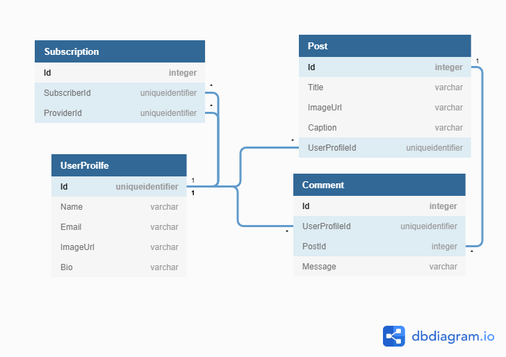

# Object/Relational Mapping and Entity Framework

An _Object/Relational Mapper_ (ORM) is a data access technology for automatically connecting C# objects to relational database tables. You've likely noticed that when working with ADO<span>.NET</span> you have to write a lot of SQL and C# code that is largely repetitive. An ORM is a tool that does the repetitive SQL and boilerplate C# for you. An ORM greatly reduces - often eliminates - the need to write SQL in your application.

## Entity Framework Core

_Entity Framework Core_ (EF) is a popular ORM created by Microsoft. It allows you to use LINQ methods in conjunction with your data models to interact with your database (e.g. SELECT. INSERT, UPDATE, DELETE data). EF then determines the SQL syntax needed to perform the appropriate action(s).

## Entity Framework Core Compared to ADO<span>.NET</span>

Before we get into the details of Entity Framework Core, let's take a quick look at how we might use it in comparison to the data access technology we've been using, ADO<span>.NET</span>. The following example uses the `CoffeeShop` database from the previous chapter.

Here's a method that will get all the bean varieties using ADO<span>.NET</span>.

```cs
public List<BeanVariety> GetAll()
{
    using (var conn = Connection)
    {
        conn.Open();
        using (var cmd = conn.CreateCommand())
        {
            cmd.CommandText = "SELECT Id, [Name], Region, Notes FROM BeanVariety;";
            var reader = cmd.ExecuteReader();
            var varieties = new List<BeanVariety>();
            while (reader.Read())
            {
                var variety = new BeanVariety()
                {
                    Id = reader.GetInt32(reader.GetOrdinal("Id")),
                    Name = reader.GetString(reader.GetOrdinal("Name")),
                    Region = reader.GetString(reader.GetOrdinal("Region")),
                };
                if (!reader.IsDBNull(reader.GetOrdinal("Notes")))
                {
                    variety.Notes = reader.GetString(reader.GetOrdinal("Notes"));
                }
                varieties.Add(variety);
            }

            reader.Close();

            return varieties;
        }
    }
}
```

And here it is with Entity Framework Core.

```cs
public List<BeanVariety> GetAll()
{
    return _context.BeanVariety.ToList();
}
```

Bit of a difference, isn't there?

Interacting with a database isn't all about querying though. Here's some code to add a bean variety to the database.

> ADO<span>.NET</span>

```cs
public void Add(BeanVariety variety)
{
    using (var conn = Connection)
    {
        conn.Open();
        using (var cmd = conn.CreateCommand())
        {
            cmd.CommandText = @"
                INSERT INTO BeanVariety ([Name], Region, Notes)
                OUTPUT INSERTED.ID
                VALUES (@name, @region, @notes)";
            cmd.Parameters.AddWithValue("@name", variety.Name);
            cmd.Parameters.AddWithValue("@region", variety.Region);
            if (variety.Notes == null)
            {
                cmd.Parameters.AddWithValue("@notes", DBNull.Value);
            }
            else
            {
                cmd.Parameters.AddWithValue("@notes", variety.Name);
            }

            variety.Id = (int)cmd.ExecuteScalar();
        }
    }
}
```

> Entity Framework Core

```cs
public void Add(BeanVariety variety)
{
    _context.Add(variety);
    _context.SaveChanges();
}
```

## Exploring Entity Framework Core with Gifter

### Gifter

To explore EF Core, we'll build a new app, Gifter. Gifter is a social app for sharing animated GIFs with others. For the time being we'll focus on using building a Web API using Entity Framework Core. In future chapters we'll be creating a React application that will interact with the API.

Here's the initial Gifter ERD.



Here's an example showing the different between EF and ADO<span>.NET</span>. This example selects all of the departments from the Bangazon database.

And the [SQL Script](./sql/Gifter.sql)

### Installing Entity Framework Core Nuget Packages

In order to use EF Core, we have to install a few packages. During the course, we've seen a few ways of installing packages. One way is no better than any other. One way that works well for copy/pasting our way to success, is to add package references to our `*.csproj` file.

> Gifter.csproj

```xml
<Project Sdk="Microsoft.NET.Sdk.Web">

  <PropertyGroup>
    <TargetFramework>netcoreapp3.1</TargetFramework>
  </PropertyGroup>

  <ItemGroup>
    <PackageReference Include="Microsoft.AspNetCore.Mvc.NewtonsoftJson" Version="3.1.5" />
    <PackageReference Include="Microsoft.EntityFrameworkCore" Version="3.1.5" />
    <PackageReference Include="Microsoft.EntityFrameworkCore.Sqlite" Version="3.1.5" />
    <PackageReference Include="Microsoft.EntityFrameworkCore.SqlServer" Version="3.1.5" />
    <PackageReference Include="Microsoft.EntityFrameworkCore.Tools" Version="3.1.5">
      <PrivateAssets>all</PrivateAssets>
      <IncludeAssets>runtime; build; native; contentfiles; analyzers; buildtransitive</IncludeAssets>
    </PackageReference>
    <PackageReference Include="Microsoft.VisualStudio.Web.CodeGeneration.Design" Version="3.1.3" />
  </ItemGroup>

</Project>
```

When you save the `Gifter.csproj` file, Visual Studio will download the packages from the Nuget package repository.

### Models

One thing EF Core has in common with ADO<span>.NET</span> is the use of models that correspond to tables in the database. For now we'll get started by building models for `Post` and `UserProfile`.

> Models/Post.cs

```cs
using System.ComponentModel.DataAnnotations;

namespace Gifter.Models
{
    public class Post
    {
        public int Id { get; set; }

        [Required]
        public string Title { get; set; }

        [Required]
        public string ImageUrl { get; set; }

        public string Caption { get; set; }

        public DateTime DateCreated { get; set; }

        [Required]
        public int UserProfileId { get; set; }

        public UserProfile UserProfile { get; set; }
    }
}
```

> Models/UserProfile.cs

```cs
using System.Collections.Generic;
using System.ComponentModel.DataAnnotations;

namespace Gifter.Models
{
    public class UserProfile
    {
        public int Id { get; set; }

        [Required]
        public string Name { get; set; }

        [Required]
        public string  Email { get; set; }

        public string ImageUrl { get; set; }

        public DateTime DateCreated { get; set; }

    }
}
```

### DbContext

In Entity Framework we don't directly use a `SqlConnection` object like we did in ADO.<span>NET</span>. Instead we use an instance of ` Microsoft.EntityFrameworkCore.DbContext`.

In the examples above you'll notice the `_context` variable. This private field is the instance of our `DbContext` that we use in our repository to interact with the database.

The first step in creating a `DbContext` is to make a new class that inherits from it. This class is commonly called `ApplicationDbContext`. Because every database is different, Microsoft could not make a generic `DbContext` to cover everything. The `DbContext` class EF Core provides is a base class that we extend with the specifics of our database.

Here is a partial implementation of an `ApplicationDbContext` for Gifter.

> Data/ApplicationDbContext.cs

```cs
using Gifter.Models;
using Microsoft.EntityFrameworkCore;

namespace Gifter.Data
{
    public class ApplicationDbContext : DbContext
    {
        public ApplicationDbContext(DbContextOptions<ApplicationDbContext> options) : base(options) { }

        public DbSet<UserProfile> UserProfile { get; set; }
        public DbSet<Post> Post { get; set; }
    }
}
```

### Configuration

Since our app is communicating with a database, we'll need a connection string. As usual, we'll store it in the `appsettings.json` file.

> appsettings.json

```json
{
  "Logging": {
    "LogLevel": {
      "Default": "Warning",
      "Microsoft": "Information",
      "Microsoft.Hosting.Lifetime": "Information"
    }
  },
  "AllowedHosts": "*",
  "ConnectionStrings": {
    "DefaultConnection":  "server=localhost\\SQLExpress;database=Gifter;integrated security=true;"
  }
}
```

We must also tell ASP<span>.NET</span> that we'd like to use the `ApplicationDbContext` class, and that we'll be connecting to a SQL Server database. We do this in the `ConfigureServices()` method in the `Startup` class.

> Startup.cs

```cs
// ...other code omitted for brevity...

public void ConfigureServices(IServiceCollection services)
{
    services.AddDbContext<ApplicationDbContext>(options =>
        options.UseSqlServer(Configuration.GetConnectionString("DefaultConnection")));

    services.AddControllers();
}

// ...other code omitted for brevity...
```

### Getting Gifter Posts

We're finally ready to query the database. Create a new repository called `PostRepository`.

> Repositories/PostRepository.cs

```cs
using System.Linq;
using System.Collections.Generic;
using Microsoft.EntityFrameworkCore;
using Gifter.Data;
using Gifter.Models;

namespace Gifter.Repositories
{
    public class PostRepository
    {
        private readonly ApplicationDbContext _context;

        public PostRepository(ApplicationDbContext context)
        {
            _context = context;
        }

        public List<Post> GetAll()
        {
            return _context.Post.ToList();
        }

        public Post GetById(int id)
        {
            return _context.Post.FirstOrDefault(p => p.Id == id);
        }
    }
}
```

Next create a Web API controller with "Get" methods.

> controllers/PostController.cs

```cs
using Microsoft.AspNetCore.Mvc;
using Gifter.Data;
using Gifter.Repositories;

namespace Gifter.Controllers
{
    [Route("api/[controller]")]
    [ApiController]
    public class PostController : ControllerBase
    {
        private readonly PostRepository _postRepository;
        public PostController(ApplicationDbContext context)
        {
            _postRepository = new PostRepository(context);
        }

        [HttpGet]
        public IActionResult Get()
        {
            return Ok(_postRepository.GetAll());
        }

        [HttpGet("{id}")]
        public IActionResult Get(int id)
        {
            var post = _postRepository.GetById(id);
            if (post == null)
            {
                return NotFound();
            }
            return Ok(post);
        }
    }
}
```

Now use Postman to view the Post data.

You'll notice the `UserProfile` property is `null` for each Post. Let's fix that.

### "Joining" tables with Include()

To bring in data from related tables, we use the `Include()` method. Update the methods in the `PostRepository` to get User Profile` data with each Post.

> Repositories/PostRepository.cs

```cs
// ...other code omitted for brevity...

public List<Post> GetAll()
{
    return _context.Post.Include(p => p.UserProfile).ToList();
}

public Post GetById(int id)
{
    return _context.Post.Include(p => p.UserProfile).FirstOrDefault(p => p.Id == id);
}

// ...other code omitted for brevity...
```

The API responses should now include the `UserProfile` property for each Post object.

### Filtering Data with LINQ

EF Core let's us use LINQ when querying data in our database.

For example, if we wanted to get all Posts from a particular user we could use LINQ's `Where()` method. We could also order the Posts with `OrderBy()`.

Add the following method to the `PostRepository`...

```cs
// ...other code omitted for brevity...

public List<Post> GetByUserProfileId(int id)
{
    return _context.Post.Include(p => p.UserProfile)
                    .Where(p => p.UserProfileId == id)
                    .OrderBy(p => p.Title)
                    .ToList();
}

// ...other code omitted for brevity...
```

...And add a method to the `PostController`...

```cs
// ...other code omitted for brevity...

[HttpGet("getbyuser/{id}")]
public IActionResult GetByUser(int id)
{
    return Ok(_postRepository.GetByUserProfileId(id));
}

// ...other code omitted for brevity...
```

Now go to https://localhost:5001/api/post/getbyuser/1 to get Posts from the user with id 1.

### Create, Update and Delete

Add the appropriate methods to the `PostRepository`...

> Repositories/PostRepository.cs

```cs
// ...other code omitted for brevity...

public void Add(Post post)
{
    _context.Add(post);
    _context.SaveChanges();
}

public void Update(Post post)
{
    _context.Entry(post).State = EntityState.Modified;
    _context.SaveChanges();
}

public void Delete(int id)
{
    var post = GetById(id);
    _context.Post.Remove(post);
    _context.SaveChanges();
}

// ...other code omitted for brevity...
```

...and to the controller...

> Controllers/PostController.cs

```cs
// ...other code omitted for brevity...

[HttpPost]
public IActionResult Post(Post post)
{
    _postRepository.Add(post);
    return CreatedAtAction("Get", new { id = post.Id }, post);
}

[HttpPut("{id}")]
public IActionResult Put(int id, Post post)
{
    if (id != post.Id)
    {
        return BadRequest();
    }

    _postRepository.Update(post);
    return NoContent();
}

[HttpDelete("{id}")]
public IActionResult Delete(int id)
{
    _postRepository.Delete(id);
    return NoContent();
}

// ...other code omitted for brevity...
```

## The Cost of Convenience

While the simpler syntax may seem like a breath of fresh air, and much easier to read (_once you get used to it_), you pay for it with poorer performance. The SQL generated by EF is a sore spot by many developers because there are cases where it is not as fast and optimized as it would be if written out in long-form by the developer.

* [Dapper vs Entity Framework vs ADO.NET Performance Benchmarking](https://www.exceptionnotfound.net/dapper-vs-entity-framework-vs-ado-net-performance-benchmarking/)
* [Performance: Entity Framework 7 vs. Dapper.net vs. raw ADO.NET](https://ppanyukov.github.io/2015/05/20/entity-framework-7-performance.html)

> **NOTE:** [Dapper](https://github.com/StackExchange/Dapper) is a popular "light-weight" ORM. It's an alternative to EF and ADO<span>.NET</span>. We won't be discussing Dapper in this course.

## Exercises

1. Create the necessary classes to make a `UserProfile` API endpoint at https://locahost:5001/api/userprofile. The endpoint should allow perform full CRUD functionality for the `UserProfile` entity.
1. Add the `Comment` entity to the system. Perform full CRUD on the `Comment` entity and also allow listing of comments by `PostId`.
1. Update the `Post` model to contain a list of comments. What impact does this have on the Post  and Comment APIs? Why?

### Object Cycles

In exercise 3 above, you should have gotten an error that looked something like this:

```txt
JsonException: A possible object cycle was detected which is not supported. This can either be due to a cycle or if the object depth is larger than the maximum allowed depth of 32.
```

This error results from trying to convert a C# object to JSON (a.k.a _serialize the object_) when that object contains a circular reference (a.k.a. a _cycle_). In this case a `Post` contains `Comment`s and each `Comment` contains a `Post`.

Inside C# code such a cycle isn't a problem. However, it is a problem when we try to serialize the C# object to JSON. JSON simply _cannot_ represent object cycles. It's not possible.

To fix this, we can configure ASP.NET Core's serialization settings. Update the `ConfigureServices` method in the `Startup` class to configure `ReferenceLoopHandling` to ignore cycles.

```cs
public void ConfigureServices(IServiceCollection services)
{
    services.AddDbContext<ApplicationDbContext>(options =>
        options.UseSqlServer(Configuration.GetConnectionString("DefaultConnection")));

    services.AddControllers()
            .AddNewtonsoftJson(options =>
                options.SerializerSettings.ReferenceLoopHandling = ReferenceLoopHandling.Ignore
            );
}
```

> **NOTE:** There are many options for fixing this cycle problem. The solution above was chosen due to it's relative simplicity. Another option would be to create a custom API Model to return from the Web API instead of using the data model. This "custom API model" is analogous to a viewmodel im MVC.

---

## Supplemental Tutorial

You may find the first four parts of this tutorial helpful. [ASP.NET Core MVC with Entity Framework Core](https://docs.microsoft.com/en-us/aspnet/core/data/ef-mvc/?view=aspnetcore-2.2).

> **NOTE:** This tutorial is challenging and will include new concepts beyond those specifically related to Entity Framework, but stick with it. It's an important part of your education to practice learning from online documentation. This will not be the last time you find yourself needing to learn something from docs.

> **NOTE:** It is easy race through the tutorial without reading and understanding what is being discussed. Do NOT make this mistake. Read the text don't just copy and paste the code.
