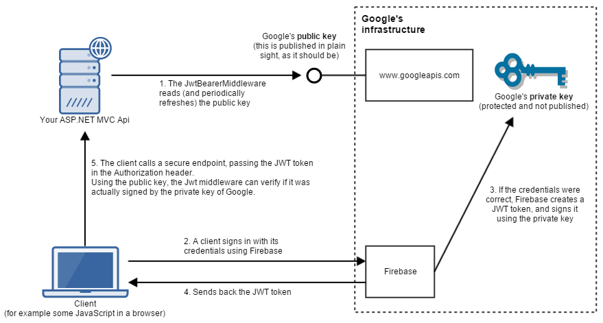

# Firebase Authentication

[Firebase](https://firebase.google.com/) is a development platform provided by Google. It offers a wide array of tools for app development, data/file storage and even machine learning. We will be using firebase for user authentication.

The subject of authentication, particularly authentication using a _third-party provider_ such as Firebase, is both broad and deep. There are several approaches to authentication and each approach is non-trivial to implement. While the approach we cover in this course is a perfectly feasible way to implement authentication, it is by no means an exhaustive look at the topic.

## Authentication vs Authorization

_Authentication_ is the process of verifying a user is who they say they are. This is often done by requesting the user to provide a username and password, but put more generally the user must demonstrate that they _know something that only they should know_ or that they _posses something that only they should have_.

_Authorization_ is the process of determining if a user should be _allowed to perform_ an action. Authorization requires that a user be authenticated since the application cannot check a user permissions until it knows who the user is.

## Firebase Authentication Setup

Firebase provides an _identity store_ for user emails and passwords. Using Firebase relieves our application of the burden (and risk) of storing user credentials. Firebase also offers a set of tools for setting password strength requirements, for letting users change passwords and many other common credential management tools that we would otherwise have to build. In this course we will only touch the surface of the tools that Firebase offers.

> **NOTE:** In addition to email/password authentication, Firebase provides tools to allow authentication via Google, Github and several other third-party auth providers. We will not cover these alternatives in this course, but there is extensive documentation on the Firebase website.

### Firebase Account

Before you get started using Firebase, you must create an account. Go to https://firebase.google.com/ and click the large `Getting started` button to create an account. You will need to login with a Google username/password. If you do not have a Google account, there is an option to create on on the Google sign in form.

### Firebase Project

A Firebase identity store is contained within a _Project_. Once you have logged into Firebase, click the `Add project` button to create new project.

The example we'll be using for this chapter is an application for managing [Grace Hopper](https://en.wikipedia.org/wiki/Grace_Hopper) quotes called `WisdomAndGrace`. Create a Firebase project with that name.

### Project Id and Web API Key

Once you've created the project, you should see a menu on the left side of the screen. Select the gear image near the top of this menu and choose the `Project settings` options.

On the Project settings page take note of the `Project ID` and the `Web API Key`. Remember how you got here because you will need these values later.

### Setting up Authentication

1. From the Project Overview page, select `Authentication` in the menu on the left.
1. From the Authentication page, select the `Sign-in method` tab.
1. Hover your mouse over the `Email/password` sign-in provider and click the pencil icon.
1. In the window that appears, turn on the `Enable` switch, but make sure the `Email link (passwordless sign-in)` switch is turned off.
1. Click the `Save` button.
1. Select the `Users` tab and click the `Add user` button. Enter an email and a password _that you must remember_. The email does not have to be real.
1. After you create the user notice the value in the `User UID` column in the table. We'll be using his id later.
1. Finally, create a second user in the same manner as before. It's recommended that you use the same password for both users.

## Demo Project Overview

Now that we have some initial setup out of the way, let's take some time to think about what we are going to be building.

Our goal is to build a full-stack application using ASP.NET Core Web API on the server, Entity Framework Core to interact with a SQL Server database, React on the client and Firebase for authentication.

Because Web API, EF Core and React are all familiar to us, we won't go into them here. But we do need to get a high-level idea of how authentication will fit into the project. The image below describes the process.

> Source: https://stackoverflow.com/questions/42336950/firebase-authentication-jwt-with-net-core/42410233#42410233

> **NOTE:** The process of authentication is very complex. It is very unlikely that you will understand very much of it right away.

### The Login Process

1. When our Web API server application starts up, it communicates with a back-end Google API server in order to gain access to Google's _public encryption key_.
1. The react application (running on a user's browser) sends a request to the Firebase server containing the user's email and password.
1. Firebase communicates with the Google  API server to confirm that the user's credentials are valid.
1. Once confirmed, Firebase sends a token (called a [JWT](https://jwt.io/introduction/)) to the React application. This token contains encoded information about the user.
1. The react application stores the token in the browser's `sessionStorage`. **The user is now _logged in_** to the app.
1. When the react application needs to make an authenticated request to the Web API server, it passes token along with the request.
1. When the Web API sever receives the request from the react application, it verifies the token and uses it to determine who the user is.

## Running the Demo

As mentioned above the application we'll be building is for managing quotes from the brilliant Grace Hopper. Because there are a lot of steps required to build this application, we will not be doing it together in class. Instead you should **fork** the Github repo linked to below, then clone your copy to your computer and follow along.

https://github.com/askingalot/WisdomAndGrace

### Look around the repo

In the repo you will find...

* A Visual Studio solution and project both called `WisdomAndGrace`.
* A `client` folder inside the project folder than contains a react application. This application's `package.json` file has already been configured to use the react proxy server.
* A sql script for building the application database.
* An `appsettings.json` file containing configuration information for the Web API.
* A `.env` file containing configuration settings for the React application.

### Update the Repo

Before we can run the app we need to make a few changes.

1. Open the SQL script in an editor and find the `INSERT` statements that insert records into the `UserProfile` table. Modify these statements to add the users you added to Firebase earlier in this chapter.
1. Update the `appsettings.json` file. Change the value of the `FirebaseProjectId` key to me the Project Id of your Firebase project.
1. Update the `.env` file. Change the value of the `REACT_APP_API_KEY` key to the API Key from your Firebase project.

Now we're finally ready to run this thing. Build your database, then run both server and client apps.

## Examining the Demo

Your instructor will take you through the parts of the demo application and describe how it is setup to use Firebase authentication.

### Some Key Areas to Explore

* JWT Authentication in `Startup.cs`.
* `app.UseAuthentication()` in `Startup.cs`.
* `FirebaseUserId` property in `UserPofile.cs`.
* `GetCurrentUser()` method in `QuoteController`.
* Firebase JavaScript Library
* `Login`, `Register` and `Logout` functions in `UserProfileProvider.js`.
* Using the token (JWT) in the `fetch()` calls in both `UserProfileProvider.js` and `QuoteProvider.js`.
* Simple `UserType` verification in `QuoteController.cs` and in `QuoteProvider.js`.
