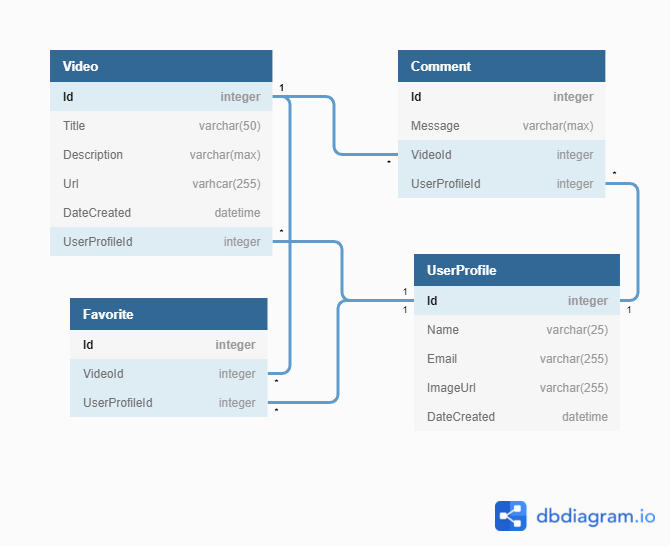

# Utility Classes, Special-Purpose Repository Methods and More Complex SQL

---

## Objectives

After completing this lesson and working on related exercises you should be able to:

1. Describe how inheriting from a base class can reduce the amount of code in a repository.
1. Define the term "utility class".
1. Define the terms "nullable int" and "nullable DateTime".
1. Describe what is meant by a "round trip" to the database.
1. Write a simple utility class that has methods for retrieving a value from a SqlDataReader by column name.
1. Rewrite given SQL code containing multiple queries into a single query using a LEFT JOIN.
1. Write a C# repository method that executes a complex SQL query (using one or more JOINs) and converts the resulting data into C# objects.

---

So far much of what we've done in this course has been basic CRUD operations on a single entity. Sure we've done a few `JOIN`s here and there, but we've mostly kept it fairly simple.

This focus on basic CRUD has also been reflected in our repositories. Our repositories usually look something like this

> ISomeModelRepository.cs

```cs
public interface ISomeModelRepository
{
    List<SomeModel> GetAll();
    SomeModel GetById(int id);
    void Add(SomeModel someModel);
    void Update(SomeModel someModel);
    void Remove(int id);
}
```

Often basic CRUD is sufficient, but there times when it isn't - times when we need something more complex. This is particularly true when it comes to querying complex data with the goal of populating multiple types of Model objects from a single query.

Let's explore this idea some more with an example application, Streamish. Along the way we'll also build some tools to help reduce some of the complexity of our repositories.

## Streamish

Streamish is a social app for sharing videos with others. For the time being we'll focus on using building a Web API. In future chapters we'll be creating a React application that will interact with the API. Along the way we'll dig into some more complex queries.

### Project Setup

1. Create the `Streamish` database using the [SQL script](./sql/Streamish.sql).
1. Use Visual Studio to create a new ASP<span>.</span>NET Core Web Application project called "Streamish". Make suse to choose the "API" template when prompted.
1. Use Visual Studio's Nuget Package Manager to install the `Microsoft.Data.SqlClient` nuget package.
1. Add the database connection string to the `appsettings.json` file.
1. Spend a little while familiarizing yourself with the Streamish ERD
    

### Model Classes

Create the `Video`, `UserProfile` and `Comment` models. We're going to ignore the `Favorite` entity for now.

> Models/Video.cs

```cs
using System;
using System.ComponentModel.DataAnnotations;
using System.Collections.Generic;

namespace Streamish.Models
{
    public class Video
    {
        public int Id { get; set; }

        [Required]
        public string Title { get; set; }

        [Required]
        public string ImageUrl { get; set; }

        public string Caption { get; set; }

        public DateTime DateCreated { get; set; }

        public int UserProfileId { get; set; }

        public UserProfile UserProfile { get; set; }

        public List<Comment> Comments { get; set; }

    }
}
```

> Models/UserProfile.cs

```cs
using System;
using System.Collections.Generic;
using System.ComponentModel.DataAnnotations;

namespace Streamish.Models
{
    public class UserProfile
    {
        public int Id { get; set; }

        [Required]
        public string Name { get; set; }

        [Required]
        public string  Email { get; set; }

        public string ImageUrl { get; set; }

        public DateTime DateCreated { get; set; }

    }
}
```

> Models/Comment.cs

```cs
namespace Streamish.Models
{
    public class Comment
    {
        public int Id { get; set; }
        public string Message { get; set; }
        public int UserProfileId { get; set; }
        public UserProfile UserProfile { get; set; }
        public int VideoId { get; set; }
        public Video Video { get; set; }
    }
}
```

### Basic CRUD

Before we can get fancy, let's cover the basics. In this section we'll build and test an initial `VideoRepository` and `VideoController`.

#### VideoRepository

And before we dive into the `VideoRepository`, let's pause a minute to reflect on our system design. Given our database has more than one entity, it's a good bet that we'll need more than one repository. And since each repository will need to access `SqlConnection`s, this is a good opportunity to share a bit of code with using inheritance. So before we create the `VideoRepository` let's create a repository parent class called `BaseRepository`.

> Repositories/BaseRepository.cs

```cs
using Microsoft.Data.SqlClient;
using Microsoft.Extensions.Configuration;

namespace Streamish.Repositories
{
    public abstract class BaseRepository
    {
        private readonly string _connectionString;

        public BaseRepository(IConfiguration configuration)
        {
            _connectionString = configuration.GetConnectionString("DefaultConnection");
        }

        protected SqlConnection Connection
        {
            get
            {
                return new SqlConnection(_connectionString);
            }
        }
    }
}
```

> **NOTE:** We mark the `Connection` property as `protected` to make it available to child classes, but inaccessible to any other code.

> **NOTE:** The use of the keyword `abstract` in the class definition is something we haven't seen before. It indicates that our `BaseRepository` class cannot be directly instantiated, but can ONLY be used by inheritance.

Now we're ready to create the `VideoRepository`. This is the first version of the class. We'll be embellishing it later.

> Repositories/VideoRepository.cs

```cs
using System;
using System.Linq;
using System.Collections.Generic;
using Microsoft.Extensions.Configuration;
using Streamish.Models;
using Streamish.Utils;

namespace Streamish.Repositories
{
    public class VideoRepository : BaseRepository, IVideoRepository
    {
        public VideoRepository(IConfiguration configuration) : base(configuration) { }

        public List<Video> GetAll()
        {
            using (var conn = Connection)
            {
                conn.Open();
                using (var cmd = conn.CreateCommand())
                {
                    cmd.CommandText = @"
                          SELECT Id, Title, Caption, DateCreated, ImageUrl, UserProfileId
                            FROM Video
                        ORDER BY DateCreated";

                    var reader = cmd.ExecuteReader();

                    var videos = new List<Video>();
                    while (reader.Read())
                    {
                        videos.Add(new Video()
                        {
                            Id = DbUtils.GetInt(reader, "Id"),
                            Title = DbUtils.GetString(reader, "Title"),
                            Caption = DbUtils.GetString(reader, "Caption"),
                            DateCreated = DbUtils.GetDateTime(reader, "DateCreated"),
                            ImageUrl = DbUtils.GetString(reader, "ImageUrl"),
                            UserProfileId = DbUtils.GetInt(reader, "UserProfileId"),
                        });
                    }

                    reader.Close();

                    return videos;
                }
            }
        }

        public Video GetById(int id)
        {
            using (var conn = Connection)
            {
                conn.Open();
                using (var cmd = conn.CreateCommand())
                {
                    cmd.CommandText = @"
                          SELECT Title, Caption, DateCreated, ImageUrl, UserProfileId
                            FROM Video
                           WHERE Id = @Id";

                    DbUtils.AddParameter(cmd, "@Id", id);

                    var reader = cmd.ExecuteReader();

                    Video video = null;
                    if (reader.Read())
                    {
                        video = new Video()
                        {
                            Id = id,
                            Title = DbUtils.GetString(reader, "Title"),
                            Caption = DbUtils.GetString(reader, "Caption"),
                            DateCreated = DbUtils.GetDateTime(reader, "DateCreated"),
                            ImageUrl = DbUtils.GetString(reader, "ImageUrl"),
                            UserProfileId = DbUtils.GetInt(reader, "UserProfileId"),
                        };
                    }

                    reader.Close();

                    return video;
                }
            }
        }

        public void Add(Video video)
        {
            using (var conn = Connection)
            {
                conn.Open();
                using (var cmd = conn.CreateCommand())
                {
                    cmd.CommandText = @"
                        INSERT INTO Video (Title, Caption, DateCreated, ImageUrl, UserProfileId)
                        OUTPUT INSERTED.ID
                        VALUES (@Title, @Caption, @DateCreated, @ImageUrl, @UserProfileId)";

                    DbUtils.AddParameter(cmd, "@Title", video.Title);
                    DbUtils.AddParameter(cmd, "@Caption", video.Caption);
                    DbUtils.AddParameter(cmd, "@DateCreated", video.DateCreated);
                    DbUtils.AddParameter(cmd, "@ImageUrl", video.ImageUrl);
                    DbUtils.AddParameter(cmd, "@UserProfileId", video.UserProfileId);

                    video.Id = (int)cmd.ExecuteScalar();
                }
            }
        }

        public void Update(Video video)
        {
            using (var conn = Connection)
            {
                conn.Open();
                using (var cmd = conn.CreateCommand())
                {
                    cmd.CommandText = @"
                        UPDATE Video
                           SET Title = @Title,
                               Caption = @Caption,
                               DateCreated = @DateCreated,
                               ImageUrl = @ImageUrl,
                               UserProfileId = @UserProfileId
                         WHERE Id = @Id";

                    DbUtils.AddParameter(cmd, "@Title", video.Title);
                    DbUtils.AddParameter(cmd, "@Caption", video.Caption);
                    DbUtils.AddParameter(cmd, "@DateCreated", video.DateCreated);
                    DbUtils.AddParameter(cmd, "@ImageUrl", video.ImageUrl);
                    DbUtils.AddParameter(cmd, "@UserProfileId", video.UserProfileId);
                    DbUtils.AddParameter(cmd, "@Id", video.Id);

                    cmd.ExecuteNonQuery();
                }
            }
        }

        public void Delete(int id)
        {
            using (var conn = Connection)
            {
                conn.Open();
                using (var cmd = conn.CreateCommand())
                {
                    cmd.CommandText = "DELETE FROM Video WHERE Id = @Id";
                    DbUtils.AddParameter(cmd, "@id", id);
                    cmd.ExecuteNonQuery();
                }
            }
        }
    }
}
```

> **NOTE:** Remember to create and register the `IVideoRepository` interface.

At first glance the code above may seem like all the other ADO<span>.</span>NET code we've written, but look closer. Notice the references to `DbUtils`.

What is `DbUtils`? It's not a part of .NET. It's a class we created in order help simplify some of our database interaction code, particularly with regards to dealing with `null` values. You might have noticed that the `Description` column in the `Video` table is nullable, so we could use the help.

Create a `Utils` folder and add the `DbUtils.cs` file inside it.

> `Utils/DbUtils.cs`

```cs
using System;
using Microsoft.Data.SqlClient;

namespace Streamish.Utils
{
    /// <summary>
    ///  A set of useful function for interacting with ADO.NET
    /// </summary>
    public static class DbUtils
    {
        /// <summary>
        ///  Get a string from a data reader object and gracefully handle NULL values
        /// </summary>
        /// <param name="reader">A SqlDataReader that has not exhausted it's result set.</param>
        /// <param name="column">The name of the column from the result set refereed to by the reader.</param>
        /// <returns>The value of the given column or null.</returns>
        public static string GetString(SqlDataReader reader, string column)
        {
            var ordinal = reader.GetOrdinal(column);
            if (reader.IsDBNull(ordinal))
            {
                return null;
            }

            return reader.GetString(ordinal);
        }

        /// <summary>
        ///  Get an int from a data reader object.
        ///  This method assumes the value is not NULL.
        /// </summary>
        /// <param name="reader">A SqlDataReader that has not exhausted it's result set.</param>
        /// <param name="column">The name of the column from the result set refereed to by the reader.</param>
        /// <returns>The value of the given column.</returns>
        public static int GetInt(SqlDataReader reader, string column)
        {
            return reader.GetInt32(reader.GetOrdinal(column));
        }

        /// <summary>
        ///  Get a DateTime from a data reader object.
        ///  This method assumes the value is not NULL.
        /// </summary>
        /// <param name="reader">A SqlDataReader that has not exhausted it's result set.</param>
        /// <param name="column">The name of the column from the result set refereed to by the reader.</param>
        /// <returns>The value of the given column.</returns>
        public static DateTime GetDateTime(SqlDataReader reader, string column)
        {
            return reader.GetDateTime(reader.GetOrdinal(column));
        }

        /// <summary>
        ///  Get an int? (nullable int) from a data reader object and gracefully handle NULL values
        /// </summary>
        /// <param name="reader">A SqlDataReader that has not exhausted it's result set.</param>
        /// <param name="column">The name of the column from the result set refereed to by the reader.</param>
        /// <returns>The value of the given column or null.</returns>
        public static int? GetNullableInt(SqlDataReader reader, string column)
        {
            var ordinal = reader.GetOrdinal(column);
            if (reader.IsDBNull(ordinal))
            {
                return null;
            }

            return reader.GetInt32(ordinal);
        }

        /// <summary>
        ///  Get a DateTime? (nullable DateTime) from a data reader object and gracefully handle NULL values
        /// </summary>
        /// <param name="reader">A SqlDataReader that has not exhausted it's result set.</param>
        /// <param name="column">The name of the column from the result set refereed to by the reader.</param>
        /// <returns>The value of the given column or null.</returns>
        public static DateTime? GetNullableDateTime(SqlDataReader reader, string column)
        {
            var ordinal = reader.GetOrdinal(column);
            if (reader.IsDBNull(ordinal))
            {
                return null;
            }

            return reader.GetDateTime(ordinal);
        }

        /// <summary>
        ///  Determine if the value a given column is NULL
        /// </summary>
        /// <param name="reader">A SqlDataReader that has not exhausted it's result set.</param>
        /// <param name="column">The name of the column from the result set refereed to by the reader.</param>
        /// <returns>true if "column" is NULL in the database otherwise false.</returns>
        public static bool IsDbNull(SqlDataReader reader, string column)
        {
            return reader.IsDBNull(reader.GetOrdinal(column));
        }

        /// <summary>
        ///  Determine if the value a given column is not NULL
        /// </summary>
        /// <param name="reader">A SqlDataReader that has not exhausted it's result set.</param>
        /// <param name="column">The name of the column from the result set refereed to by the reader.</param>
        /// <returns>true if "column" is not NULL in the database otherwise false.</returns>
        public static bool IsNotDbNull(SqlDataReader reader, string column)
        {
            return !IsDbNull(reader, column);
        }

        /// <summary>
        ///  Add a parameter to the given SqlCommand object and gracefully handle null values.
        /// </summary>
        /// <param name="cmd">The command to which to add the parameter.</param>
        /// <param name="name">The name of the parameter.</param>
        /// <param name="value">The value of the parameter. May be null.</param>
        public static void AddParameter(SqlCommand cmd, string name, object value)
        {
            if (value == null)
            {
                cmd.Parameters.AddWithValue(name, DBNull.Value);
            }
            else
            {
                cmd.Parameters.AddWithValue(name, value);
            }
        }
    }
}
```

Read through the code above. Does it make sense? Are there other helper methods you think you might need? What about other "utilities" that aren't related to databases?

You'll find it's fairly common practice to create such _utility classes_ (sometimes called _helper classes_). They are the "junk drawer" of our software projects. Beware, though, just like everything in software development there are positives and negatives to utility classes. Resist the temptation to over-generalize. When a particular method is only needed in one place, it's better to just make it a `private` method of whatever class it's used in.

#### VideoController

Let's round out basic CRUD by creating a simple API that allows us to Create, Read, Update and Delete `Video`s.

> Controllers/VideoController.cs

```cs
using System;
using Microsoft.AspNetCore.Mvc;
using Streamish.Repositories;
using Streamish.Models;

namespace Streamish.Controllers
{
    [Route("api/[controller]")]
    [ApiController]
    public class VideoController : ControllerBase
    {
        private readonly IVideoRepository _videoRepository;
        public VideoController(IVideoRepository videoRepository)
        {
            _videoRepository = videoRepository;
        }

        [HttpGet]
        public IActionResult Get()
        {
            return Ok(_videoRepository.GetAll());
        }

        [HttpGet("{id}")]
        public IActionResult Get(int id)
        {
            var video = _videoRepository.GetById(id);
            if (video == null)
            {
                return NotFound();
            }
            return Ok(video);
        }

        [HttpPost]
        public IActionResult Post(Video video)
        {
            _videoRepository.Add(video);
            return CreatedAtAction("Get", new { id = video.Id }, video);
        }

        [HttpPut("{id}")]
        public IActionResult Put(int id, Video video)
        {
            if (id != video.Id)
            {
                return BadRequest();
            }

            _videoRepository.Update(video);
            return NoContent();
        }

        [HttpDelete("{id}")]
        public IActionResult Delete(int id)
        {
            _videoRepository.Delete(id);
            return NoContent();
        }
    }
}
```

There's nothing new in the `VideoController`. It's just a standard Web API controller.

#### Test the API Using Postman

I know you don't want to, but do it anyway. It's always best to test _as soon as possible_. You want as little time as possible to pass between the time you _**create** the bug_ and the time you _**find** the bug_. That way you have some hope of remembering what you were thinking when you wrote the code.

### Beyond Basic CRUD

In your thorough testing of the API, you surely noticed that the JSON representation of a `Video` was missing some pieces. Each `Video` has a property for a `UserProfile` object (to represent the author of the Video) and a property for `Comments` made about that Video. However, although we have the properties, we don't have the data. Let's remedy that starting with the `UserProfile`.

There are a couple of ways we might imagine getting a `UserProfile` object for a particular `Video`. Assuming we have a `UserProfileRepository`, we could do something like this in the `VideoController`.

```cs
[HttpGet]
public IActionResult Get()
{
    var videos = _videoRepository.GetAll();

    foreach (var video in videos)
    {
        video.UserProfile = _userProfileRepository.GetById(video.UserProfileId);
    }

    return Ok(videos);
}
```

That would work, but it would _NOT_ be an approach.

_Why not?_

There are a couple reasons related to code readability and software design principles, but we're going to focus on another reason: Performance.

#### Limiting "Round Trips" to the Database

In this course we don't spend a lot of time talking about the performance of our software - how fast (or slow) our code is. In general it's best to get your code working before you worry about performance. And, frankly, just getting it working is hard enough when you're learning.

> **NOTE:** Prematurely focusing on performance has famously been called an [evil](https://stackify.com/premature-optimization-evil/) to which many software developers find themselves in danger of succumbing.

One area where it is appropriate to talk about performance is in regards to _round trips_ to the database. A _round trip_ to the database simply refers to the process of an application making a request for data, and then waiting for and receiving a response from the database.

This process takes time. A lot of time. In fact many apps spend most of their time waiting for data to come back from the database.

There's no avoiding going to the database for data. Sometimes we make one trip, sometimes we make several. This is just the nature of web development. But we should _think_ about the trips we make to the database. We should be able to justify each one. And we should limit them when we can.

#### Back to Videos and UserProfiles

A better way to set the `UserProfile` property on a `Video` would be to get the `UserProfile` data at the same time we get the `Video` data.

Replace the `GetAll()` method in `VideoRepository` with this code.

```cs
public List<Video> GetAll()
{
    using (var conn = Connection)
    {
        conn.Open();
        using (var cmd = conn.CreateCommand())
        {
            cmd.CommandText = @"
                SELECT p.Id AS VideoId, p.Title, p.Caption, p.DateCreated AS VideoDateCreated, 
                       p.ImageUrl AS VideoImageUrl, p.UserProfileId,

                       up.Name, up.Bio, up.Email, up.DateCreated AS UserProfileDateCreated, 
                       up.ImageUrl AS UserProfileImageUrl
                  FROM Video p 
                       LEFT JOIN UserProfile up ON p.UserProfileId = up.id
              ORDER BY p.DateCreated";

            var reader = cmd.ExecuteReader();

            var videos = new List<Video>();
            while (reader.Read())
            {
                videos.Add(new Video()
                {
                    Id = DbUtils.GetInt(reader, "VideoId"),
                    Title = DbUtils.GetString(reader, "Title"),
                    Caption = DbUtils.GetString(reader, "Caption"),
                    DateCreated = DbUtils.GetDateTime(reader, "VideoDateCreated"),
                    ImageUrl = DbUtils.GetString(reader, "VideoImageUrl"),
                    UserProfileId = DbUtils.GetInt(reader, "UserProfileId"),
                    UserProfile = new UserProfile()
                    {
                        Id = DbUtils.GetInt(reader, "UserProfileId"),
                        Name = DbUtils.GetString(reader, "Name"),
                        Email = DbUtils.GetString(reader, "Email"),
                        DateCreated = DbUtils.GetDateTime(reader, "UserProfileDateCreated"),
                        ImageUrl = DbUtils.GetString(reader, "UserProfileImageUrl"),
                    },
                });
            }

            reader.Close();

            return videos;
        }
    }
}
```

The code above gets all the data we need with a single round trip to the database.

#### Handling a Video's Comments

Before we dive into the code to get a Video's Comments, let's take another moment to think. Do we _always_ need a Video's Comments? Another way to ask this is, will we ever need a Video object but NOT need it's Comments?

The answer to this question depends on the _business rules_ of the application your building (i.e. the features/requirements a Product Owner outlines for an app)

For Streamish, let's say we don't always need the Comments. We may want a view that displays all the Videos without the comments.

So, given that we don't always want Comments, it doesn't make sense to add code to get them in the `GetAll()` method. Fortunately, though, we have the full power of C# at our disposal. We're not limited in what methods we can add to our repository.

##### GetAllWithComments()

Let's create a special purpose method that gets all the Videos along with their Comments. Add this method to the `VideoRepository` class and to the `IVideoRepository` interface.

```cs
public List<Video> GetAllWithComments()
{
    using (var conn = Connection)
    {
        conn.Open();
        using (var cmd = conn.CreateCommand())
        {
            cmd.CommandText = @"
                SELECT p.Id AS VideoId, p.Title, p.Caption, p.DateCreated AS VideoDateCreated,
                       p.ImageUrl AS VideoImageUrl, p.UserProfileId AS VideoUserProfileId,

                       up.Name, up.Bio, up.Email, up.DateCreated AS UserProfileDateCreated,
                       up.ImageUrl AS UserProfileImageUrl,

                       c.Id AS CommentId, c.Message, c.UserProfileId AS CommentUserProfileId
                  FROM Video p
                       LEFT JOIN UserProfile up ON p.UserProfileId = up.id
                       LEFT JOIN Comment c on c.VideoId = p.id
              ORDER BY p.DateCreated";

            var reader = cmd.ExecuteReader();

            var videos = new List<Video>();
            while (reader.Read())
            {
                var videoId = DbUtils.GetInt(reader, "VideoId");

                var existingVideo = videos.FirstOrDefault(p => p.Id == videoId);
                if (existingVideo == null)
                {
                    existingVideo = new Video()
                    {
                        Id = videoId,
                        Title = DbUtils.GetString(reader, "Title"),
                        Caption = DbUtils.GetString(reader, "Caption"),
                        DateCreated = DbUtils.GetDateTime(reader, "VideoDateCreated"),
                        ImageUrl = DbUtils.GetString(reader, "VideoImageUrl"),
                        UserProfileId = DbUtils.GetInt(reader, "VideoUserProfileId"),
                        UserProfile = new UserProfile()
                        {
                            Id = DbUtils.GetInt(reader, "VideoUserProfileId"),
                            Name = DbUtils.GetString(reader, "Name"),
                            Email = DbUtils.GetString(reader, "Email"),
                            DateCreated = DbUtils.GetDateTime(reader, "UserProfileDateCreated"),
                            ImageUrl = DbUtils.GetString(reader, "UserProfileImageUrl"),
                        },
                        Comments = new List<Comment>()
                    };

                    videos.Add(existingVideo);
                }

                if (DbUtils.IsNotDbNull(reader, "CommentId"))
                {
                    existingVideo.Comments.Add(new Comment()
                    {
                        Id = DbUtils.GetInt(reader, "CommentId"),
                        Message = DbUtils.GetString(reader, "Message"),
                        VideoId = videoId,
                        UserProfileId = DbUtils.GetInt(reader, "CommentUserProfileId")
                    });
                }
            }

            reader.Close();

            return videos;
        }
    }
}
```

This method is quite a bit more complex than the `GetAll()` method. How's should we go about understanding it?

Here are some things you should try:

1. Read the code...then read it again.
1. Copy out the SQL and run it in a query window. Note the results. Take particular note of the duplicate Video data. What makes each record in the resultset unique?
1. Use the Visual Studio debugger to step line-by-line through the code. Pay particular attention to how the `existingVideo` variable is used.
1. Talk to classmates. Can you describe this code to others?
1. Check your understanding with an instructor.

##### Using the GetAllWithComments method

Add this method to your `VideoController`

```cs
[HttpGet("GetWithComments")]
public IActionResult GetWithComments()
{
    var videos = _videoRepository.GetAllWithComments();
    return Ok(videos);
}
```

And test it by using Postman to send a GET request to the `/api/video/getwithcomments` route.

## Exercises

1. Update the `VideoRepository.GetById()` method to include the `UserProfile` object in the returned `Video` object.
1. Add a `GetVideoByIdWithComments()` method to your `VideoRepository` that gets a single `Video` and includes that Video's comments.
1. Create a `UserProfileController` and `UserProfileRepository` with all the basic CRUD operations.
1. Add methods to the `UserProfileController` and `UserProfileRepository` to return a single `UserProfile` along with the list of videos authored by that user.

### Challenge

1. Update the method you added in Exercise 4 to include all the comments for each video.
