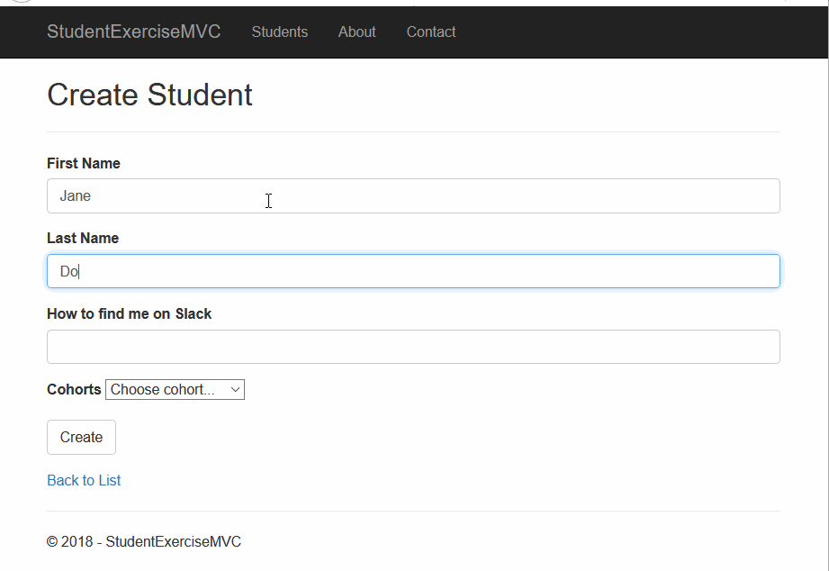

# Automated Testing

How do you know your code does what you think it does?

_You Test It!_

There are two basic approaches to testing.
1. Manual Testing - You or _**someone else**_ run the application and verify that it does what it's supposed to do.
1. Automated Testing - You _**write code**_ that runs your application and verifies that it does what it's supposed to do.

The trend in the industry is toward automated testing.

## Types of Automated Tests

There are two main types of automated testing.
1. Unit Testing - Testing individual classes or methods.
1. Integration Testing - Testing a complete request/response cycle. An integration test will use a literally visit a URL in the web application. It will fill out HTML forms, click buttons and follow links to make things happen in your application. Data will be read from and written to the database.

We will be covering integration tests in this chapter.

## Steps for each Automated Test

* Action - Each test should have the code required to test an action, or feature, of your program.
* Assert - What should be true, or what state should an object be in when code is executed.
* Arrange - Building out the classes and methods needed to make meet the assertion.


## Integration Testing in ASP<span></span>.NET Core MVC

https://docs.microsoft.com/en-us/aspnet/core/test/integration-tests?view=aspnetcore-2.1


> **NOTE:** The example below will only make sense after you read the documentation linked above.

### Example

Consider the process of creating a new student.

1. Navigate to the create page at `/students/create`
1. Enter the first and last names, and slack handle.
1. Select a cohort from the dropdown.
1. Click the `Create` button.
1. Wait for the index page to appear and note the new student in the list.



What's happening during this process?
1. An HTTP client sends a `GET` request to `/students/create`.
1. The `Create()` method of the `StudentsController` is called. This method creates a ViewModel that contains the list of Cohorts for the Create view's cohort dropdown, and passes that ViewModel to the Create view.
    ```cs
    // GET: Students/Create
    public ActionResult Create()
    {
        // NOTE: _config cointains the DB connection string
        var model = new StudentCreateViewModel(_config);
        return View(model);
    }
    ```
1. The Create view, `create.cshtml`, uses the ViewModel to generate HTML that is sent to the client.
1. A user fills out the HTML form and clicks the `Create` button.
1. The HTTP client sends a `POST` request to `/students/create`.
1. The `Create(StudentCreateViewModel model)` method of the `StudentController` is called. This method inserts a new Student into the database, then redirects the HTTP client to the `/students` URL.
1. The request to `/students` causes the `Index()` method of the `StudentsController` to be called. This method gets all students from the database and passes them to the Index view.
1. The Index view `index.cshtml` uses the list of Students to generate HTML that is sent to the client.
1. The user sees that the Student they added is in the list of all students.

> **NOTE:** The above process is clearly a **lot**, but it's worth taking some time to read through it. Once you grasp this process, you'll have a solid foundation for understanding web applications.

