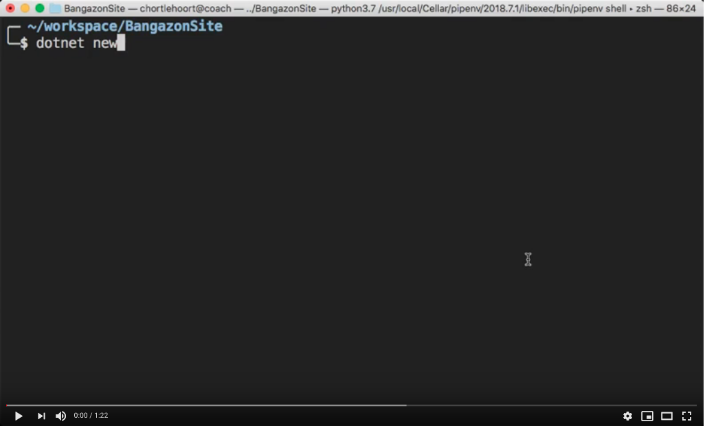

# Starting a Project with a Test Suite

Perform all of these steps on a branch before you submit a pull request.

## Create Github Repo

1. Create a new Github repository
1. Choose `Visual Studio` from the options for a .gitignore

## Create Local Solution

Replace `<url>` below with the connection string from Github. Also note that the period at the end of the `git clone` command is **not a mistake**.

```sh
mkdir ~/workspace/csharp/BangazonSite && cd $_
git clone <url> .
dotnet new mvc -n Bangazon
dotnet new xunit -n BangazonTests
dotnet new sln -n Bangazon -o .
dotnet sln Bangazon.sln add Bangazon/Bangazon.csproj
dotnet sln Bangazon.sln add BangazonTests/BangazonTests.csproj
```

[](https://youtu.be/sI2SMfG7DiU)

## appsettings.json Template

Your `appsettings.json` should be ignored since each teammate's connection string will be different. By copying the file as template, this ensures that each person who clones your repository will get a file to be modified for their own machine.

Just make sure you include instructions on how to do this in your README.

For example...

> To connect to your own database, run the following command in your terminal and modify the connection string to point to your local SQL Server Express instance
>
>    `cp appsettings.json.template appsettings.json`

```sh
cp Bangazon/appsettings.json Bangazon/appsettings.json.template
echo 'appsettings.json' >> .gitignore
```

