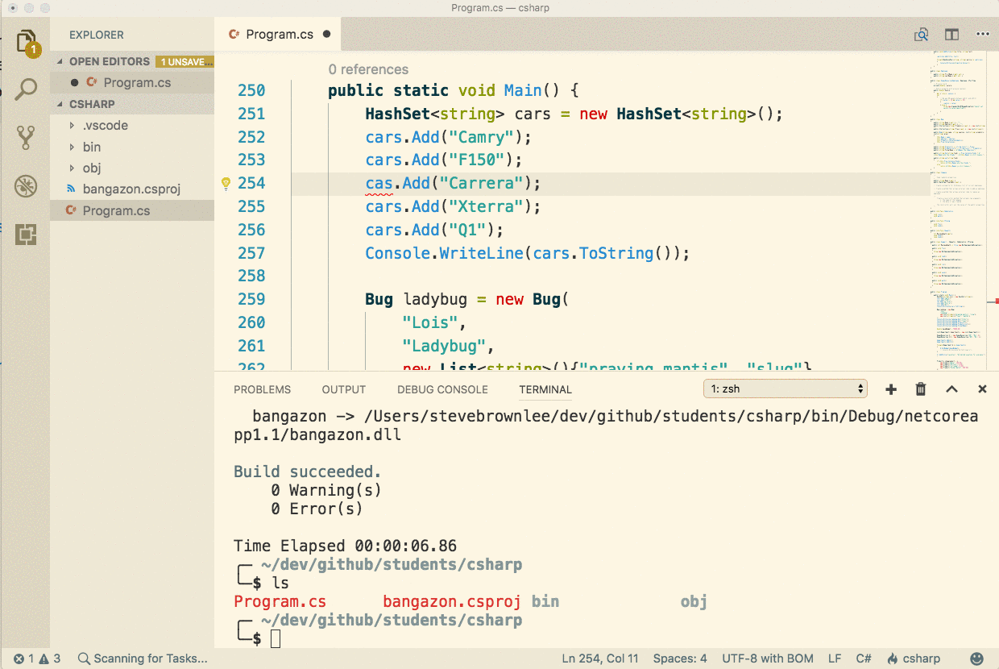
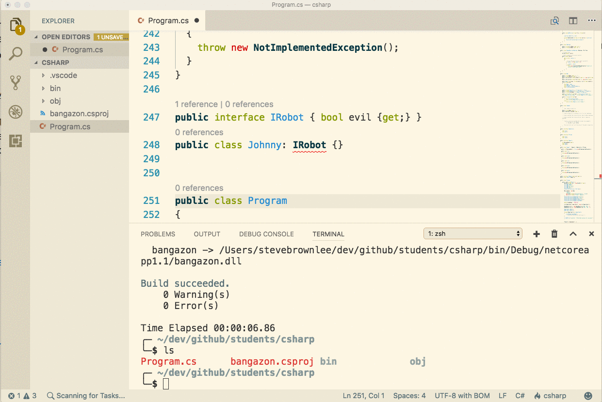
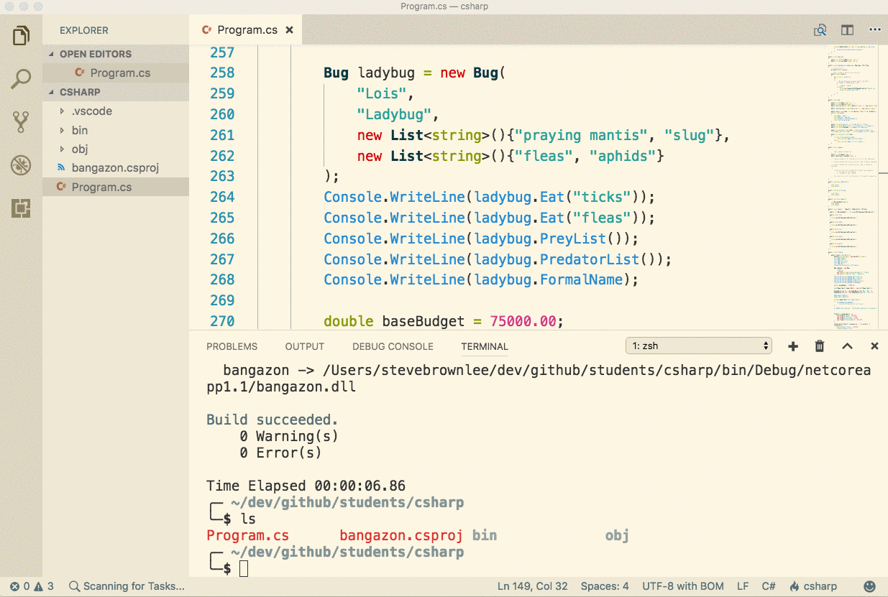

# Using Visual Studio Code

> **Reference:** Please take time to watch the [intro videos](https://code.visualstudio.com/docs/getstarted/introvideos) for the editor. Much of the material is for working with JavaScript, so we're providing C# specific instructions below.

## Builtin Console Access

Use the **Ctrl+`** keyboard shortcut to open up the [integrated terminal](https://code.visualstudio.com/docs/editor/integrated-terminal) instance right inside your editor. OSX and Linux users get this right out of the box and it truly is just another instance if your terminal. For Windows users, if the terminal does not work initially, follow the link above and look in the Configuration section to set the appropriate setting.

## The Lightbulb

A yellow lightbulb will appear in the left gutter of your editor when when the C# compiler determines that there is a task that it can help you with. For example, if you misspell a variable name, it can help you fix it.

Or if your class implements an interface (don't worry, we'll get to those in a bit), the lightbulb will offer to provide boilerplate code for you.

## Code Navigation

**THIS IS ONE OF THE MOST USEFUL FEATURES OF THE VS CODE EDITOR. LEARN IT!! USE IT!!**

Looking at some code that is creating object instances of a specific type, but it's not working the way you expect? Want to quickly go look at the code that defines the type or method?

Use `Cmd+Click` on OSX, and `Ctr+Click` on Windows.

In this animation, I want to see the definition of the method named `Eat()`, so I `Cmd+Click` on the method name, and the editor jumps to the definition. You'll see that the editor underlines the method before I click on it.

## The Panels

### Explorer

The explorer panel is just like the file explorer panel in every other editor you've used, but the Code team added some very handy features to.

1. If you highlight a file name in the explorer panel and press return, it allows you to rename the file.
1. If you highlight a file, and press `Cmd+Delete` it will delete the file.
1. Need to do something with a file on the command line? Highlight the file name and press `Shift+Cmd+C` to open up a new terminal instance in the directory that contains the file.

### Debugger

Watch these videos for an overview of using the debugger tool. You'll learn this more in-depth during class.

* [Visual Studio Code -- C# Dev Using .NET Core](https://youtu.be/B-v58Yf07RE?t=481)
* [NSS Learning Team: Using Visual Studio Code](https://www.youtube.com/watch?v=ibLRROlkio4&index=2&list=PLX0ucpUE_qINmrJY4MasublSjpvljkqNS). You can also jump directly to the part where we [discuss the debugger](https://youtu.be/ibLRROlkio4?list=PLX0ucpUE_qINmrJY4MasublSjpvljkqNS&t=810).
