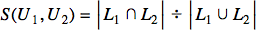
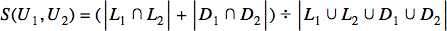
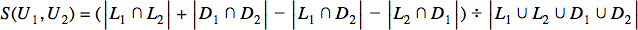
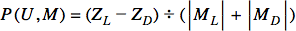

# Bangazon Recommendation Engine

## Table of Contents

1. [Prerequisites](#prerequisites)
1. [What You Will Be Learning](#what-you-will-be-learning)
1. [Requirements](#requirements)
1. [Resources](#resources)

## Prerequisites

* Set Theory
* ERD Development
* Migrations
* MVC Concepts
* Models
* Controllers

## What You Will Be Learning

## Sets

You will learn how to use unions and intersection on sets ([HashSet](https://msdn.microsoft.com/en-us/library/bb359438.aspx) in C#) to determine if a particular customer should have certain products in their Recommendation List.

##### Like Similarity Coefficient in Two Sets

##### Dislike Similarity Coefficient in Two Sets

##### Dislike+Like Similarity Coefficient in Two Sets

##### Dislike+Like Similarity+Difference Coefficient in Two Sets

##### Possibility Coefficient

This looks complex at first blush, but you'll discover that the steps with become clearer as you work it out.

## Requirements

1. When a customer first authenticates, the first view should display two lists.
    1. If there are any items currently in an open order, display those products.
    1. List any products that have a Possibility Coefficient great than 0.25.
1. On the product detail view, add an affordance for a customer to like, or dislike, a product.
1. If a customer has ordered a product, then it should be registered as a like, regardless if the customer performed the gesture on the product detail page.

## Resources

* The [Jaccard similarity coefficient](https://en.wikipedia.org/wiki/Jaccard_index)
* [Article](https://www.toptal.com/algorithms/predicting-likes-inside-a-simple-recommendation-engine) describing the general process, but with Node.js.