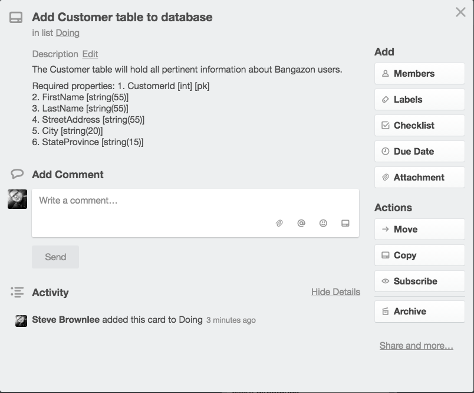
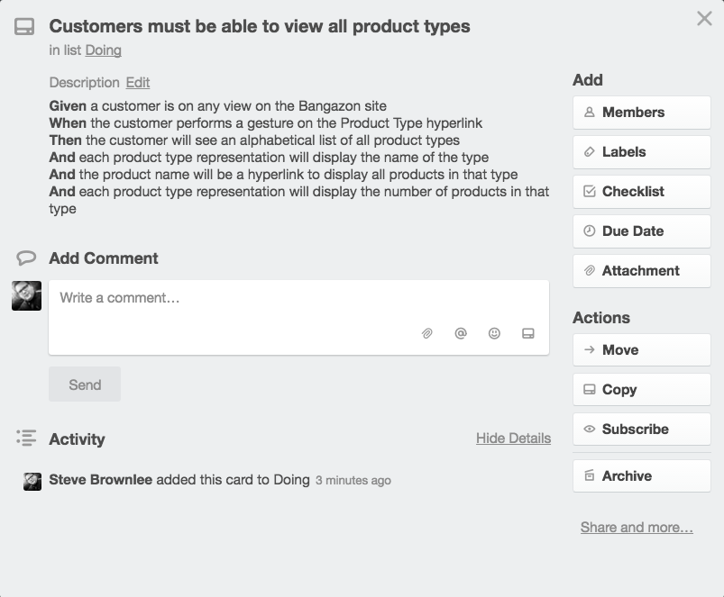

# Writing Feature Tickets

## Technical Ticket

A technical ticket must be as encapsulated, or as specific, as possible. Avoid writing lazy tickets such as `Implement tables in database`, or `Configure Customer controller`.

Here's an example of a ticket for implementing a single table in a database.

## User Story Ticket

User story tickets are for decribing the behavior of an application, and how a user will interact with the system. Use the [Behavior Driven Development](https://en.wikipedia.org/wiki/Behavior-driven_development) language of **Given/When/Then**.

> **Given** application is in a particular initial state
> 
> **When** an event happens
> 
> **Then** application should be in this state

